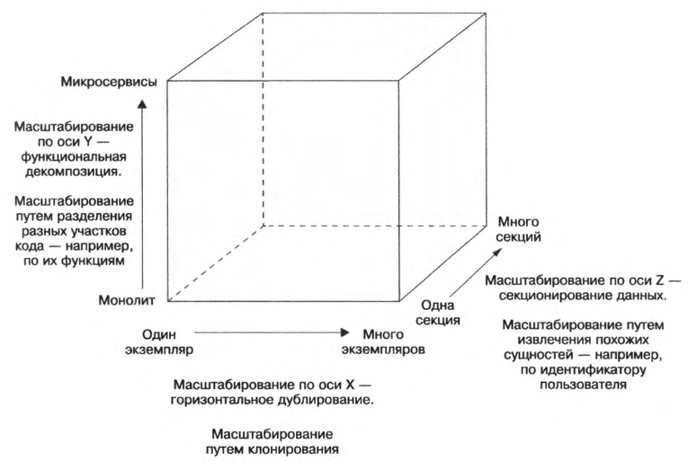
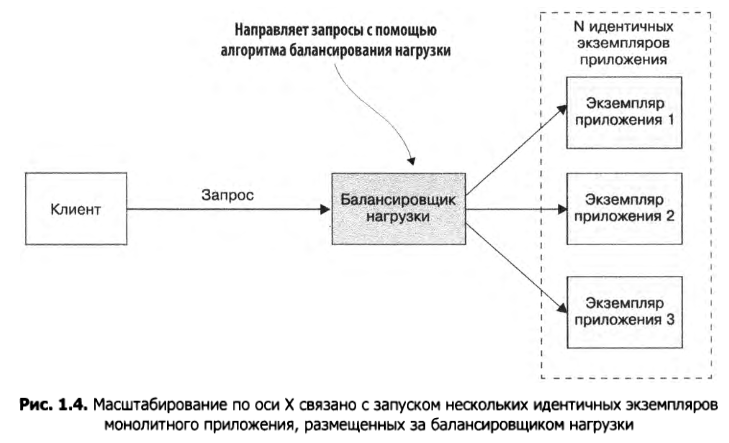
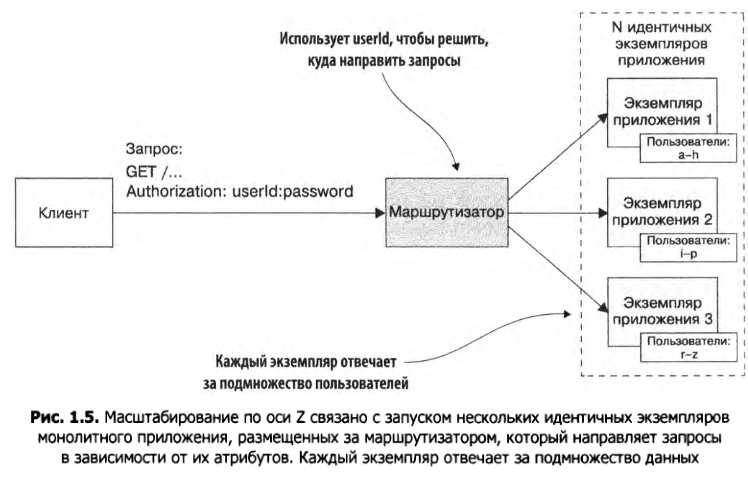
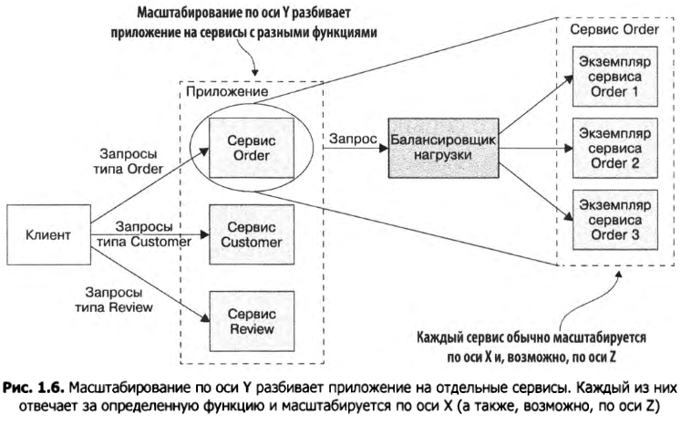
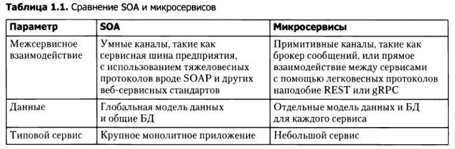
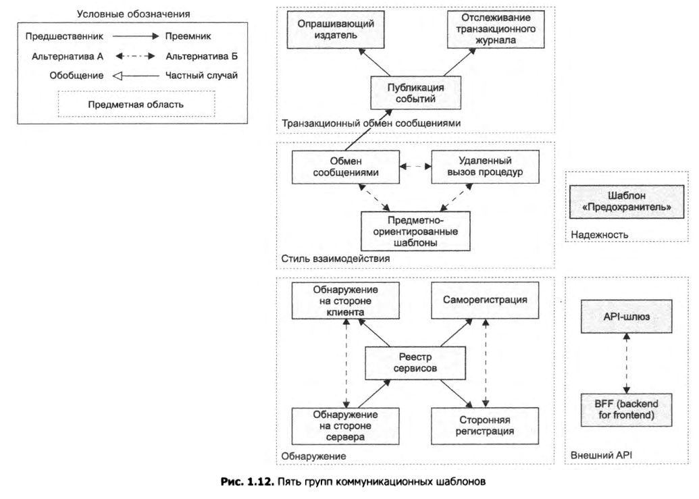
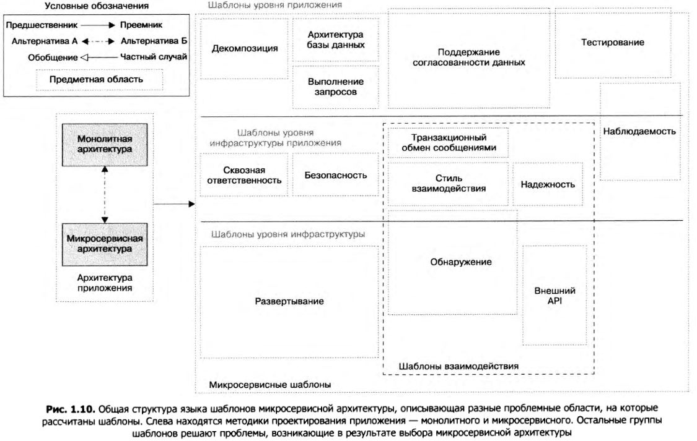
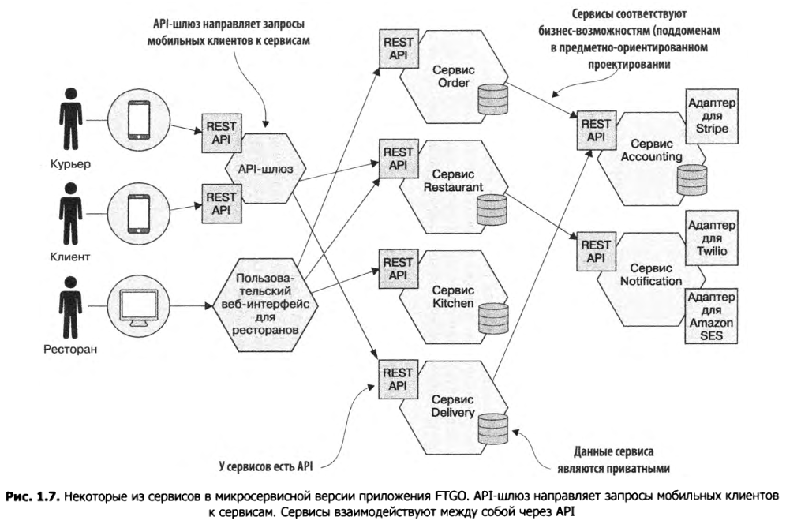

Стр 53

# Концепции

## Виды требований к программам

Функциональные требования - это непосредственно функционал, которым должна обладать программа. Например, бронирование номеров, продление поселения, выезд раньше срока и т.д. От архитектуры ФТ не зависят.

Нефункциональные требования (или "атрибуты качества") - это требования, связанные с обслуживанием программы, требования к ее производительности, масштабируемости, тестированию, частоте выпуска новых версий и все в этом духе.

## Куб масштабирования

Это про способы увеличить производительность приложения. В общих чертах есть три подхода (описание взято из книги Ричардсона, возможно соль несколько в другом, так что здесь только наброски, детально разобраться можно и отдельно, сейчас главное просто знать что оно существует):

* Масштабирование по оси X (зеркалирование, mirrorring) - запускается несколько экземпляров приложения, они убираются за балансировщик нагрузки и он старается распределить входящие запросы равномерно между экземплярами приложения.

  

* Масштабирование по оси Z (sharding, секционирование, разбиение и т.д.) - основано на принципе секционирования данных. Опять же, запускается несколько экземпляров приложения, они убираются за маршрутизатор, который отправляет входящий запрос в зависимости от какого-то его атрибута на тот или иной экземпляр.

  

  TODO: В чем профит в таком подходе мне не понятно. Потому что на первый взгляд очевидная проблема - это поступление запросов с близкими ключами, что приведет к сильной нагрузке одного экземпляра и простаиванию других. Масштабирование по Х таким недостатком как будто не обладает.

* Масштабирование по оси Y - собственно, микросервисы, функциональная декомпозиция. Разбиение приложения на сервисы с различными функциями.

  

Первые два подхода способны улучшить производительность приложения, но не помогают в управлении сложностью самого приложения. В то время как микросервисы (в теории) позволяют распилить монолит на отдельные "подпрограммы", с которыми будет проще ознакомиться, чем с целой системой. При этом к каждому МС можно также успешно применять первые два подхода. Получается что X, Z - это чисто технические средства масштабирования, а Y еще отчасти и логическое средство.

## SOA

TODO: Сервис-ориентированная архитектура

## IPC

InterProcess Communication - межпроцессное взаимодействие. То, как сервисы взаимодействуют друг с другом и с внешним миром.

Вопросы, связанные со взаимодействием:

* Стиль взаимодействия. Какой механизм IPC следует использовать?
* Обнаружение. Каким образом клиент сервиса узнает его IP-адрес, чтобы, например, выполнить НТТР-запрос?
* Надежность. Как обеспечить надежное взаимодействие между сервисами с учетом того, что некоторые из них могут быть недоступны?
* Транзакционный обмен сообщениями. Как следует интегрировать отправку со общений и публикацию событий с транзакциями баз данных, которые обновляют бизнес-информацию?
* Внешний API. Каким образом клиенты вашего приложения взаимодействуют с сервисами?

# Шаблоны

* Инфраструктурные шаблоны — решают проблемы, в основном касающиеся инфраструктуры и не относящиеся к разработке.
* Инфраструктура приложения — предназначены для инфраструктурных задач, влияющих на разработку.
* Шаблоны приложения — решают проблемы, с которыми сталкиваются разработчики.

# Высказывания, факты

* В микросервисной архитектуре единицей модульности является сервис. За счет разделения системы на, так сказать, физически разные программы, модульность сохраняется очень хорошо, ведь взаимодействовать с сервисом можно только через его API, а вызов какой-то его внутренней части "напрямую" попросту невозможен. В противоположность этому, в монолитной программе, теоретически, можно схитрить через наследование, неудачные модификаторы видимости и вызвать то, что авторы не предполагали.
* У каждого МС зачастую своя база данных.

# Плюсы и минусы

Которые показались интересными

## Плюсы

* Утечки памяти в сервисе не кладут другие сервисы. В монолите подобные ошибки в любой части приложения кладут весь монолит.
* Возможность масштабирование каждого сервиса по-отдельности и возможность подбора для него наиболее подходящего оборудования. Например, одному сервису нужно много памяти, а процессор не важен. А другому важен мощный процессор, а памяти так много не надо. В случае монолита пришлось бы для масштабирования брать сервер одновременно с мощным процессором и большим количеством памяти, что могло бы выйти дороже в итоге.
* Техническая независимость сервисов позволяет использовать разные технологии для реализации, проще обновлять версии использующихся технологий, не затрагивая остальные сервисы. Так что в целом систему становится проще переводить с легаси на новые рельсы.

## Минусы

* Когда дело доходит до сценариев, затрагивающих *более одного* сервиса, все становится сложнее, чем в монолите:
  * Более сложная реализация транзакций
  * Более сложное тестирование

# Примеры предметной области

## Food to Go

Из книги Ричардсона.

Основные черты "приложения":

* Общее назначение: посредник между ресторанами, курьерами и заказчиками еды (клиентами).
* Клиенты заказывают еду на сайте FTGO или через мобильное приложение.
* FTGO координирует курьеров, доставляющих еду из ресторанов клиентам.
* FTGO отвечает за оплату курьерам и ресторанам.
* Рестораны с помощью специального "сайта" редактируют доступное у них меню и управляют заказами.
* FTGO пользуется сторонними сервисами для реализации некоторого функционала вроде электронной почты, обмена сообщениями и обработки платежей.

Потенциальное разбиение такой системы на сервисы:

# TODO

- [ ] Горизонтальное и вертикальное(?) масштабирование