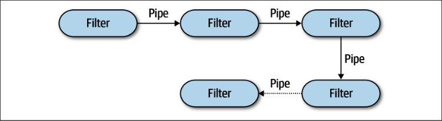
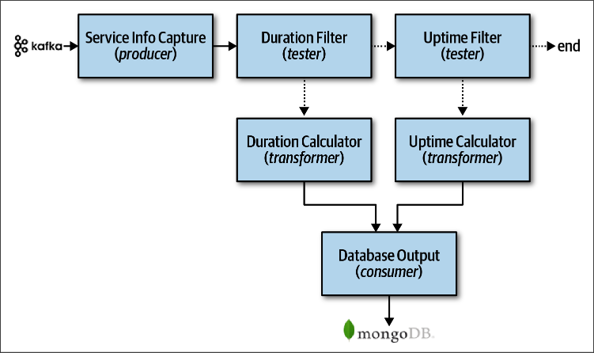

# Конвейерная архитектура

На английском называется Pipeline architecture, а на русском я точного названия не нашел, мелькнуло только где-то "конвейерная". Звучит адекватно, буду пользоваться, но иметь ввиду и оригинальное название.

Основной концепцией является пропускание исходных данных через цепочку *фильтров*.

Фильтры делятся на несколько типов:

* Производитель, или еще называется источник (Producer, Source)
* Тестировщик (Tester)
* Преобразователь (Transformer)
* Потребитель (Consumer)

Вот пример подобной архитектуры:

* Фильтр SIC умеет подключаться к кафке и брать из нее данные. Далее эти данные надо классифицировать и что-то с ними сделать на основе их природы. Классификацией занимаются фильры-тестировщики.
* SIC отдает данные первому тестировщику - DF. Если он "опознает" их, то передает связанному с ним преобразователю - DC. Если не опознает - передает следующему тестировщику - UF. Если он их тоже не опознал - данные никак не обрабатываются. Если опознал, то передает преобразователю UC.
* Попав в преобразователь, над данными производятся какие-то манипуляции и обработанные данные идут дальше. В данном случае - уже к конечному потребителю, коим является БД mongo.

То есть вся суть архитектуры сводится к тому, чтобы настроить некоторую цепочку преобразователей, а ветвление организовать с помощью тестировщиков.

Данная архитектура делит программные компоненты по техническому признаку, а не логическому.

TODO: Не понятно, что такое пайпы на схеме. Вероятно это не какие-то программные компоненты, а просто так обозначается, что данные уходят, например, по Http другому фильтру, или просто вызывается какой-то метод, если программа монолитная. В книге Марка Ричардса написано, что обычно конвейерная архитектура деплоится монолитно, но мне кажется, что это почти что идеальная схема для микросервисов. И поэтому мне опять же кажется, что КА это скорее дизайн паттерн, чем архитектурный.