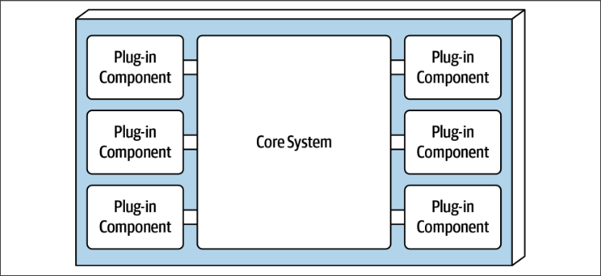
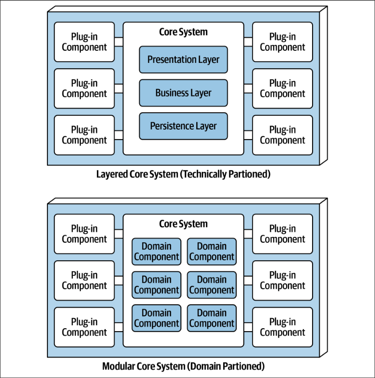
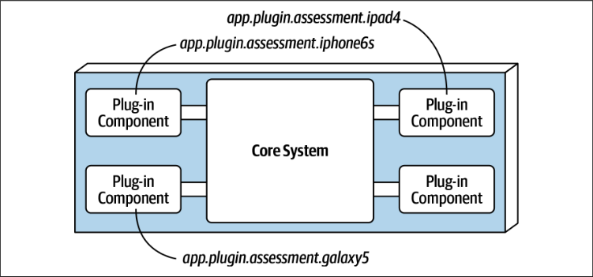

# Микроядерная архитектура

Английское название Microkernel architecture, или plug-in architecture.

Основная идея заключается в том, что есть базовая, кор-система, функциональность которой расширяется за счет подключения дополнительных систем ("плагинов").

Кор-система обязательно включает в себя функциональность по работе с плагинами, т.е. поиск, подключение\отключение, использование и т.д. При этом любая другая функциональность, "полезная", может как присутствовать, так и полностью отсутствовать.

Кор может быть реализован разными способами, например, с применением многослойной архитектуры, или через DDD-подход.

Плагины могут быть как отдельными файлами, "рядом" с кор-системой

так и отдельными сервисами

