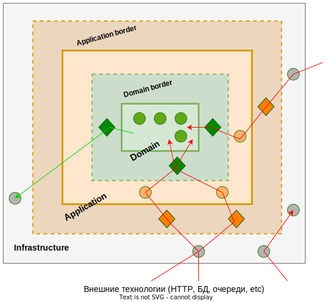

# Гексагональная архитектура

Термин “Гексагональная архитектура” ввел Алистер Кокберн (Dr. Alistair Cockburn). Её еще называют "Архитектура портов и адаптеров".

Все, что написано дальше, является попыткой сформулировать идею ГА на основе инфы, прочитанной в интернете. Причем с попыткой прилепить прочитанные факты в любом случае, даже если они уже кажутся какими-то лишними или странными. Оставляю их тут только ради истории, чтобы потом, если когда-нибудь прямо вот гарантированно узнаю, что же такое ГА, почитать и понять, где были ошибки. В общем, далее в основном просто ход размышлений. Итоговый вывод на данный момент, "без шелухи", я написал в разделе резюме.

## Слои

* Приложение делится на несколько слоев. Например, джентельменский набор: слой предметной области, слой приложения, слой инфраструктуры.

## Граница слоя

* В каждом слое есть "граница" (border), в которой располагаются:

  * Интерфейсы (и их реализации), обозначающие функциональность слоя, которую он способен предоставить другим слоям.
  * Интерфейсы, обозначающие функциональность, которая нужна самому слою для его работы, но реализацию которых он намерен получить от других слоев.

  Слои могут взаимодействовать только через границу.

* За "границей" находятся компоненты слоя, о которых другие слои ничего не знают и соответственно не могут с ними работать непосредственно. Этакая "приватная тусовка", реализующая ценную функциональность слоя.

## Схемы взаимодействия слоев

Типичные схемы взаимодействия слоев:

* Компонент может непосредственно работать с другими компонентами на том же слое.

  Например, и контроллер, и репозиторий относятся к инфраструктурному слою. Пусть в контроллер приходит запрос на выполнение максимально простой операции, которая сводится к извлечению данных, не требующих ни преобразования, ни использования никакой бизнес-логики. В этом случае контроллер может обратиться к репозиторию напрямую и отправить полученные данные клиенту. Такое вполне допустимо, когда при передаче какого-то запроса на другой слой обнаруживается, что этот слой не добавляет никакой логики обработки, а просто перекидывает запрос дальше и получается так называемый sinkhole-антипаттерн. В этих случаях допускается выкинуть из обработки "слой-посредник".

* Слой может непосредственно работать с любым граничащим слоем.

  Например, в контроллер (инфраструктурный слой) приходит запрос на перевод денег с одного счета на другой. С этим могут быть связаны дополнительные проверки - достаточно ли денег на балансе, не заблокированы ли счета и т.д. Одним словом, требуется сложная бизнес-логика. Тогда контроллер вызывает нужную команду с прикладного слоя, передавая ей все нужные данные. Прикладной слой, в свою очередь, создает все необходимые объекты предметной области и организует их совместную работу.

  Здесь мы видим такую схему взаимодействия слоев: `Инфраструктурный --> Прикладной --> Предметная область`. Обычно при движении "снаружи вовнутрь" перескоки через слой не практикуются, т.е. доступ `Инфраструктурный --> Предметная область` технически возможен, но логически неверен, потому что каждый слой-обертка как правило служит декоратором и определяет сценарии взаимодействия со слоем, который он оборачивает.

* Слой может непосредственно работать с любым внешним слоем.

  Например, если на уровне предметной области требуются данные из репозитория, можно напрямую воспользоваться реализацией репозитория с инфраструктурного слоя. Т.е. прыжок через слой в случае "изнутри наружу"  `Инфраструктурный <-- Предметная область` разрешен.

## Владелец интерфейса

Вот я выше написал эти три сценария взаимодействия слоев:

* Компонент может непосредственно работать с другими компонентами на том же слое.
* Слой может непосредственно работать с любым граничащим слоем.
* Слой может непосредственно работать с любым внешним слоем.

При этом написал, что перескок через слой в ситуации "снаружи вовнутрь" невозможен, а в ситуации "изнутри наружу" - нормально. По итогу, только после описания всех трех сценариев, собственный же пример про контроллер, который пользуется репозиторием напрямую, заставил меня задуматься, нет ли противоречий в этих правилах.

Где в данном случае должен находиться интерфейс репозитория?

Если на уровне домена, тогда первый пример, когда контроллер напрямую работает с репозиторием в обход прикладного уровня, является некорректным. Потому что в этом случае контроллер должен взять интерфейс репозитория из доменного уровня, т.е. как раз скакнуть снаружи вовнутрь, проигнорировав прикладной слой. А это нарушает правило "Слой может непосредственно работать с любым граничащим слоем". И здесь не важно, что реализация интерфейса репозитория находится в инфраструктуре вместе с контроллером, т.к. контроллер работает с реализацией через интерфейс.

Если же интерфейс репозитория тоже находится на уровне инфраструктуры, тогда получается, что домен зависит от инфраструктуры, что еще более абсурдно.

Вполне возможно, что интерфейс репозитория логично расположить на прикладном уровне. Тогда, с одной стороны, у домена не возникает зависимости от инфраструктуры, а с другой - контроллеру не приходится делать прыжок вовнутрь через прикладной уровень. К тому же стоит перечитать Эванса по части репозиториев. Может быть на уровне приложения они и должны находиться по науке. Зависимость домена от приложения я не считаю ошибкой, а почему - написал в отдельном разделе.

## Неразлучность домена и прикладного уровня

На данный момент по ощущениям домен и приложение можно рассматривать пусть не как единое целое, но как неразделимые вещи. Потому что без прикладного слоя домен, по сути, это просто набор деталей, которые надо как-то собрать вместе для решения задачи. Так что, грубо говоря, при переносе приложения из консольного в веб, перенести только домен - недостаточно. А вот вместе в прикладным слоем - то что надо. Если же сценарии использования тоже реализовывать в домене, например в виде сервисов, тогда как будто такое понятие как "прикладной слой" вообще перестает существовать.

UPD. 9.10.2023. Не совсем так. Перечитав конспект по сервисам, могу сказать следующее - прикладной слой - это клей между доменом и инфраструктурой. Всю логику, которая не ограничивается вызовом одной доменной команды на сущности или VO, а задействует последовательность вызова команд или даже несколько сущностей, нужно оформлять в доменном слое, а не в прикладном. Пример: отсылать sms-уведомления клиенту, если баланс снизился до заданного уровня. Операция проверки баланса и принятия решения, что нужно уведомление реализуется в домене. В прикладном слое идет опрос этой операции и если уведомление нужно, то на прикладном слое решается, как именно отправить уведомление (sms, почта, в зависимости от настроек), а также активируются конкретные инфраструктурные объекты, реализующие физическую отправку этих уведомлений.

Поэтому в принципе можно сказать, что домен и приложение не обязательно являются неразлучными, т.к. в приложении задействуются специфичные вещи, вроде чтения конфигов, использование конкретных объектов инфраструктуры. Хотя, если это все организовать через интерфейсы и DI, тогда возможно и прикладной слой можно будет перенести. В общем, точно только одно - доменный слой максимально независимый и самостоятельный, а прикладной - в зависимости от того как реализовать - может зависеть от инфраструктуры крепко, а может и не зависеть.

# Резюме

Если отбросить сомнительные вещи, то у меня получились такие выводы:

* Любая архитектура, в которой так или иначе упоминаются какие-то слои, это попытки обмазать какими-то дополнительными ограничениями \ объяснениями базовую идею  группировки \ разделения компонентов приложения на основе их логического назначения.

* Минимальный и он как будто же и достаточный набор слоев, это:

  * Доменный - классы, написанные нами, которые позволяют решить бизнес-задачу. Тот самый уникальный код, ради которого и пишется программа, который представляет ценность.

  * Прикладной - определяет, что может делать наша программа. Это код-менеджер, код-клей, который создает объекты домена и организует их совместную работу для выполнения задачи. Прикладной уровень заявляет: "Программа может выполнять задачи A, B, C". Когда ему поступает запрос "Выполни задачу A", он знает, что для этого ему нужно создать доменные объекты M, K, P, соединить их определенным образом и полученная схема позволит выполнить работу.

    UPD. Не совсем. Лучше такие сложные соединения реализовывать в домене, чтобы в прикладном слое ограничиваться максимально простыми вызовами к домену. Тогда доменная логика не будет просачиваться в приложение и домен будет проще переносить.

  * Инфраструктурный - фреймворки, библиотеки, пользовательский интерфейс, а также наш собственный код, написанный с непосредственным использованием этих вещей. Например, реализация уведомителя по sms на основе готовой библиотеки.

  Все слои кроме этих трех - опциональные и возможно надуманные.

* Прикладной слой является оболочкой домена, они неразлучны в пределах конкретной программы. Работать с доменом непосредственно никто кроме прикладного слоя не может. Если кому-то нужно выполнить бизнес-задачу, он обращается к прикладному слою.

* Каждый слой имеет приватную и публичную часть. Публичная называется "границей". На границе находятся:

  * Интерфейсы и их реализации, обозначающие функциональность слоя, которую он способен предоставить другим слоям. Также на границе слой задает понятные ему структуры данных. Клиенты обращаются к публичным компонентам с просьбой выполнить некоторую задачу, оформляют свои данные в понятные слою структуры, а эти публичные компоненты уже с помощью приватных компонентов задачу решают.
  * Интерфейсы, обозначающие функциональность, которая нужна самому слою для его работы, но реализацию которых он намерен получить от других слоев. Типичный пример - репозиторий. Программам требуется хранить наработанные данные. Прикладной слой может определить на своей границе интерфейс репозитория, а в инфраструктурном слое мы можем написать конкретную реализацию этого интерфейса, например, на основе Hibernate. И тогда наше приложение сможет сохранять данные в реляционной БД.
  
* В зависимости от того, как нарисовать слои, могут возникать разные предрассудки о правилах взаимодействия между ними. Например, можно нарисовать их в виде стека, друг над другом, как обычно делается при объяснении многослойной (Layered) архитектуры. А можно в виде вложенных друг в друга окружностей. Возникают разные вопросы, например, можно ли перескакивать через слой. Если нельзя, то что делать, если очень нужно?

  Привязывать правила взаимодействия к графическому изображению не стоит. Вы можете выстраивать взаимодействие между слоями так, как вам кажется целесообразным. Главное условие - налаживать взаимодействие через компоненты, обозначенные в границе слоя, и не затрагивать его приватную часть. Если в языке нормальные модификаторы видимости, соблюсти такое правило технически будет только проще.

* В качестве ориентира для организации функциональности прикладного слоя можно использовать концепцию `Команда > Шина команд > Обработчик команды`.

# Материалы

https://habr.com/ru/articles/267125/

