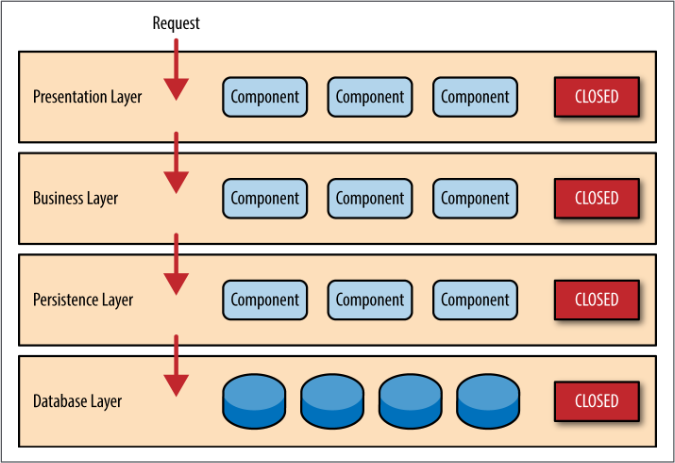
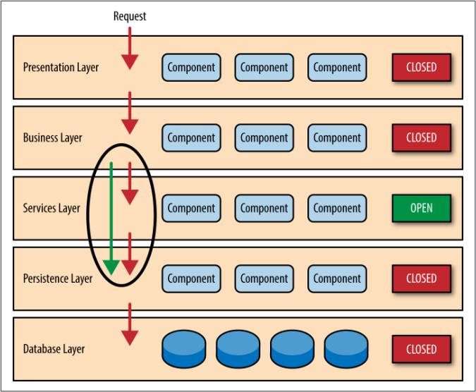
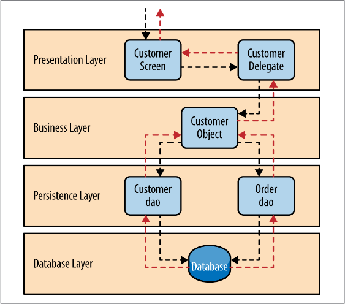
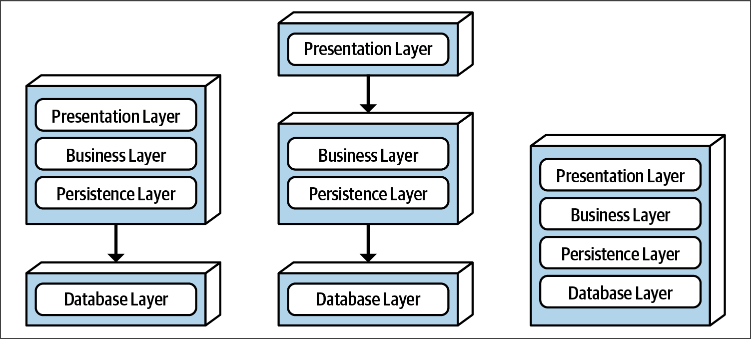

# Многоуровневая архитектура

## Краткая характеристика

Многоуровневая архитектура еще известна как:

* Слоистая архитектура
* N-tier архитектура

Основная цель - сгруппировать программные компоненты так, чтобы близкие по своему *техническому* назначению компоненты находились "рядом" друг с другом и не перемешивались с компонентами других групп. Полученные группы называются слоями (layers).

"Близкие по техническому назначению" означает, что компоненты группируются именно по своей технической роли - представление, бизнес-логика, логика хранения. Для многослойной архитектуры это характерная особенность. В ней компоненты, относящиеся к одному *логическому* блоку, например к работе с "Покупателем" или "Заказом", разносятся по разным слоям. В противовес этому существует DDD-стиль, где наоборот - компоненты группируются именно по логическому признаку, но это уже другая история.

TODO: Мне сейчас кажется, что "многоуровневость" больше похожа на дизайн-паттерн. Ибо что нам мешает взять DDD-стиль и в пределах домена нашлёпать слоев? Или например организовать многоуровневость в пределах микросервиса?

Нет ограничений на количество слоев, но одним из типичных является разбиение на 3 уровня:

* Уровень представления (Presentation layer)
* Уровень бизнес-логики (Business layer)
* Уровень хранения (Persistence layer)

## Открытые и закрытые слои

Все слои изначально считаются "закрытыми". Это значит, что компоненты на каждом слое могут обращаться только к компонентам ближайшего слоя ниже:

Если из этого правила нужно сделать исключение, то слой "открывают" и тогда компоненты могут пользоваться не только открытым слоем, но и слоем под ним:

Зеленая стрелка означает, компоненты BL могут пользоваться и компонентами SL, и компонентами PL.

Зачем может потребоваться открывать слой? Например, на BL у нас есть какие-нибудь вспомогательные компоненты, нужные бизнес-логике для ее работы. При этом мы не хотим, чтобы PresentationL имел к ним доступ. Поэтому мы создаем еще один слой, SL и переносим их туда. Однако появляется проблема - BL теряет прямой доступ к PL, потому что между ними оказывается наш новый слой SL. Этот нежелательный эффект мы устраняем за счет того, что делаем SL открытым.

Следует понимать, что все это логические концепции и для поддержания подобных ограничений может не быть языковых и платформенных средств.

## Обработка запроса, sinkhole антипаттерн

Обработка запроса заключается в последовательном прохождении через все слои. Каждый слой выполняет какую-то полезную работу над запросом.

* Здесь компонент CustomerScreen специализируется исключительно на форматировании данных, на приведении их в удобный для восприятия вид. Он не знает как эти данные достать.
* Поэтому он обращается к компоненту CustomerDelegate, который специализируется на том, что просто знает, что данные можно получить, выполнив обращение к CustomerObject.
* CustomerObject - это объект бизнес-логики. Часто бывает, что приложение не просто считывает данные из БД, а выполняет над ними какие-то расчеты. Эти расчеты - как раз и есть задача CustomerObject. Но чтобы получить исходные данные, над которыми эти расчеты можно выполнить, их нужно считать из БД.
* Поэтому CustomerObject обращается к компонентам CustomerDao и OrderDao, которые специализируются на работе с БД. Первый, например, на извлечении информации о покупателях, а второй - на извлечении информации о заказах.
* Слой БД это обычно просто сама СУБД, а не отдельный слой в нашей программе.
* CustomerDao и OrderDao извлекают данные и передают их CustomerObject.
* Он выполняет свои вычисления и отдает данные CustomerDelegate.
* А он, в свою очередь, отдает их CustomerScreen, который их форматирует, приводит в определенный вид, и возвращает тому, кто их запросил.

Таким образом, запрос проходит через все слои "туда и обратно".

Если оказывается, что слои в основном просто передают запрос дальше, не выполняя никаких полезных действий, то возникает так называемый sinkhole антипаттерн. Это значит, что либо есть лишние слои, либо функциональность неправильно разнесена по слоям. В примере выше такой антипаттерн получится, если выполнять на PersistenceL не только извлечение нужных данных, но и какие-нибудь вычисления, которые по-хорошему должны происходить на уровне бизнес-логики.

## Топология

Топология определяет, как слои деплоятся физически.

TODO: Надо бы как-то уточнить, что понимается под деплоем. Может быть это, грубо говоря, просто разбиение на разные .jar-файлы, которые потом вместе закидываются на сервер. А может быть это разные сервера или виртуальные машины. В общем, реальный деплой пока для меня загадка. Когда разберусь, дописать сюда.

