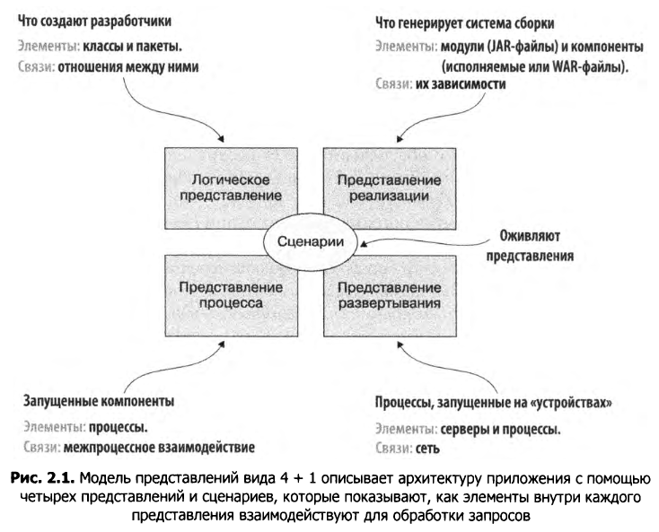
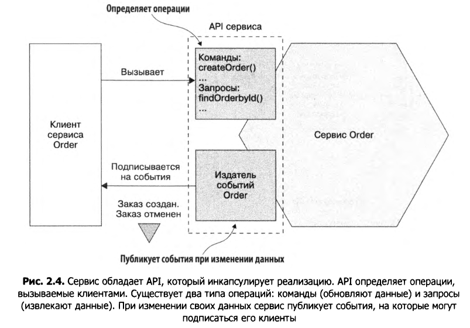

# Модель представлений архитектуры вида 4+1

Стр. 65

В общих чертах архитектуру можно описать с четырех сторон:

* Логическое представление - программные элементы, создаваемые разработчиками. В объектно-ориентированных языках это классы и пакеты. Связи между ними соответствуют отношениям между классами и пакетами, включая наследование, взаимосвязи и зависимости.
* Представление реализации - результат работы системы сборки. Это представление состоит из модулей, представляющих упакованный код, и компонентов, которые являются исполняемыми или развертываемыми единицами и содержат один или несколько модулей. В Java модуль имеет формат JAR, а компонентом
  обычно выступает WAR- или исполняемый JAR-файл. Связь между ними определяется зависимостями между модулями и тем, какие компоненты объединены в тот или иной модуль.
* Представление процесса - компоненты на этапе выполнения. Каждый элемент является процессом, а отношения между процессами представляют межпроцессное взаимодействие.
* Развертывание - то, как процессы распределяются по устройствам. Элементы в этом представлении состоят из серверов (физических или виртуальных) и процессов. Связи между серверами представляют сеть. Это представление также описывает отношение между процессами и устройствами.
* +1 сценарии. Каждый сценарий описывает, как различные архитектурные компоненты внутри конкретного представления взаимодействуют между собой, чтобы обработать запрос. Например, сценарий в логическом представлении демонстрирует взаимодействие классов. Аналогично сценарий в представлении процесса показывает совместную работу процессов.

TODO: ну здесь кроме первого пункта все остальное очень слабо понятно. Даже примерно трудно сообразить. Надо гуглить.

# Многоуровневая архитектура

Это концепция, суть которой - в распределении программных элементов по нескольким уровням (предположительно, как я понял, друг над другом). Каждый уровень имеет строго обозначенный набор обязанностей. Зависимость уровней друг от друга тоже строго определена и направлена, как я понял, сверху вниз, т.е. уровень сверху может зависеть либо от уровня непосредственно под собой, либо от любого уровня, расположенного ниже себя.

Частный случай МА - трехуровневая архитектура. С ее помощью можно выразить логическое представление архитектуры:

* Уровень представления — содержит код, реализующий пользовательский интерфейс или внешние API.
* Уровень бизнес-логики — содержит бизнес-логику.
* Уровень хранения данных — реализует логику взаимодействия с базой данных.

# Шестигранная архитектура

В центре - бизнес-логика с одним или несколькими портами. Порт - это набор операций, с помощью которых БЛ взаимодействует с окружающим миром - со своими зависимостями и с теми, кто сам от нее зависит. Выражается, например, с помощью интерфейса в языке программирования.

Порты бывают исходящие и входящие:

* Входящие - это интерфейс для компонентов, которые зависят от БЛ.
* Исходящие - это интерфейс, через который БЛ сама может с кем-то взаимодействовать.

Адаптеры - это реализации портов. Соответственно, порт могут реализовывать несколько адаптеров.

# Сервис

Сервис - это автономный, независимо развертываемый программный компонент, который реализует определенные полезные функции. У него есть API, через который сервис предоставляет доступ к своим функциям.

Существует два вида операций:

* Команды - выполняет действия и обновляет данные. Например, createOrder()
* Запросы - извлекает данные. Например findOrderById()

Особняком идут события: сервис, которые потребляются его клиентами. публикует события Например OrderCreated, OrderCancelled.

Каждый микросервис обладает собственной архитектурой и иногда отдельным
стеком технологий. Но обычно сервисы имеют шестигранную архитектуру. Их API
реализуются адаптерами, которые взаимодействуют с бизнес-логикой приложения.
Бизнес-логика вызывается адаптером операций, а события, которые она генерирует,
публикуются адаптером событий.

Представление реализации сервиса способно принимать множество форм. Компонент
может быть автономным процессом, веб-приложением/OSGI-пакетом, запущенным
в контейнере, или бессерверной облачной функцией. Однако сервис должен иметь
API и развертываться независимо — это основное требование.

# Некоторые утверждения

* Архитектура приложения - это его общая структура, состоящая из отдельных частей и зависимостей между ними. Архитектура приложения - это его декомпозиция на части (элементы) и связи между ними.
  * Архитектура имеет большое значение, потому что она определяет качественные атрибуты приложения, или его «-ости». Традиционно архитектура сосредоточена на таких аспектах, как:
    * Масштабируем-ость.
    * Надежн-ость.
    * Безопасн-ость.
* Ключевой идеей микросервисной архитектуры является функциональная декомпозиция.
* Сервисы организуются скорее вокруг бизнес-проблем, а не технических аспектов.
* Архитектура здания относится к определенному стилю: викторианскому, ар-деко и т. д. Каждый стиль  это набор проектировочных решений, определяющих отличительные признаки здания и строительные материалы.
  * Архитектурный стиль ПО определяет семейство подобных систем с точки зрения структурной организации. В частности, стиль определяет набор компонентов и коннекторов, которые можно применять в реализациях этого стиля, а также ряд правил, согласно которым они могут сочетаться.
  * Конкретный архитектурный стиль предоставляет ограниченную палитру элементов (компонентов) и связей (коннекторов), на основе которых вы можете описать представление архитектуры своего приложения.
* Требование, согласно которому сервисы должны быть слабо связанными и взаимодействовать только через API, исключает коммуникацию через базу данных. Постоянные данные сервиса должны восприниматься как поля класса и оставаться приватными.
* Отношение к общим библиотекам - Старайтесь применять библиотеки только для функций, изменение которых маловероятно. А функции, которые с большой вероятностью в дальнейшем будут меняться, можно оформить в виде отдельного сервиса.

# Просто некоторые фразы

* Коннекторы между сервисами реализуются с помощью механизма межпроцессного взаимодействия, такого как REST API или асинхронный обмен сообщениями.

# Некоторые термины

* Божественные классы (классы, которые используются в разных частях приложения и создают запутанные зависимости, препятствующие декомпозиции).
* Бессерверная облачная функция.
* Распределенный монолит - когда постоянно приходится менять свой сервис из-за изменений в других сервисах, из-за не достаточно слабой связанности.
* Пользовательские истории и сценарии использования.
* 

# Супервкратце

* Многоуровневая архитектура и шестигранная (гексагональная).

  TODO: Не очень понятно принципиальное отличие. Как по мне, это одно и то же. Суть в отделении бизнес-логики от зависимостей и внешнего мира с помощью интерфейсов. Мб загуглить.