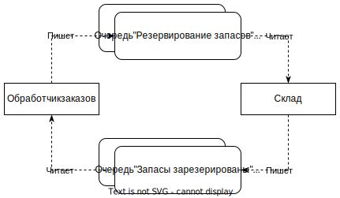

# Межпроцессные вызовы

Межпроцессный вызов - это когда компоненты системы взаимодействуют через сетевой вызов. Например, один мс дергает ручку другого. Внутрипроцессный - когда компоненты взаимодействуют внутри одного процесса на одном компьютере. Например, один объект вызывает метод другого.

Особенности межпроцессного вызова:

* Производительность межпроцессного вызова очевидно ниже. Для передачи данных необходимо их сериализовать, передать по сети, десериализовать, выделить память на стороне получателя. Для сравнения, во внутрипроцессном стиле передача заключается в простой передаче указателя на область памяти с данными. Это приводит к тому, что нужно лучше думать о структуре полезной нагрузки запроса, чтобы передавать минимальный объем необходимых данных.
* Изменение интерфейса при межпроцессном вызове дается сложнее. Т.к. провайдер и пользователь разворачиваются независимо, то при обратно несовместимых изменениях нужно одновременно разворачивать все затронутые мс или продумывать поэтапное внедрение нового интерфейса.
* Обработка ошибок при мп сложнее. Ошибки могут быть нерегулярными и сложнее понять, в чем именно ошибка. Поэтому сервис должен иметь богатый набор средств, чтобы максимально близко к сути излагать причины ошибок. В HTTP для этого есть много разных кодов ответа. Категории ошибок:
  * Пропуск - запрос отправлен, но ответ не получен.
  * Ошибка ответа - ответ получен, но он неправильный с точки зрения получателя. Например, отсутствуют нужные данные.
  * Сбой синхронизации - какое-то действие случилось раньше или позже относительно момента, когда оно должно было случиться.

# Блокирующий и неблокирующий вызов

## Блокирующий вызов

Блокирующий вызов концептуально представляет собой модель, когда поток, отправивший запрос, ожидает получения ответа и с этим ответом продолжает свою работу.

В этом случае можно сказать о так называемой "логической" блокировки сервиса. Сам сервис может продолжать обслуживать поступающие запросы "физически" за счет того, что каждый запрос обрабатывается новым потоком. Однако внутри каждого такого потока будет ожидание ответа от другого сервиса, и поток дальше не пойдет, пока не получит ответ. Т.е. можно сказать, что "логически" сервис блокируется.

Недостатки:

* Медленная работа - если второй сервис отвечает медленно, у него высокая нагрузка, то и первый сервис будет работать медленно.
* Возникает связь не просто между двумя мс, а между двумя конкретными экземплярами мс. Для запроса и ответа используется одно и то же сетевое соединение. Если первый сервис отвалился, пока ждал ответа, то ответ будет потерян и никакой другой экземпляр первого сервиса его обработать не сможет.

Этот метод плохо подходит, когда мс формируют длинную цепочку, например:

Нарушение в любом звене приводит к сбою всей операции. К тому же возрастает потребление ресурсов, потому что каждый мс вынужден держать открытое сетевое соединение.

## Неблокирующий вызов

Неблокирующий вызов концептуально представляет собой модель, когда поток, отправивший запрос, не занимается обработкой ответа, а значит ему не нужно ждать ответ вовсе.

# Стили взаимодействия микросервисов

Взаимодействие между разными мс может быть построено на разных стилях, это обычное дело.

## Связь через общие данные

Communication through common data. Основные характеристики шаблона:

* Есть общее хранилище - БД или файловая система, в которое одни мс данные записывают, а другие - считывают. Например, записывают строки в БД или кладут файлы в файловую систему.
* Обычно это хорошо работает, когда поток данных однонаправленный - т.е. когда отправитель только пишет, а получатель только читает. Если же и получатель должен что-то писать в общее хранилище, все может стать сильно сложнее. Например, изменение одной и той же строки в БД (какой-нибудь статус заказа), может привести к неконсистентности строки.
* Не очень подходит для систем, которые должны быстро реагировать на появление новых данных. Получатели обычно узнают о появлении новых данных для них путем периодического опроса \ сканирования хранилища, а это вносит задержку. Можно добавить механизм, чтобы отправитель после отправки данных заодно информировал получателя.
* За счет простых технологий шаблон подходит для реализации взаимодействия с древними системами. Потому что любая древность все равно как минимум умеет работать с файловой системой.
* Иногда не рассматривается как паттерн взаимодействия, потому что увидеть связь между сервисами весьма сложно.
* Примеры этого паттерна "Data lake" и "Data warehouse" TODO: погуглить отдельно про эти термины. При data lake мс загружают данные в общее хранилище в сыром виде, а получатели должны сами уметь трактовать эти данные. При data warehouse используется хранилище с фиксированной структурой и поставщики должны загружать данные в соответствующем виде.

## Запрос-ответ

Request-response. Запрос-ответ - это логический стиль организации взаимодействия сервисов. Он подразумевает, что один сервис делает запрос к другому и инициирует таким образом какое-то действие, а полученный ответ нужен первому сервису для продолжения работы. Технически можно сделать двумя способами:

* Блокирующим - отправка запроса и получение ответа происходит в одном и том же сетевом соединении. Все в целом так, как описано в разделе про блокирующий вызов. Из плюсов - отвечающему серверу не нужно ничего знать о запрашивающем.

* Неблокирующим - поток, отправляющий запрос, не занимается обработкой ответа и поэтому не ждет его.

  Поскольку обработкой ответа занимается вообще другой поток, никак не связанный с отправкой, то требуется ответ как-то связать с исходным запросом. Можно воспользоваться очередями и в нагрузку добавлять id. TODO: но вообще это отдельная тема.

  

## Событийное взаимодействие

Event-driven interaction. Основная идея в том, что сервис выпускает какое-то событие, а другие сервисы, увидев это событие, сами решают, какое действие им выполнить. Издатель события понятия не имеет о том, кто слушает его события и как на них реагирует, поэтому связь между сервисами получается слабая.

Сервис склад выпускает событие "Заказ упакован", на которое подписаны сервисы уведомлений и запасов. Уведомления, видя это событие, отправляют уведомление клиенту, что его заказ упакован, а склад уменьшает у себя количество запасов. В случае использования модели "запрос-ответ", в сервис склад пришлось бы добавлять логику, учитывающую на какие события надо слать уведомления, а на какие нет. При событийной модели такую логику можно разместить в сервисах уведомлений. Да и в целом сервисы становятся более самостоятельными, т.к. не приходится слать в них запросы явно и говорить что им делать.

Есть разница между терминами "Событие" и "Сообщение". Событие - это логическое понятие, некоторые данные, которые характеризуют факт, произошедший в системе. Сообщение же является техническим понятием, контейнером, через который событие передается в очередь сообщений. Т.о., событие упаковывается в сообщение, является его полезной нагрузкой. Точно так же можно передать запрос в сообщении, тогда получится асинхронная версия модели "запрос-ответ". С технической точки в обоих случаях все выглядит одинаково - второй сервис читает сообщение. Но с логической, в случае модели "запрос-ответ" сообщение содержит прямое указание, что должен сделать второй сервис, а в событийной модели он сам принимает решение, что делать, на основе типа события.

### Реализация

Реализовать событийное взаимодействие можно несколькими способами, среди прочих такие:

* Брокеры сообщений (RabbitMQ, Kafka).
* Через HTTP (спецификация Atom).

О них подробнее нужно гуглить отдельно.

Что касается организации состава событий, то здесь возможны несколько вариантов:

* Событие содержит только идентификатор чего-либо. Если подписчикам события требуется дополнительная информация, они запрашивают ее у сервиса-издателя события. Недостатки такого подхода:
  * Появляется дополнительная связь у подписчика с издателем.
  * Если многим подписчикам требуется дополнительная информация, то на издателя сыпется шквал этих дополнительных запросов, что замедляет его работу.
* Событие содержит всю информацию, которая может кому-то понадобиться. Недостатки:
  * Каждый подписчик получает все данные, даже если большая их часть ему не нужна. Это может негативно сказаться на приватности данных.
  * Любые однажды опубликованные данные накладывают на издателя обязанности, потому что если этими данными кто-то пользуется, то их нельзя просто взять и удалить из события.
  * Увеличивается объем сообщения. Хотя учитывая, что обычно это просто текст, вряд ли это вызовет серьезные технические проблемы.
* Разделить одно событие на несколько. Допустим, в одном событии публиковать id, а в других - дополнительную информацию. Тогда подписчик, увидев базовое событие, прочитает нужную ему дополнительную информацию из другой очереди, о которой знает только он, и не знают другие подписчики, которым эта информация не нужна. Недостатки:
  * Издатель может лечь, не успев опубликовать дополнительные события, и тогда подписчики не получат нужную им дополнительную информацию.

