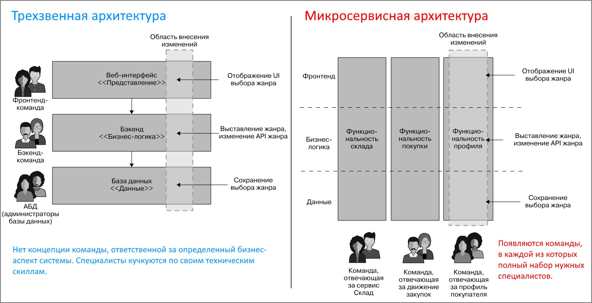

# Основные идеи микросервисов

## Понятие "микросервис"

Микросервисы - это архитектурный стиль, основная идея которого в том, что единая система строится из набора отдельных сервисов, которые взаимодействуют друг с другом (и с другими системами) по сети. По сути, это одна из форм модульной декомпозиции, в которой модули просто взаимодействуют по сети. Каждый сервис моделируется вокруг предметной подобласти. Например, предметная область (домен) - это онлайн-магазин. Её можно разделить на несколько предметных подобластей (субдомены) - складские запасы, управление заказами, доставка. Каждый субдомен реализуется в виде микросервиса, а их совместная работа формирует целую систему.

Разделение на микросервисы убирает необходимость для разработчиков разбираться во всей системе целиком, в каждом аспекте ее работы. Вместо этого каждая команда хорошо разбирается в конкретной части системы, что упрощает ввод новых сотрудников в курс дела.

Микросервисы являются наследником концепции сервис-ориентированной архитектуры (SOA), но при этом они более гибкие, потому что не зависят от конкретных технологий и каких-то специализированных протоколов, а используют обычный HTTP.

Каждый микросервис является полноценным срезом бизнес-функциональности, т.е. включает в себя полный набор нужных слоев (например, UI + прикладной слой + БД слой). Слоя UI может не быть, а могут быть дополнительные слои, но это уже детали.

## Независимость сервисов

Независимость сервисов друг от друга достигается благодаря многим особенностям проектирования, среди которых:

* Каждый сервис определяет интерфейс, через который остальные могут с ним взаимодействовать. Поэтому любые внутренние изменения для остальных участников не важны, пока интерфейс остается стабильным.

* Каждый сервис как правило имеет собственную базу данных, соответственно, любые изменения в ее структуре никак не влияют на другие сервисы. Например, изменения в БД сервиса "складские запасы" не влияет на сервис "управление заказами".

  Если какому-то сервису А требуются данные другого сервиса В, то А как и любой другой сторонний потребитель явным образом запрашивает их у В через его интерфейс.

Независимость сервисов позволяет поднять сколько угодно экземпляров каждого конкретного микросервиса в зависимости от потребностей. Например, может быть достаточно одного экземпляра "складских запасов", но "управления заказами" может потребоваться больше (пусть три экземпляра), потому что очень много людей делают заказы и один экземпляр сервиса с нагрузкой не справляется.

Когда добавление в систему новой функциональности выливается в необходимость вносить изменения в несколько сервисов сразу - это плохо, потому что снижает показатель независимости сервисов. Уже не удастся разворачивать каждый сервис независимо. Поэтому нужно минимизировать межсервисные изменения.

## Размер микросервисов

Несмотря на название, "микро" вовсе не означает максимальную миниатюрность сервиса. Размер может быть произвольным и не выражается в количестве строк кода или размере интерфейса. Бывает наоборот удобнее объединить несколько сервисов в один, вместо того чтобы разделять один большой на два поменьше. Например, если между сервисами слишком активное взаимодействие, то накладные расходы на обмен сообщениями могут быть высоки и в этом случае есть смысл объединить два сервиса в один.

Так что подходящий размер микросервиса формируется на основе многих факторов, один из которых - способность человека понять, уместить себе в голову микросервис целиком, хорошо понять как он работает.

## Группировка людей

Отличительной особенностью микросервисов является группировка команд разработчиков не исключительно по техническим навыкам (фронт, бэк, dba), а по бизнес-функциональности. Как видим, при микросервисах у нас внутри сервиса может быть та же самая трехзвенная архитектура, но появляются команды, каждая из которых ответственна за определенный бизнес-аспект системы и обладает полным набором специалистов:

Условный микросервис А не всегда имеет собственный UI, поэтому набор специалистов может отличаться.