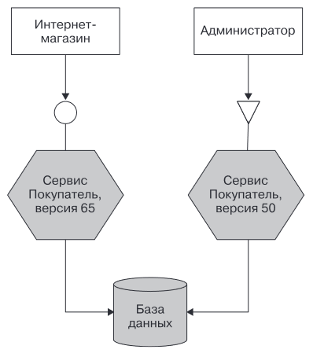
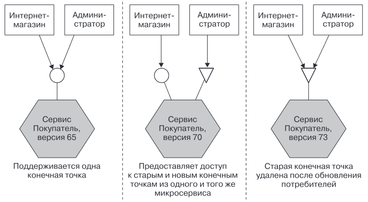

# Обработка изменений между микросервисами

Это вопрос о том, что делать, если изменяется контракт (интерфейс) между двумя сервисами. В целом, существует два пути:

* Избегать критических изменений.
* Управлять критическими изменениями, если они все же необходимы.

# Избегание критических изменений

Здесь несколько подходов.

## Наращивание изменений

Добавляем новые элементы, не удаляя старые. Например, добавляем поле в нагрузку.

TODO: правда, тут вопрос того, как поля обрабатываются. Если, например, это какая-нибудь автоматическая десериализация из JSON в конкретный класс, то добавление нового поля ведь тоже может ее сломать?

## Tolerant reader

"Будьте консервативны при отправке, и либеральны при чтении".

По возможности нужно избегать очень жесткой привязки клиентского кода к интерфейсу мс. Например, есть мс уведомлений, который отсылает клиентам сообщения, что заказ отправлен. Когда его просят об этом, то шлют ему id клиента. Он по этому id вытягивает из другого сервиса инфу о клиенте, которая включает в себя поля firstname, lastname, email, phone. Потом сервис уведомлений переделывают так, что телефон ему больше не нужен. Однако информационный сервис продолжает слать телефон. Так вот писать сервис уведомлений надо так, чтобы наличие этого телефона ничего не сломало. Грубо говоря, если он получил больше полей, чем ему нужно, то должен просто взять нужные и проигнорировать остальные.

Кроме того, если структура ответа информационного сервиса изменилась, то по возможности сервис уведомлений не должен из-за этого ломаться. Например, было:

```xml
<customer>
    <firstname>Tom</firstname>
    <lastname>Sawyer</lastname>
    <email>toms@sp.com</email>
</customer>
```

Стало:

```xml
<customer>
    <naming>
        <firstname>Tom</firstname>
        <lastname>Sawyer</lastname>
        <nickname>tom</nickname>
    </naming>
    <contacts>
        <email>toms@sp.com</email>
    </contacts>
</customer>
```

Все поля остались под своими именами, просто изменилась структура. Мс уведомлений все еще мог бы извлечь нужную информацию, вопрос только в том, как он написан.

## Подходящие технологии

Не все технологии одинаково легко работают с изменениями. Где-то изменения даются проще, где-то труднее. Ну здесь уже отдельно гуглить надо. Для примера, взято из книги как есть:

* Java RMI - плохо реагирует на изменения.
* gRPC Protocol buffers - поддерживает понятие номера поля. Каждая запись в формате Protocol buffers должна определять номер поля, который ищет клиентский код. Если добавляются новые поля, клиенту все равно.
* Avro позволяет отправлять схему вместе с полезной нагрузкой.

## Явный интерфейс

Не особо понятно, как это относится к теме "избегания" критических изменений, но суть в том, что гораздо лучше, когда мс явно обозначает свой интерфейс, чтобы потребители и разработчики понимали, что менять можно, а что нельзя. Когда ясно понятно, что вот этой ручкой кто-то пользуется, то нельзя просто взять и поменять.

TODO: хотя не особо понятно, как это выглядит. Любая ручка, как по мне, нужна для внешнего пользования. Соответственно, если ты меняешь любую ручку, то можешь кого-то сломать. И как тут поможет схема? Особенно в условиях слабой связанности сервисов, когда ты не знаешь, кто тобой пользуется.

В общем, технологии, упомянутые в разделе:

*  спецификация OpenAPI
* спецификация JSON Schema
* Avro
*  AsyncAPI (https://www.asyncapi.com), собравшая ряд известных пользователей, но набирающей наибольшую популярность будет CloudEvents (https://cloudevents.io) — спецификация, которая поддерживается фондом Cloud Native Computing Foundation (CNCF).

### Семантическое управление версиями

Это еще одна концепция, которая помогает сервисам понять, могут ли они пользоваться другим сервисом или нет. Каждая версия сервиса снабжается меткой формата Major.Minor.Patch. Это цифры, например, 1.3.0. Так что клиент может сперва запрашивать версию сервиса и по ней понимать, может он пользоваться или нет. Увеличение мажора означает появление обратнонесовместимых изменений. Увеличение же минора и патча говорит о том, что пользоваться можно.

# Управление критическими изменениями

Одно из преимуществ мс - это возможность независимого развертывания. При критических изменениях, которые ломают потребителей, независимость достигается двумя способами:

* Параллельная работа несовместимых версий мс.
* Эмуляция старого интерфейса.

## Параллельная работа несовместимых версий мс

Параллельная работа подразумевает, что мы запускаем новую версию мс, а старые продолжают работать. Соответственно, кто уже пользовался мсом, тот пользуется старыми версиями, а новые пользователи пользуются новой. Возникают дополнительные сложности:

* Необходимо вводить какую-то систему распределения запросов, чтобы она распределяла запросы на новую и старую версию мса.
* При исправлении багов необходимо править их в обоих версиях и необходимо разворачивать две версии.
* Поскольку обе версии пользуются одной БД, здесь тоже могут быть проблемы.



В итоге, использование параллельных версий не предполагает какую-то длительную работу, а подходит скорее как краткосрочная мера вплоть до нескольких минут.

## Эмуляция старого интерфейса

Идея этого подхода в том, что мы запускаем новую версию мс, в которой одновременно присутствует и старая версия ручки, и новая. Это дает нам возможность переписать клиентов, перевести их на новую ручку, а потом просто удалить старую, когда ею уже никто не пользуется.



Маршрутизацию на ту или иную версию можно делать по-разному, кто во что горазд. Например:

* При использовании HTTP можно помещать версию в заголовок или делать его частью URI.

