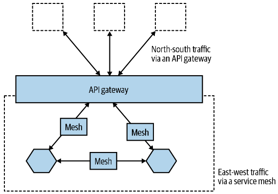
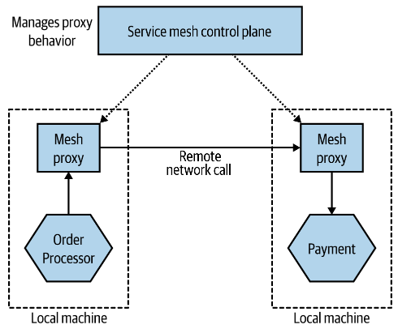

Встречается термин `reverse proxy`, погуглить что это.

# Service Meshes and API Gateways

## API Gateways

Тема связана с дата-центрами и потоками трафика в них. Трафик можно разделить условно на два типа:

* Север-юг (North-South) - трафик, входящий в дата-центр и выходящий из него.
* Восток-запад (East-west) - трафик, циркулирующий только внутри дата-центра.

API-шлюз формирует периметр вокруг внутреннего трафика. Он принимает внешние запросы.

Написано вот что:

> If you are using an API gateway or a service mesh to implement shared, common
> behavior for your microservices, it’s essential that this behavior is totally generic—in
> other words, that the behavior in the proxy bears no relation to any specific behavior
> of an individual microservice.

Т.е. вроде как API-шлюз не должен быть связан с каким-то определенным микросервисом. Он реализует совместно используемое поведение. Правда какие примеры такого поведения есть - хз. Надо гуглить.

Одним из вариантов использования API-шлюзов является выставление микросервисов наружу, например, если они работают в Kubernetes. Но для этого есть отдельные специализированные инструменты, например Ambassador.

## Service Meshes

Сервис меши нужны для вынесения из микросервисов функциональности, обычно одинаковой для всех сервисов. Например, common features implemented by service meshes include mutual TLS, correlation
IDs, service discovery and load balancing, and more.

При использовании микросервисной архитектуры у нас больше east-west трафика. Единственный north-south запрос, например, оформление заказа, может провоцировать множество east-west запросов. Поэтому, если мы выносим какую-то функциональность из мс в прослойку, то должны учитывать оверхед, который эта прослойка внесет в межсервисные вызовы. Сервис меши это учитывают.

Насколько я понял, сервис меш состоит из множества меш-проксей, каждая из которых находится на том же компьютере, что и микросервис. Т.е. один микросервис - один меш-прокси. Мс все вызовы посылает на меш-прокси, а она уже разбирается как-то, куда это послать. В общем, опять гуглить надо. Никаких технологий не упоминалось. Только мелькнул термин pod рядом с Kubernetes.