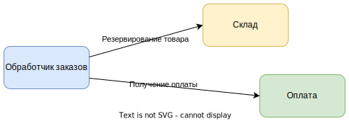
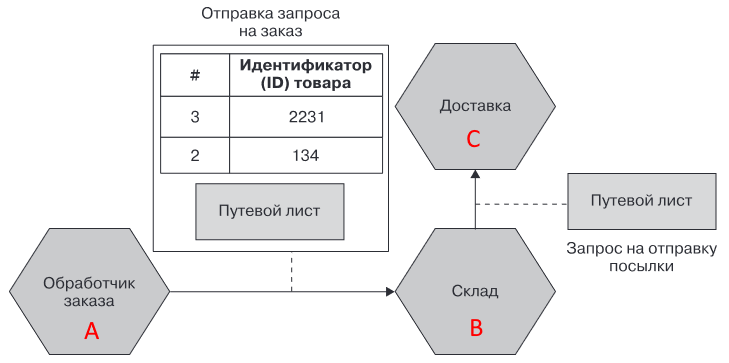
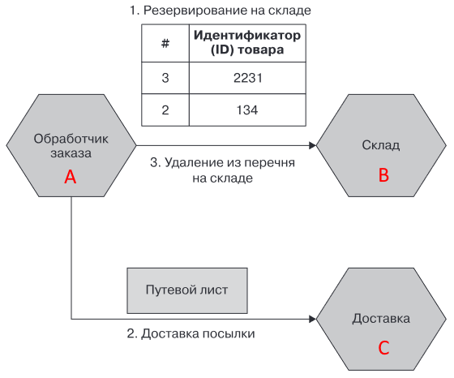
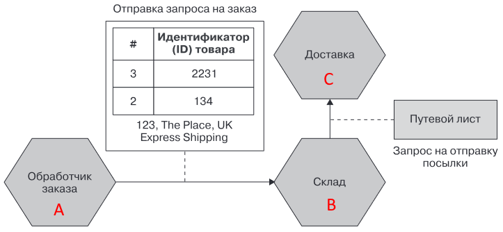
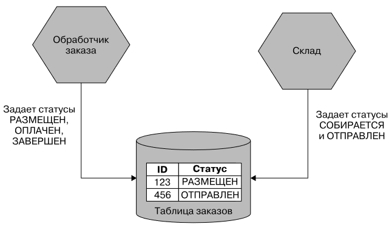
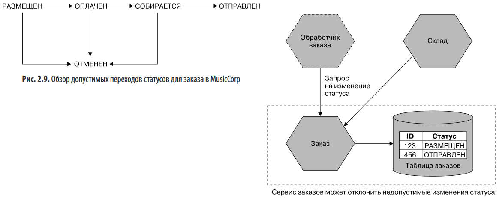
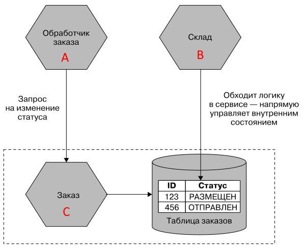

# Low coupling, high cohesion

Принцип "Low coupling, high cohesion" применим и к микросервисам (cohesion буду называть кохезией, а coupling - сцеплением). Высокая кохезия внутри каждого сервиса ведет к уменьшению параметра сцепления. Если связанная бизнес-функциональность находится в пределах одного сервиса, то необходимость внесения правок в эту функциональность затронет только этот сервис, а в другие никаких правок вносить не придется. Получается низкое сцепление сервисов. И наоборот, если границы проведены неудачно и связанная бизнес-функциональность оказалась размазанной по нескольким сервисам, то изменения такой функциональности приведут в необходимости внесения правок в несколько сервисов.

Кроме того, на низкое сцепление влияет стабильность интерфейса сервиса. Нужно ограничить взаимодействие сервисов минимально необходимым набором операций. Каждое обратно несовместимое изменение интерфейса приводит к необходимости править потребителей этого интерфейса. Поэтому, чем меньше причин взаимодействовать - тем меньше сцепление сервисов.

# Типы сцепления

От слабых ("хороших") до сильных ("плохих"):

```
Предметное (доменное) -> Сквозное -> Общее -> По содержимому
```

## Предметное

Предметное (доменное) сцепление (domain coupling) является неизбежным, поскольку система выполняет свои функции за счет взаимодействия отдельных сервисов друг с другом. Поэтому полностью избежать сцепления, очевидно, невозможно. Однако следует сокращать взаимодействие сервисов друг с другом до минимально возможного. Если один сервис общается с большим количеством других сервисов, вероятно в нем сосредоточено слишком много логики.



TODO: В книге упоминается еще временн*о*е сцепление. Это когда два сервиса должны быть подняты одновременно, потому что один не сможет выполнить свою работу без другого. На этом примере говорится, что между "Обработчиком заказов" и "Складом" есть временное сцепление, поскольку если склад не функционирует, то обработчик заказов не сможет завершить операцию резервирования. Но в таком случае, имхо, получается что временное сцепление есть между любыми взаимодействующими сервисами. Написано, что брокеры сообщений являются одним из способов избежать временного сцепления. При асинхронной модели общения обработчик заказов не "повисает" в ожидании ответа склада. С технической точки зрения конечно да, однако с логической ведь операция резервирования все равно не может завершиться, пока склад не сделает резерв.

## Сквозное

Сквозное сцепление (pass-through coupling) появляется, когда в цепочке `A -> B -> C` сервис А передает некоторые данные сервису В только потому, что эти данные нужны сервису С.

Пример: путевой лист формируется в А и передается в В, который с ним ничего не делает, а передает как есть в С. В содержит в себе логику резервирования, отправки заказа и обновления перечня товаров.



Слабость в том, что в случае изменения структуры путевого листа придется вносить изменения во все три сервиса.

Решение 1: передавать путевой лист из А в С напрямую, минуя В. Недостаток решения в том, что у А увеличивается показатель сцепления, потому что теперь он взаимодействует не с одним, а с двумя сервисами. Кроме того, усложняется его логика, т.к. он теперь вынужден взять на себя роль менеджера всего процесса - и попросить В зарезервировать, и попросить С отправить, и попросить В обновить запасы.



Решение 2: передавать из А в В не конкретный объект, нужный С, а просто данные, из которых этот объект можно собрать. Тогда сборкой объекта займется В и в случае изменения формата путевого листа придется править только два сервиса.



Решение 3: формировать путевой лист в А, но передавать его как неструктурированные данные, чтобы В не заморачивался над его содержимым, а передавал как есть.

TODO: об этом всем написано в Часть 1 Глава 2. В данном примере мне не понятно решение 2. Изменение состава путевого листа в "б*о*льшую" сторону (требуется больше данных о покупателе \ заказе) все равно приведет к тому, что придется править сервис А, чтобы он отсылал в В больше данных. Соответственно, какая разница, отправлять просто данные или этот самый путевой лист сразу? Все равно эти данные, из которых В будет собирать путевой лист, передаются в виде какого-то объекта, так почему бы сразу не назвать этот объект "Путевой лист" и передавать? И почему вообще склад или обработчик заказа должен формировать путевой лист? Если он нужен доставке, то можно просто отдать ей нужные данные, и пусть сама собирает этот лист как ей надо. Тут конечно сказывается недостаток информации о том как вообще это все работает, что собой представляет путевой лист, какая у него структура, зачем он нужен логически. Но даже если допустить, что ок, пусть этот лист формируется в обработчике заказа, то при возможности передать его как "черный ящик" в двоичном виде через В, решение 1 вообще бессмысленно. В общем, идея этого типа сцепления понятна, но подходы к решению сомнительные.

## Общее

Общее сцепление (common coupling) появляется, когда несколько сервисов используют общие данные (например, используют общую БД).

Проблема в том, что изменения в логике работы одного сервиса могут изменить данные так, что они станут некорректными с точки зрения другого сервиса или бизнес-процесса в целом. БД в данном случае не принадлежит никакому из сервисов, она может например крутиться в самостоятельном контейнере сама по себе, а сервисы могут тыкать ее непосредственно.



В данном случае ошибок можно избежать, если избавиться от общей БД, разрешив работать с ней только одному сервису. Этот сервис сможет принимать запросы от других сервисов на нужные им изменения в БД, анализировать их на корректность и выполнять или отклонять.



В книге двадцать раз было сказано, что мс строятся по принципу "у каждого мс своя БД", так зачем же вообще рассматривать случай с какой-то общей БД, если это не канонично?

## Сцепление по содержимому

Сцепление по содержимому (content coupling) возникает, когда какой-то сервис вносит изменения в БД другого сервиса напрямую. Т.е. не обращается к сервису с запросом на изменение, а берет и сам непосредственно что-то меняет в "чужой" БД.



Это может привести к ошибкам в данных из-за расхождения логики в B и C. Кроме того, если мс захочет изменить структуру БД, это может нарушить работу B.