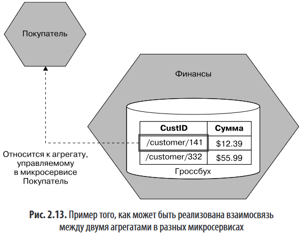
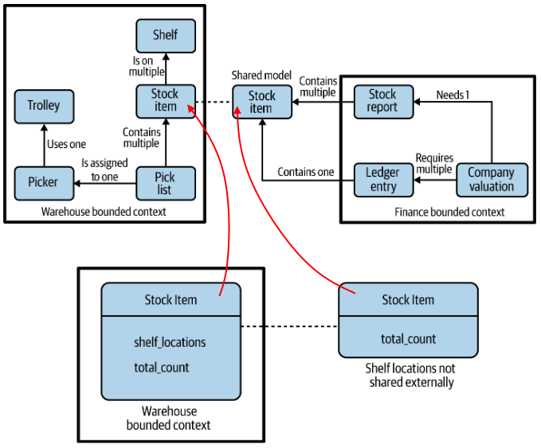
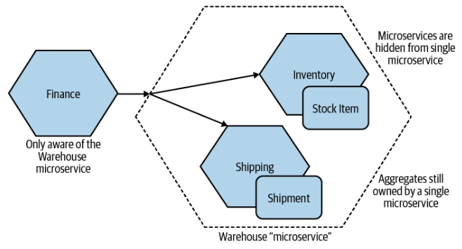

# Немного DDD понятий

Взяты из книги Сэма Ньюмана, поэтому отражают именно его понимание этих концепций. Может не совпадать с Эвансом и другими.

## Единый язык

В любой предметной области есть своя терминология. Моделируя предметную область в программе, мы учитываем эту терминологию и наши компоненты системы имеют не какие-то абстрактные названия, а мы стараемся выразить их через реальную терминологию. Это упрощает коммуникацию между программистами и экспертами.

## Агрегат

> Модель, всегда работавшая в моем представлении, предполагает рассмотрение агрегата в качестве понятия из реальной предметной области — подумайте о чем-то вроде заказа, инвойса, единицы хранения и т. д. Жизненный цикл агрегатов обычно связан с этими понятиями, что позволяет реализовать агрегат в виде конечного автомата.
>
> В целом агрегат - нечто имеющее состояние, идентичность, жизненный цикл, которыми можно управлять как частью системы, - обычно относится к концепциям реального мира.
>
> The aggregate is a self-contained state machine that focuses on a single domain concept in our system.

Больше похоже на определение сущности, если честно.

Интересный момент в книге про агрегаты только один - как сохранить связь между агрегатами, если они находятся в разных мс.

Предлагается не просто хранить какое-то число-идентификатор, но и каким-то образом указывать на сам мс, который этим агрегатом владеет. Например `soundcloud:tracks:123`.

## Ограниченный контекст

Насколько я понял по описанию из книги, ограниченный контекст (Bounded Context) это по сути субдомен. Он состоит из множества логически сгруппированных агрегатов и предоставляет интерфейс, через который "остальной мир" может с этим BC взаимодействовать. Часто бывает так, что BC соответствуют структуре самой компании.

Разделение домена на BC позволяет скрыть сложности отдельных подразделений, оставив возню с внутренними деталями только для сотрудников, которые непосредственно в этой области задействованы. А для всех остальных существует минималистичный доступный для понимания интерфейс для взаимодействия с этим BC.

Bounded context representing a collection of associated aggregates, with an explicit interface to the wider world.

В разных BC могут присутствовать одинаковые концепции. Например, концепция Stock item нужна и на складе, и в финансах. Правда, в несколько разном виде. Например, на складе нужно знать, на какой полке можно найти итем, а в финансах нужно просто знать общее количество итемов.

Насколько я понял, в каждом BC будет свой класс, приватное представление итема, для пользования внутри BC. Кроме того, будет еще публичное представление, которое склад будет возвращать через api, когда финансы запросят количество итема. Ну и в финансах тоже будет DTO, в которое развернется полученная от склада инфа, и на основе этого DTO уже сформируется итем приватного вида в финансах.

# Формирование сервисов по BC и агрегатам

Границы сервисов можно прокладывать как по BC, так и по агрегатам. Рекомендуется начать с небольшого количества сервисов, следовательно, первые сервисы формируем по BC. Затем, когда появилась уверенность, можно разделить эти сервисы на несколько уже по агрегатам (или по более мелким BC, которые удалось обнаружить внутри более крупного BC) Главное помнить правило, что один агрегат не должен быть размазан по нескольким сервисам. Сервис может состоять из нескольких агрегатов, но каждый агрегат обязательно целиком должен находиться внутри одного сервиса.

Разделение сервиса на несколько не обязательно должно быть известно остальному миру. Для мира все еще может существовать только один сервис - склад, который на самом деле уже представляет собой несколько сервисов. Сам сервис склада может принимать запросы от других сервисов и отправлять их сервисам Inventory и Shipping:

# Event storming

ES - это подход к созданию модели предметной области. Суть его в том, что все сотрудники, имеющие отношение к будущей системе, собираются вместе (технари, не технари, эксперты, пользователи) и начинают описывать систему простыми словами:

* Сначала они пытаются выделить *события* (domain events), например "Заказ размещен", "Оплата получена", т.е. определить, что вообще может происходить в системе.
* Потом они пытаются объяснить, какие действия пользователя (актора) приводят к этим событиям.
* Пытаются выделить агрегаты. Обычно это существительные, мелькающие в событиях. Например, "Заказ", "Оплата".
  * Группируют события и команды вокруг агрегатов.
* Распределяют агрегаты по ограниченным контекстам.

Важно чтобы на всех этих этапах имеющаяся на данный момент реализация (или другие технические детали) не влияли на процесс формирования модели.

# Почему DDD?

* BC хорошо изолируют связанную друг с другом функциональность системы. При удачно проведенных границах любые изменения в требованиях бизнеса будут сконцентрированы в небольшой области, и нам не придется вносить изменения по всей системе.
* Единый язык упрощает коммуникацию между разработчиками, экспертами и пользователями, а также определение эндпоинтов сервиса.