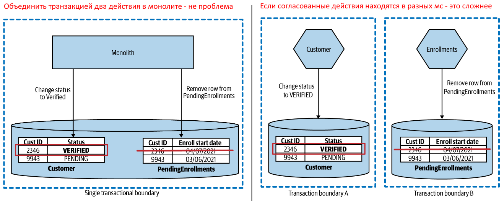
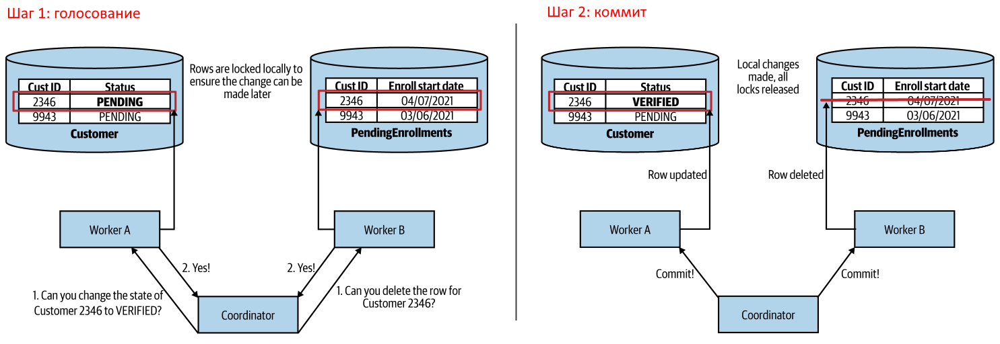

# Проблема согласованности в микросервисах

Реляционные СУБД реализуют ACID модель транзакций. Но нереляционные бывает и не реализуют, так что ACID - не единственный способ сохранить данные в консистентном виде.

Когда два действия, которые требуют согласованности друг с другом, нужно выполнить на разных БД в разных сервисах, мы теряем гарантию согласованности в том виде, в каком она присутствует в случае монолита.

# Распределенные транзакции, two-phase коммит

Two-phase commit (2PC) алгоритм - это попытка реализовать в распределенной системе "классическую" транзакцию.

Суть его в том, что появляется координатор транзакции. Сначала он посылает каждому участнику запрос вида "Можешь выполнить такое-то действие?". Если *все* участники подтверждают, что могут, тогда координатор шлет им второй запрос - "Выполняйте".

Когда участник подтверждает, что может выполнить действие, то блокирует данные, которые затрагивает транзакция, чтобы их никто не изменил до ее завершения.

Недостатки 2PC:

* Отсутствие требования изолированности из ACID. Это требование гласит, что пока транзакция полностью не завершится, мы не должны видеть частичных изменений данных. Здесь же мы их видим, потому что каждый участник после получения команды "Выполняйте" от координатора выполняет их независимо. Один уже выполнил, а другой только начал.
* Данные могут остаться в несогласованном состоянии, если один из участников отваливается на фазе коммита. Например, два участника подтвердили возможность выполнения, координатор послал команды "Выполняйте". Первый участник свою часть транзакции выполнил, а второй отвалился и запрос выполнения как бы завис в воздухе и в итоге вообще не выполнился. Данные остались частично измененными.
* Общая потенциальная медлительность системы приводит к тому, что данные блокируются на весьма длительные сроки, что делает систему еще медленнее.

В общем случае рекомендуется просто не пользоваться распределенными транзакциями. Если не умеете организовать согласованность иначе, то просто не надо разделять состояние, которое требует согласованных операций, по разным сервисам. Держите его в одном сервисе. Разделите, когда научитесь как.

# Саги

Сага - это алгоритм для координации множественных изменений над состоянием без необходимости блокировать данные на длительное время.

Идею саг впервые сформулировали Hector Garcia-Molina и Kenneth Salem в работе, посвященной наиболее эффективным путям обработки операций, названных `long lived transactions` (LLTs). Это транзакции, которые могут занимать часы или даже дни, и при этом подразумевают изменения данных.

Основная идея в том, чтобы разбить длинную транзакцию на последовательность коротких транзакций, которые можно выполнить независимо. Изначально саги использовались для обработки LLT, выполняемых на одной БД, но модель хорошо работает и в распределенных системах.

Сага целиком не дает нам атомарность из ACID, но атомарностью обладает каждая отдельная транзакция в саге.

В случае ошибки сага предлагает два действия:

* Backward recovery - предполагается, что мы составляем набор компенсирующих действий, которые позволяют нам "откатить" завершившиеся ранее в пределах саги транзакции. Фактически, имхо, наверное сделать еще одну транзакцию, просто с обратным эффектом.
* Forward recovery  - возможность продолжить выполнение с точки, где произошла ошибка. Т.е. попробовать выполнить действие, приведшее к ошибке, еще раз.

Стоит отметить, что ошибки здесь имеются ввиду именно бизнесовые, а не технические. Если ошибка возникает из-за того, что сервис не отвечает, то такие ситуации обрабатываются отдельно. Например, если у клиента не достаточно денег для оплаты заказа - это бизнес-ошибка. А если сервис оплаты не отвечает - это техническая.

Статья по ограничениям саг https://www.ufried.com/blog/limits_of_saga_pattern/