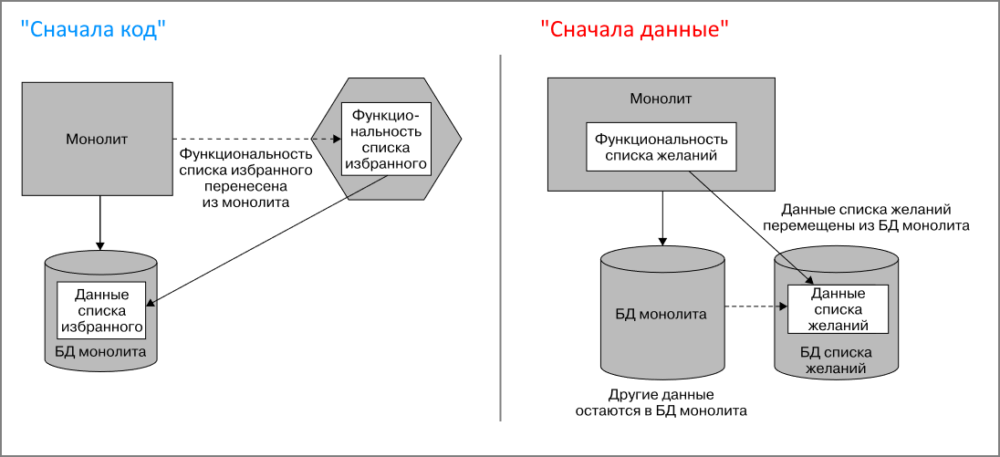
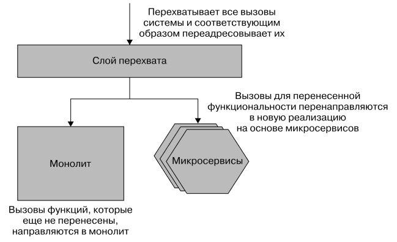
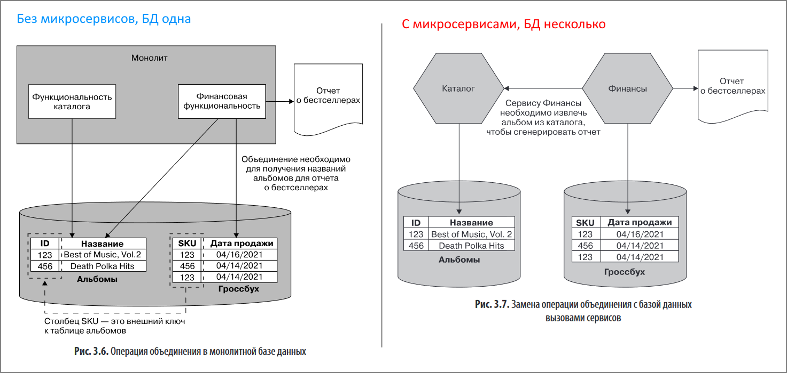
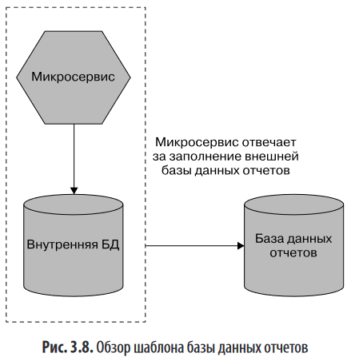

# Разделение монолита на части

При разделении монолита на части начать можно с выделения нескольких функций и реализации их в виде микросервисов. Основная часть системы остается монолитной, а какая-то небольшая становится мс. В первую очередь можно выделить функциональность, дающую узкое место в системе.

Не стоит увлекаться мс без четкого понимания предметной области и понимания границ субдоменов.

Выбор кандидата на извлечение в мс определяется балансом между двумя пунктами:

* Насколько просто извлечь компонент.
* Сколько пользы принесет извлечение.

Даже после извлечения в мс, функциональность может оставаться в монолите и продолжать работу. На этом факте строятся некоторые паттерны (например, parallel run или feature toggle).

# Способы разделения

В целом есть два способа выделения мс из монолита:

* Сначала код - выделяем функциональность в мс, а БД остается единственной. Монолит и получившийся мс пользуются одной БД.
* Сначала данные - выделяем из БД ту часть, которая нужна планируемому мс и формируем отдельную БД.

В любом случае сначала нужно изучить и код, и БД, чтобы понять, возможно ли извлечение обоих частей в принципе. Может оказаться, что извлечь код невозможно или очень сложно, тогда нет смысла возиться с БД. Если код извлечь легко, а с БД какие-то сложности, но нет смысла извлекать код, потому что микросервис без собственной БД может принести больше вреда, чем пользы.

Для успешного отделения части БД нужно, чтобы не было операций, которым нужна транзакция по обеим разделенным частям.

# Шаблоны

## Душитель

Strangler Fig Pattern - вводится дополнительный слой, который принимает все запросы и решает, куда их направить - в монолит или в новые мс. Монолит продолжает работать как работал, даже не подозревая, что стал частью новой системы. По мере выделения из него функциональности, монолит понемногу худеет.

## Параллельное выполнение

Parallel run - при поступлении запроса, его одновременно обрабатывают и монолит, и соответствующий мс, а затем результаты сравниваются. Подходит для наиболее критичной функциональности. Подробнее обещали в главе 8 рассказать об этом.

## Переключаемая функция

Feature toggle - добавляет возможность настройки, кто должен выполнить запрос - монолит или мс. Подробнее - в статье Пита Ходжсона (Pete Hodgson, "Feature Toggles (aka Feature Flags)").

# Проблемы декомпозиции данных

Т.е. проблемы, возникающие при разделении одной БД на несколько.

## Производительность

Падение производительности связано с тем, что join между таблицами переносится, грубо говоря, с уровня таблиц на уровень микросервисов. Т.е. раньше, когда БД была единая и нужная информация была распределена по нескольким таблицам, то суммарная информация добывалась путем простого соединения таблиц. Теперь же требуется сделать запрос к мс, владеющему той БД, в которой лежит недостающая информация, что очевидно медленее.

Если подобные операции выполняются редко, то медленное выполнение не является критичным. Если они выполняются часто, придется подумать над улучшением производительности. Например, выбирать данные из мс "Каталог" пачкой, либо кэшировать их, чтобы не приходилось обращаться к каталогу.

## Целостность данных

Когда данные лежат в одной БД, то целостность данных контролируется на уровне СУБД. Например, если мы продали какой-то товар и в таблице продаж есть внешний ключ на таблицу с товарами, то мы не можем из "Товаров" просто взять и удалить товар, потому что на него есть ссылки и СУБД не позволит это сделать.

Когда мы разделяем БД на несколько, то такая возможность пропадает и приходится искать альтернативные способы. Например, не проводить реальное удаление записи, а просто через дополнительное поле помечать ее как удаленную. Или копировать название товара в таблицу продаж при осуществлении продажи, но тогда нужно подумать как проводить синхронизацию названий в случае изменения названия товара в таблице товаров.

## Транзакции

При разделении БД на несколько, транзации тоже перестают работать. Распределенные транзации не дают таких же гарантий как обычные, поэтому в распределенных системах используются другие механизмы, например, "Саги" (подробнее обещано в главе 6).

## Инструменты для изменений БД

Для помощи в изменении схемы реляционной БД (версионирование) есть такие инструменты как Flyway (https://flywaydb.org) или Liquibase (https://www.liquibase.org).

## БД отчетов

БД каждого мс должна быть скрыта от внешнего мира. Она предназначена только для внутреннего пользования и любая информация из нее может быть добыта только путем обращения к эндпоинту мс.

Однако бывают случаи, когда удобнее организовать прямой доступ к БД (что это за случаи - толком не написано). Для таких ситуаций существует концепция "Отчетной БД".

Отчетная БД содержит только часть данных ("столбцов") из основной БД и ничего "лишнего". Она может сильно отличаться по структуре, может даже быть построена на другой технологии. За ее заполнение отвечает мс.

TODO: интересно, отчетная БД относится только к одному мс или в нее может поступать инфа из множества мс?