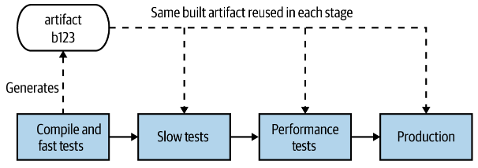

# Continuous Integration

CI (непрерывная интеграция) - это механизм, который позволяет при коммите кода автоматически выполнять различного рода проверки. Например, компилируется ли код, проходят ли тесты.

Примеры инструментов CI:

* Jenkins
* CircleCI
* Travis

Использование CI-инструментов не обязательно означает применение CI-практики. Она подразумевает:

* Интеграцию своего кода в основную ветку каждый день. Чем дольше вы не делаете такую интеграцию, тем сложнее будет ее выполнить впоследствии.
* Обязательное наличие тестов, которые проверяют код на логические ошибки.
* (не понял до конца что имеется ввиду - то ли невозможность интеграции, то ли успешная интеграция, которая все сломала) Вы не интегрируете последующие изменения, если обнаружили, что текущие изменения не интегрируются успешно.

# Модели ветвления

* feature branching - когда для каждой фичи создается отдельная ветка и работа ведется изолированно от других. Оказывается, это не идеальный подход, потому что он задерживает интеграцию. Вы интегрируете код, только когда завершили работу над фичей, и эта интеграция может быть сложной.
* trunk-based development - необходимо гуглить дополнительно. Как будто бы это модель, когда все коммитят в одну ветку, используя какие-то "feature flags", чтобы прятать незавершенную работу.

# Continuous Delivery

CD предполагает наличие пайплайна (pipeline), который включает в себя несколько шагов по проверке готовности артефакта к проду.

Артефакт - это например наш микросервис. Шаги - это например компиляция, пачка быстрых тестов, пачка медленных тестов, тестов на производительность. Если какой-либо шаг фейлится, то дальше пайплайн не идет. Т.о. можно избежать выполнения медленных тестов, если быстрые зафейлились.

Из книги не понятно на самом деле, в чем отличие CI от CD, но при этом сказано:

> I have seen many people try to hack and extend CI tools to make them do CD, often
> resulting in complex systems that are nowhere near as easy to use as tools that build
> in CD from the beginning.

Т.е. будто CI CD могут идти отдельно друг от друга.

Стоит еще отметить, кто CD не обязательно связано с деплоем. Т.е. успешно прошедший CD код может деплоиться вообще отдельно, хоть вручную.