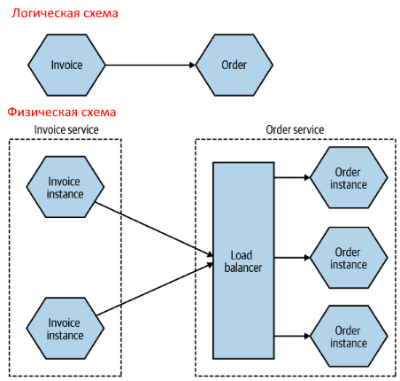
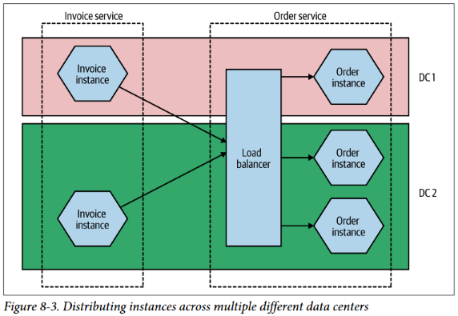
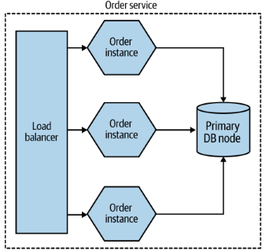
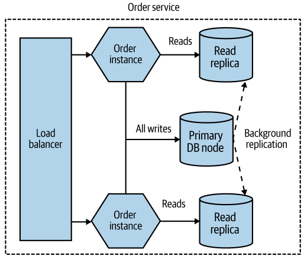
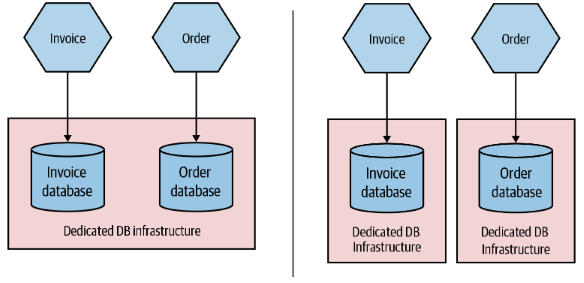
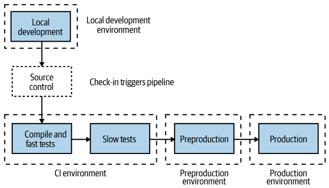

# Логическое и физическое развертывание

Когда речь идет о логической схеме взаимодействия мс, то техническая реализация не учитывается. Мы просто отражаем факт, что один мс взаимодействует с другим.

В физической схеме показывается реальная организация сервисов и зависит она от желаемых целей:

* Выдерживание высокой нагрузки - чтобы сервис справлялся лучше, потребуется несколько экземпляров.
* Надежность - чтобы сервис был более живучим, вероятно придется разместить экземпляры не просто на разных машинах, но и в разных дата-центрах.

P.S. Правда не очень понятно, где находится балансировщик нагрузки. На двух стульях сидит.

# База данных

Одну базу данных нельзя делить между двумя *разными* микросервисами. Однако когда речь идет о нескольких экземплярах одного мс, то все наоборот - все экземпляры должны использовать единую БД.

"Одна" база данных, опять же, не обязательно означает единственную физическую БД. Обычно создают систему из нескольких БД, часть из которых используются только для чтения, а одна - для записи. Например:

Все экземпляры мс пишут в одну реляционную БД. На фоне происходит репликация данных между этой БД и остальными, предназначенными только для чтения. И когда в сервис приходит запрос на чтение, он читает из соответствующей БД. Из-за особенностей работы реляционных БД их трудно масштабировать. А вот для чтения выбираются обычно не реляционные БД, которые легко масштабируются. Поэтому за счет того, что мы разгружаем главную БД от операций чтения, она в целом работает быстрее.

Несколько БД могут управляться как одной инфраструктурой, так и разными. Главное, чтобы БД были разделены логически.

# Окружение

Код проходит через несколько т.н. окружений. Например, продакшен - это наиболее полное окружение, включающее в себя все микросервисы, базы данных, балансировщики и т.д. Development - это минимальное окружение, например, ноутбук разработчика, где обычно невозможно развернуть полную систему. CI-окружение - это окружение частичное, где вместо некоторых сервисов могут быть заглушки. Одним словом, окружение - это пространство, в котором выполняется код.

asd

# Принципы деплоя

## Isolated execution

Изолированное выполнение. Означает, что каждый экземпляр микросервиса должен работать в отдельной среде. В современном мире эта среда обычно представляет собой контейнер.

Если представить, что все мс работают в одной среде, это приводит к нескольким проблемам:

* Становится трудно понять, кто грузит систему больше всего, потому что все сервисы пользуются ресурсами вместе.
* Если разные сервисы пользуются одной и той же зависимостью, но разными ее версиями, это становится трудно обеспечить.

## Focus on automation

Автоматизация. Означает, что все, что может быть выполнено автоматически, должно выполняться автоматически, а не вручную. Микросервисы устраняют некоторые проблемы, но привносят дополнительные сложности в область управления системой в целом. Пример вещей, которые могут выполняться автоматически:

* Поднять новый контейнер с экземпляром мс.
* Внести изменения в БД.

Автоматически имеется ввиду с помощью запуска скриптов, а не щелканья мышкой. При этом конечно сами скрипты вероятно придется запустить вручную.