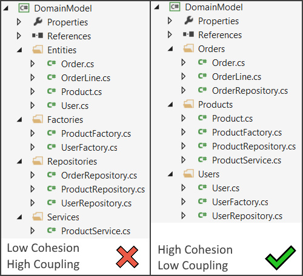
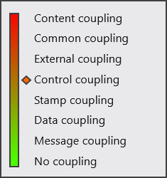
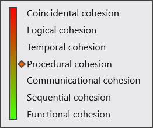
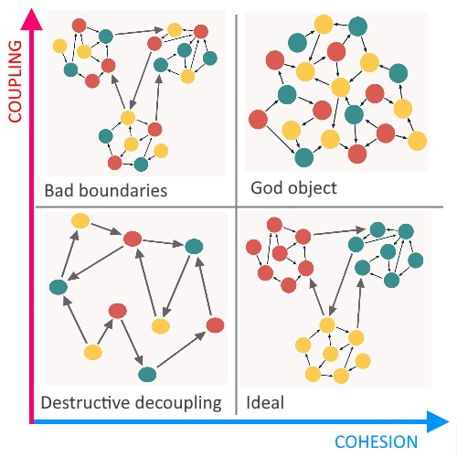

# Cohesion и coupling

## Правило

> Общее правило: *high cohesion, low copling*. 

Как запомнить: co**H**esion **H**igh, coup**L**ing **L**ow.

Термины желательно не переводить, потому что слишком много вариантов и некоторые из них очень созвучны (вроде cohesion-"связность", а coupling - "связАнность"). При этом слово связанность при объяснении удобно использовать как самостоятельное, без привязки к этим терминам.

## Значение терминов

В общих чертах, этим понятиям можно дать такую характеристику:

* Coupling - это мера, показывающая степень зависимости блоков друг от друга.
* Cohesion - это мера, показывающая, насколько элементы внутри блока логически связаны друг с другом для выполнения единой задачи.

Под блоком здесь можно понимать что угодно - метод, класс, пакет, модуль и т.д. Соответственное, если блок - это класс, тогда элементы блока - это методы класса. Если блок - пакет, то элементы - это классы, и т.д. Т.е. эти понятия масштабируются до любого уровня. И правило действует на всех уровнях.

Coupling: чем выше связанность между двумя блоками, тем больше вероятность что даже небольшие изменения в одном блоке могут привести к серьезным изменениям в другом блоке. И наоборот, чем связанность блоков меньше, тем меньше влияние изменений в одном блоке на другой блок. Поэтому нужно стремиться к low copling, т.е. низкой связанности между блоками.

Cohesion: чем выше логическая связь между элементами блока, тем меньше среди них лишнего "шума", тем лучше выражена цель блока, лучше соблюдается принцип единственной ответственности. Например, если в одном классе содержится и функциональность по извлечению данных из файла, и по их преобразованию в нужный формат, и по обработке получившихся структур, и по записи результата куда-то еще, то такой класс имеет низкий показатель cohesion. Это значит, что в нем намешано слишком много разной функциональности, непосредственно не связанной друг с другом. Потому что чтение данных из файла само по себе никак не связано с тем, какие вычисления потом будут проводиться над данными. А вычисления сами по себе не имеют отношения к тому, куда потом уйдут результаты. Понять назначение такого класса ощутимо сложнее, чем если бы вся эта функциональность была разнесена по разным классам. Аналогично, в пакете с коллекциями не лежат классы, отвечающие за ввод-вывод.

Два этих понятия неразделимы - если понижается cohesion, автоматически растет coupling, и наоборот - если cohesion повышается, то coupling падает.

## Пример на структуре проекта

Пример правила на уровне структуры проекта:



В вопросе cohesion и copling следует отталкиваться от логической связанности. В примере слева элементы сгруппированы по техническому признаку, а не логическому. Нет никакой логической связи между фабрикой товаров и фабрикой пользователей. Тот факт, что они оба являются фабриками - это технический факт. Поэтому cohesion внутри каждой группы низкий. А coupling между группами наоборот высокий, потому что например чтобы репозиторий пользователя из группы Repositories мог работать, ему нужен класс User из группы Entities. Следовательно, группа не может функционировать без другой группы.

В примере справа элементы сгруппированы по логическому признаку. В группе Product собраны все элементы, которые относятся к товару - и сам класс товара, и репозиторий, и фабрика, и какой-то товарный сервис. Получается высокий cohesion внутри группы и низкий coupling между группами, потому что каждая группа может функционировать самостоятельно, в отрыве от других. Конечно какая-то связь между ними будет присутствовать, например, внутри заказа может быть список товаров, а также пользователь, который его сделал. Но эта связь уже вызвана естественной логикой. К тому же при желании ее можно разорвать, если пользоваться не самими объектами User, Product, а их идентификаторами. Например, когда все три группы находятся в разных микросервисах.

Можно привести такую житейскую аналогию: в гостиницу приехали пять семей. В примере слева мы поселяем всех отцов в один номер, всех матерей в другую, всех сыновей в третью, всех дочерей в четвертую, и т.д. С точки зрения здравого смысла это абсурдно. В примере справа мы естественным образом поселяем каждую семью в отдельный номер и все семьи спокойно живут отдельно, а при необходимости могут иметь какие-то связи, например, вместе ходить на завтрак или экскурсии.

# Виды Coupling'а



Под *компонентом* далее понимается самостоятельная часть или набор частей, которые выполняют конкретную функцию системы.

Разделение на зависимостей по видам помогает оценить уровень зависимости более конкретно.

## Content coupling

> Компонент зависит от приватных элементов другого компонента.

Самый тяжелый вид зависимости. Например, если один класс напрямую использует \ модифицирует поля другого класса. Хотя в современных ООП-языках такая грязь решается на уровне синтаксиса, возможно в языках вроде C это решается только дисциплиной и пониманием, что есть в конкреткном случае является приватными элементами.

## Common coupling

> Компоненты используют глобальные элементы, которые могут меняться в процессе работы программы.

Использование глобальных данных желательно минимизировать и оставлять только для тех случаев, когда они не могут спровоцировать ошибки. Например, если глобальные данные - это какой-то конфиг, который не меняется, тогда это нормально.

## External coupling

> Несколько компонентов разделяют один и тот же элемент, который является внешним по отношению к системе, в которой находятся сами компоненты.

Например, необходимость использовать сторонний формат данных, интерфейс, инструмент.

## Control coupling

> Один компонент влияет на ход выполнения другого компонента посредством передачи ему данных.

Например, один компонент А передал другому компонету В некоторое число. В проверил это число на условие `arg < 10` и в зависимости от этого выполнил одно или другое действие. Таким образом переданные данные повлияли на ход выполнения компонента В.

## Stamp coupling и Data coupling

> Data coupling - компоненты разделяют данные, представляющие собой примитивное значение.

> Stamp coupling (она же data-structured coupling) - компоненты разделяют данные, представляющие собой не примитивное значение, а комплексное. Например, структура, запись, класс.

Под разделением предполагается передача друг другу этих данных в качестве параметров методов.

В [некоторых источниках](https://www.geeksforgeeks.org/module-coupling-and-its-types/) разделяют понятия Stamp coupling и Data-structured coupling. Первое определяют как просто обмен данными с помощью структуры, а второе как обмен с помощью структуры и при этом уточняется, что каждый компонент пользуется не всей структурой, а только какой-то ее частью.

## Message coupling

> Компонент вызывает метод другого компонента, не передавая ему никаких параметров.

Это самый меньший уровень зависимости. Здесь зависимость только от имени метода.

## No coupling

Ситуация, когда между модулями нет *прямой* (непосредственной) коммуникации. This is when two modules have no direct communication at all.

# Виды Cohesion'а



## Coincidential cohesion

> Компоненты сгруппированы в блок произвольно, можно сказать "случайно", не основываясь ни на каких принципах.

Например, какие-нибудь утилитарные классы, хелперы, в которых в кучу свалено все подряд.

## Logical cohesion

> Компоненты сгруппированы по техническому назначению.

Например, все репозитории в одной группе, все сущности - в другой, все контроллеры - в третьей. P.S. В разделе описания терминов я писал, что следует группировать элементы, исходя из их логической связи, но вот оказывается, что есть такой тип coupling'а, "логический". Название, по-моему, не очень. В общем, под логической связью выше имелась ввиду "доменно-логическая" связь, а не эта.

## Temporal cohesion

> Компоненты сгруппированы в зависимости от момента времени, когда они выполняются.

Например, все классы, которые работают в момент старта приложения, инициализации или завершения, в момент возникновения ошибки и т.д.

## Procedural cohesion

> Группировка компонентов, которые выполняются в определенном порядке, образуя некий процесс.

Например, какой-нибудь процесс оплаты товара может включать в себя проверку доступных средств, списание, еще-то что-нибудь, и отправку в конце уведомления о покупке. Как таковой связи между проверкой средств и отправкой уведомления нет и можно было бы уведомления поместить в отдельный блок, где были бы их разные виды (почта, смс и т.д.). Но тем не менее procedural cohesion уже считается имеющей право на существование.

## Communicational cohesion

> Компоненты группируются, потому что у них одинаковый вход \ выход.

Например, ввод - это корзина с товарами. И есть три компонента - для расчета скидки, налога и доставки.

## Sequential cohesion

> Компоненты сгруппированы, потому выход одного компонента служит входом другого.

Например, один компонент форматирует данные и передает другому на валидацию.

## Functional cohesion

> Компоненты сгруппированы, потому что их работа направлена на выполнение одной хорошо поставленной цели.

# Вопросы

HMM:

* Могут ли разные виды зависимостей перемешиваться и присутствовать одновременно? Например, если два компонента используют глобальную структуру и при этом один на основе данных из этой структуры ведет себя по-разному, что здесь как будто присутствуют разом stamp, common и control coupling.
* Описания на данный момент в основном взяты из книги Software architect’s handbook - Ingeno Joseph (2018), но в интернете встречаются, во-первых, отличающиеся от книжных трактовки, а во-вторых, список зависимостей состоит из большего количества. Так что похоже тема очень дискуссионная и по этой причине копаться в ней глубоко смысла нет. В общих чертах понятно и ладно.


# Материал

Сюда попали вещи, которые мне по итогу исследований кажутся сомнительными, но тем не менее были найдены на просторах интернета и обдуманы. Пусть лежит либо как пример заблуждений, либо как потенциальное напоминание, что рассмотренные темы неоднозначны и весьма дискуссионны.

## Пример control coupling

Что не нравится:

* Во-первых, это как минимум похоже еще и на Common coupling, т.к. два метода используют одну и ту же структуру данных (хотя не факт, если для common считаются только глобальные переменные); и на Stamp coupling, потому что разделяемые данные представлены структурой, а не примитивом.

```c
// Модуль 1: Система навигации
typedef struct {
    double altitude;
    double longitude;
    double latitude;
} NavigationData;

void calculateAltitude(NavigationData* navData) {
    navData->altitude = ...;
    navData->longitude = ...;
    navData->latitude = ...;
}
```

```c
// Модуль 2: Система управления полетом
void controlEngine(NavigationData* navData) {
    if (navData->altitude > 10000.0) {
        ...
    } else if (navData->altitude < 5000.0) {
        ...
    } else {
        ...
    }
}
```

```c
// Главная функция, демонстрирующая зависимость по данным
int main() {
    NavigationData navData;
    calculateAltitude(&navData);
    controlEngine(&navData);
    return 0;
}
```

## Data coupling и Control coupling

Определение согласно [DO-178C](https://en.wikipedia.org/wiki/DO-178C) (документ, согласно которому сертификационные органы Канады оценивают аэрокосмическое ПО):

> Компонент имеет зависимость вида **data coupling**, если он зависит от данных, которые не находятся под его эксклюзивным управлением.

> Компонент имеет зависимость вида **control coupling**, если на его выполнение влияет другой компонент.

Например, модуль А считал значение температуры датчиков и сохранил их куда-то как есть. Пусть считанные значения - просто какие-то специфичные числа, а не непосредственно градусы. Модуль В забрал эти данные, обработал (например, перевел эти абстрактные технические значения в градусы Цельсия, Кельвины и Фаренгейты) и тоже сохранил куда-то. Модуль С прочитал значения градусов, проанализировал, и на их основе засветил лампочки прибора зеленым, желтым или красным цветом.

Между модулями А и В, В и С есть зависимость по данным, а между В и С есть еще зависимость по управлению, потому что модуль С меняет свое поведение в зависимости от того, какие данные подготовил модуль В (например, температура < 0 считается нормальной и лампочка горит зеленым, если 0 - 20, то желтым, а > 20 то красным). Между А и С нет никакой зависимости, потому что они используют разные данные и напрямую не взаимодействуют.

TODO: эти определения я вывел сам, исходя из нескольких прочитанных источников. Замечу, что поциенты путались в показаниях, поэтому пришлось додумывать самому, так что за 100% корректность не ручаюсь. Но как стартовая точка пойдет.

UPD: Альтернативное мнение (из книги Software architect’s handbook - Ingeno Joseph (2018)): data coupling это про связь модулей только через примитивные данные. Когда один модуль вызывает метод другого модуля, то он передает в метод какие-то параметры и получает результат. В этом случае говорят про data coupling.


## Взаимосвязь coupling и cohesion

TODO: инфа сомнительная. Я не уверен, что одновременно оба параметра могут быть высокими. Они как будто бы взаимоисключающие. Но пока оставлю этот кусок здесь, до выяснения обстоятельств.

Полностью развязать блоки невозможно, ведь общая задача решается через взаимодействие блоков друг с другом. Но зависимости нужно сводить к минимуму, оставляя только необходимые и избавляясь от лишних. Лишние зависимости в примере с организацией классов порождала, например, сама организация файлов. Мы от нее избавились, и у нас осталась естественная логическая связь между "папками". Так что хороший вариант итогового дизайна подразумевает адекватный компромисс.

Комбинации кохезии и коплинга можно представить такой диаграммой:



Круги - это элементы кода, а цвет - их потенциальные блоки.

* Ideal - все элементы логически верно распределены по блокам. Они тесно взаимодействуют друг с другом внутри своих блоков, а связи между блоками минимизированы. Нет элементов, которые почти не используются и как бы "оторваны" от общей массы, выглядят "лишними", "не на своем месте". Это показатель того, что блок написан хорошо, качественно, в нем нет ничего логически лишнего.
* God object - все элементы свалены в единый блок и хаотично взаимодействуют друг с другом. Разбираться в этом сложно, вносить изменения - тоже. Если разнести элементы по разным блокам, то общий дизайн от этого сильно выиграет.
* Destructive decoupling - диаметральная противоположность God object'у. В погоне за low coupling элементы вообще перестают образовывать логические блоки и программа становится набором отдельных разрозненных функций, взаимосвязь которых понять ничуть не проще, чем в случае с God object.
* Bad boundaries - блоки есть, но элементы в них подобраны не особо удачно. В итоге появляются лишние связи между блоками и само такое разбиение не способствует формированию реальной картины взаимодействия. P.S. Хотя на рисунке все выглядит прилично, но по сути каждый кружок одного цвета, но в разных блоках, может рассматривать как дополнительную связь между блоками.