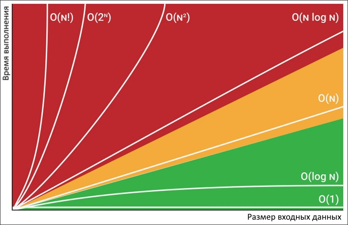

# Концепция Big O

Концепция Big O показывает взаимосвязь между количеством данных и количеством шагов, которые нужны для их обработки.

Под "временем выполнения" подразумевается как раз это количество шагов, т.к. непосредственно время, например, в миллисекундах, зависит от конкретного устройства, на котором работает программа. На быстром устройстве она может выполниться за 100мс, а на медленном за 2сек. Но количество шагов в обоих случаях будет одинаковым.

Big O показывает максимальное количество шагов, которое может потребоваться. Так сказать, в худшем случае.

Кроме time complexity есть еще space complexity, аналогичная метрика для памяти.

