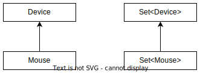

# Предисловие

Термины ковариантность, контрвариантность и инвариантность относятся к производным типам. Производные типы - это не потомки, а, например, дженерики. Кроме дженериков примеров я не знаю, но и этого вполне достаточно.


`Set<Parent>` является производным типом от `Parent`, а `Set<Child>` - производным от `Child`. Объяснения формулировок, названия типов и примеры для объяснений следует воспринимать в отрыве от конкретного языка и компилятора.

# Формулировки

* Совместимость присваивания (*assignment compatibility*, Эрик Липперт) - когда потомка можно присвоить переменной родителя. Например:

  ```java
  Child c = new Child();
  Parent p = c;
  ```

* Вариантность - сохранение совместимости присваивания у производных типов.

  * ***Ко***вариантность - сохранение совместимости так же, как у оригинальных типов.
  * ***Контра***вариантность - сохранение совместимости в обратном порядке относительно оригинальных типов.

* Инвариантность - отсутствие совместимости присваивания у производных типов.

Вариантность нужна для того, чтобы и в производных типах можно было пользоваться преимуществами полиморфизма.

Чтобы не сломать голову, важно думать о вариантности именно в контексте производных типов.

# Объяснения

Классы на псевдоязыке:

```java
class Device {
    private String name;

    public Device(String name) {
        this.name = name;
    }

    public void plug() {
        System.out.println("Устройство " + name + "подклчено.");
    }
}
```

```java
class Mouse extends Device {
    public Mouse(String name) {
        super(name);
    }

    public void scroll() {
        System.out.println("Крутим колесико мыши.");
    }
}
```

## Ковариантность

> Типичный сценарий: "Вы можете работать с мышью как с устройством, и можете работать с набором мышей как с набором устройств."



Совместимость присваивания между производными типами выглядит так же, как между оригинальными:

```java
Device d = Mouse;  // Совместимость оригинальных типов
Set<Device> sd = Set<Mouse>;  // Совместимость производных типов такая же
```

Пример:

```java
void koDemo(Set<Device> devices) {
    devices.forEach(d -> d.plug);
}
...
var mice = new Set<Mouse>;
koDemo(mice);
```

Если мы можем работать с одним потомком как с родителем, то значит должны иметь возможность работать и с коллекцией потомков как с коллекцией родителей. В том смысле, что мы должны иметь возможность передать коллекцию мышей в метод, который ожидает коллекцию устройств, и работать там с каждой мышкой из коллекции как с устройством.

## Контравариантность

> Типичный сценарий: "Вы можете работать с мышью как с устройством, но не можете работать с устройством, как с мышью, потому что оно может быть не мышью, а чем-то еще". Например, и мышь, и клавиатуру, и наушники вы можете *подключить* к компьютеру, потому что все они являются устройствами. Но кликнуть наушники или послушать мышь вы не можете.


Совместимость присваивания между производными типами направлена в обратную сторону:

```java
Device d = Mouse;  // Совместимость оригинальных типов
Action<Mouse> am = Action<Device>;  // Совместимость производных типов - "инвертирована"
```

Пример:

```java
void kovarDemo(Action<Mouse> mfunc) {
    var mouse = new Mouse("Logitech");
    mfunc.invoke(mouse);  // Вызываем на мышке метод plug. Он у нее есть, все в порядке.
}

Action<Device> func = d -> d.plug();
kovarDemo(func);
```

Если мы можем выполнить какую-то функцию над устройством, значит эта же функция должна работать над мышью, потому что мышь тоже является устройством. Соответственно, если метод принимает функцию, рассчитанную на мышь, то обязан также принимать функцию, рассчитанную на устройство.

Однако передать "мышиную функцию" на место "девайсовой функции" нельзя, потому что она может вызвать мышиную функциональность, которой у устройства нет:

```java
// Невозможно
void kovarWrongDemo(Action<Device> dfunc) {
    var device = new Device("Plug'n'play device");
    dfunc.invoke(device);  // Попытка вызвать на Device метод scroll, которого у него нет.
}

Action<Mouse> func = m -> m.scroll();
kovarWrongDemo(func);
```

TODO: Приделать сюда примеры на нормальной джаве, а не только на псевдоязыке. Тут понадобится знания вайлдкардов, так что вернуться к этому можно при добивании дженериков. UPD. Приделывать сюда примеры на джаве с вайлдкардами как раз не стоит. В текущем конспекте следует придерживаться псевдоязыка, чтобы не отвлекаться от сути какими-то синтаксическими особенностями.

# Выводы

Вывод личный, сделан на основе текущего понимания. За 100% правильность не ручаюсь.

И ковариантность, и контравариантность направлены на разрешение в производных типах работать с потомком как с родителем и предотвращение возможности работать с родителем как с потомком.

# Использованная литература

```
https://habr.com/ru/articles/218753/
```

