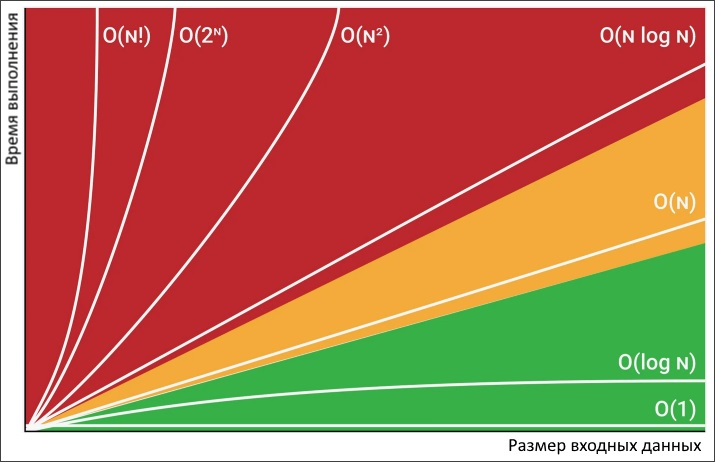

# Термины

* Асимптота - это прямая, к которой стремится кривая, но никогда ее не касается. Применительно к алгоритмам асимптоматическая сложность означает, что входные данные стремятся к бесконечности.


# Сложность алгоритмов

## Big O

Концепция Big O показывает взаимосвязь между количеством данных и количеством шагов, которые нужны для их обработки.

Под "временем выполнения" подразумевается как раз это количество шагов, т.к. непосредственно время, например, в миллисекундах, зависит от конкретного устройства, на котором работает программа. На быстром устройстве она может выполниться за 100мс, а на медленном за 2сек. Но количество шагов в обоих случаях будет одинаковым.

Big O показывает максимальное количество шагов, которое может потребоваться. Так сказать, в худшем случае.

Кроме time complexity есть еще space complexity, аналогичная метрика для памяти.



## $O(1)$ константная

Время выполнения не зависит от количества данных.

Примеры:

- Извлечение элемента из массива:

  ```java
  int[] arr = { 1, 6, 3, 4 };
  int item = arr[2];  // <-- O(1)
  ```


## $O(log_2n)$ логарифмическая

Связана с бинарным поиском, поэтому основание логарифма всегда 2. Это алгоритмы, где на каждой итерации обрабатывается только половина элементов от предыдущей итерации.


## $O(n)$ линейная

Время выполнения равномерно увеличивается при увеличении количества элементов.

Примеры: 

* Обход любой коллекции.

```java
private static void n() {
    int[] arr = { 1, 6, 3, 4 };
    int sum = 0;
    int steps = 0;

    for (int i = 0; i < arr.length; i++) {  // <-- O(n)
        sum += arr[i];
        steps++;
    }

    System.out.println("Элементов:" + arr.length);
    System.out.println("Шагов:" + steps);
}

// Вывод
Элементов:4
Шагов:4
```


## $O(n * log_n)$ линейно-логарифмическая


## $O(n^2)$ квадратическая

Частный случай *полиномиальной* сложности $n^m$. В квадратичной время выполнения увеличивается вдвойне по отношению к количеству элементов. Пример - вложенный цикл по той же самой коллекции.


## $O(2^n)$ экспоненциальная


## $O(n!)$ факториальная


# Дополнения

## "Отбрасывание констант"

Возьмем два примера поиска минимального и максимального значения в каком-то массиве `arr`:

```java
private void minmax(int[] arr) {    
    int min = Integer.MAX_VALUE;
    int max = Integer.MIN_VALUE;
    for (int x : arr) {
        if (x < min) min = x;
        if (x > max) max = x;
    }
    System.out.println(String.format("min: %d, max: %d", min, max));
}
```

Второй пример:

```java
private void minmax(int[] arr {  
    int min = arr[0];
    int max = arr[0];
    for (int x : arr) {
        if (x < min) min = x;
    }
    for (int x : arr) {
        if (x > max) max = x;
    }
    System.out.println(String.format("min: %d, max: %d", min, max));
}
```

Первый пример фактически работает быстрее, потому что в нем всего один цикл. Его сложность $O(n)$. Сложность второго примера по идее должна быть $O(2n)$, потому что один и тот же массив обходится два раза. Однако его можно было бы обойти и три раза, и четыре, и пять, и сколько угодно. Главное, что эти обходы не вложены друг в друга. Поэтому на самом деле с точки зрения Big O сложность функции `minmax` в обоих примерах одинаковая - $O(n)$, потому что под $n$ подразумевается бесконечное число элементов, стало быть $2n$, $3n$, $4n$ это все одно и то же, потому что бесконечность, умноженная на любое число, это все равно бесконечность.

## "Плюс и умножение"

В описании сложности можно встретить знаки `+` и `*`, которые отражают взаимосвязь между элементами алгоритма, например, циклами.

Плюс описывает независимые друг от друга операции, а умножение - зависимые. Плюс - это например два последовательных цикла, а умножение - когда один вложен в другой:

```java
private static void plus() {
    int[] arr1 = { 3, 1, 8 };  // Размер массива 3
    int[] arr2 = { 4, 10, 2, 1 };  // Размер массива 4
    int min = arr1[0];

    int steps = 0;

    for (int i: arr1) {  // Два независимых цикла
        if (min > i) min = i;
        steps++;
    }
    for (int i: arr2) {
        if (min > i) min = i;
        steps++;
    }

    System.out.println("min: " + min);
    System.out.println("steps: " + steps);  // 7 шагов, т.е. "+"
}
```

```java
private static void mult() {
    int[] arr1 = { 3, 1, 8 };  // Размер массива 3
    int[] arr2 = { 4, 10, 2, 1 };  // Размер массива 4
    int min = arr1[0];

    int steps = 0;

    for (int i: arr1) {
        for (int j: arr2) {  // Один цикл вложен в другой
            if (min > i) min = i;
            steps++;
        }
    }

    System.out.println("min: " + min);
    System.out.println("steps: " + steps);  // 12 шагов, т.е. "*"
}
```

Здесь в обоих случаях минимальный элемент определяется правильно, но когда используется вложенный цикл, на это уходит больше шагов.

## "Неважная сложность"

В сложности может быть несколько элементов, например $O(n^2 + n)$. В таких случаях присутствует т.н. "неважная сложность", которой можно пренебречь. Неважной является та сложность, которая меньше. В данном случае это $n$. Т.е. итоговая сложность получается $O(n^2)$.

Еще несколько примеров:

* $O(n + log_n)$ = $O(n)$. Вспоминаем как выглядит график логарифма по отношению к обычному $n$, если не понятно, почему здесь $O(n)$.
* $O(5*2^n + 10*n^{100})$ = $O(2^n)$. Здесь менее очевидно, потому что если взять конкретное число, например $n=3$, то получится 8 против $3^{100}$ и последнее очевидно больше. Однако на графике видно, что в целом $2^n$ медленнее, чем $n^m$, поэтому выбираем медленную в качестве итоговой сложности.
* $O(n^2 + B)$ = $O(n^2 + B)$. Здесь ничего отбросить нельзя, пока не известно, что такое B.

# Материалы

* https://www.youtube.com/watch?v=ZRdOb4yR0kk
* https://habr.com/ru/articles/188010/