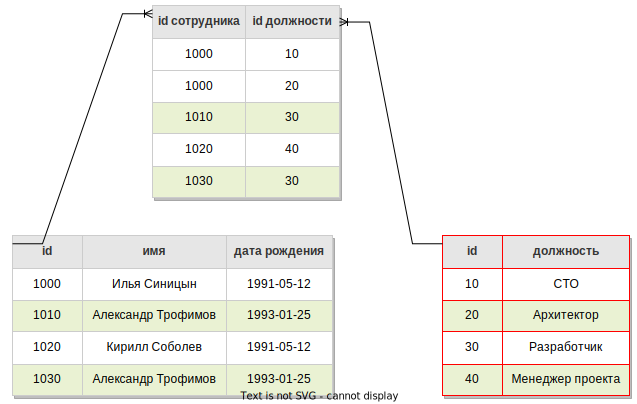
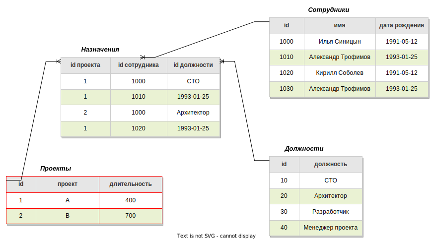
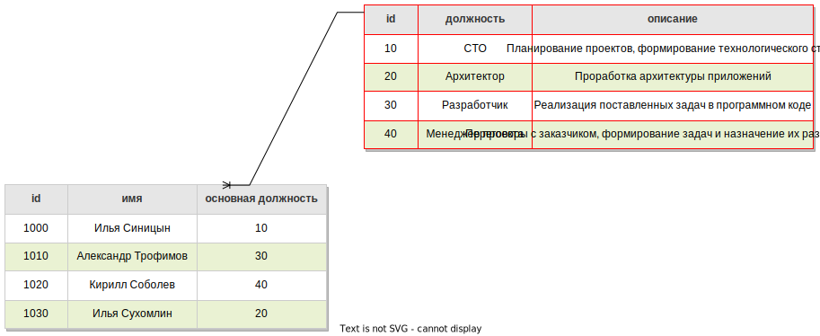

# Нормализация

Нормализация - это приведение БД к виду, отвечающему нормальным формам. Нормальная форма - это набор формальных критериев к структуре БД.

В результате нормализации БД шаг за шагом избавляется от логической избыточности. Логическая избыточность проявляется в дублировании данных в нескольких таблицах, за счет чего повышается вероятность приведения БД в противоречивое состояние. В одном месте данные обновили, а в другом нет - появилось противоречие, где же правильные данные?

Список нормальных форм, от менее к более строгим:

* Ненормализованная форма или нулевая нормальная форма (UNF)
* Первая нормальная форма (1NF)
* Вторая нормальная форма (2NF)
* Третья нормальная форма (3NF)
* Нормальная форма Бойса-Кодда (BCNF)
* Четвертая нормальная форма (4NF)
* Пятая нормальная форма (5NF)
* Доменно-ключевая нормальная форма (DKNF)
* Шестая нормальная форма (6NF)

БД считается нормализованной, если находится минимум в 3НФ. Более того, на практике редко доходит до дальнейшей нормализации, потому что 3НФ уже устраняет достаточное количество проблем, но еще не приводит к снижению производительности и усложнению восприятия. Ситуации, когда нужна 4НФ довольно редки, а 5НФ и дальше относятся больше к теории, чем к реальному миру.

То, что БД находится в какой-то НФ автоматически означает, что она уже находится и в предыдущих НФ.

# Нормальные формы

## Первая нормальная форма

> На удивление я не нашел каких-то единых определений для 1НФ. Сколько сайтов, столько и мнений. Некоторые вещи кажутся странными, но как будто все же не лишенными смысла. Поэтому я решил их тоже выписать. В "основные критерии" я буду выписывать то, что показалось наиболее правдоподобным, а в "дополнительные критерии" - то, что любопытно, но сомнительно или неоднозначно.

Основные критерии:

* Хранящиеся в каждом столбце данные должны быть скалярными. Т.е. поле не может хранить список значений.

Дополнительные критерии:

* В таблице не может быть повторяющихся строк.

  Требование странное, потому что, насколько я понимаю, в реляционной модели таблица, которая имеет повторяющиеся строки (т.е. по сути это означает отсутствие первичного ключа), вообще за таблицу даже не считается.

* В таблице не может быть полей, которые имеют одинаковый смысл.

  Например, не может быть два поля под телефон - один домашний, другой рабочий. Потому что при появлении человека с тремя телефонами это бы означало необходимость переделывать структуру таблицы.

* В столбце хранятся данные одного типа.

  Требование странное, потому что опять же, такая таблица не может называться реляционной. Технически невозможно создать в СУБД таблицу, в один и тот же столбец можно было бы сохранить и дату, и строку. Еще приводится пример, когда физически тип данных один, например, целое число, но логически в столбце хранятся разные значения, например, зарплата в рублях и в долларах.

* Порядок строк \ столбцов не имеет значения.

  Что-то из области фантастики. Тут даже трудно пример придумать, когда бы последовательность имела значение. Вероятно, тут какой-нибудь абсурдный пример вроде хранения пин-кода, по столбцу на каждую цифру, с неговорящими ничего названиями.

Пример нарушения критериев 1НФ (галочками одних цветов обозначены одинаковые даты рождения для наглядности, а Александры Трофимовы - это два разных сотрудника, у которых просто все совпадает, но по id видно, что это не один и тот же человек):

| #    | id сотрудника :key: | имя                | должность        | дата рождения                      |
| ---- | ------------------- | ------------------ | ---------------- | ---------------------------------- |
| 1    | 1000                | Илья Синицын       | CTO, архитектор  | 1991-05-12 :ballot_box_with_check: |
| 2    | 1010                | Александр Трофимов | Разработчик      | 1993-01-25 :white_check_mark:      |
| 3    | 1020                | Кирилл Соболев     | Менеджер проекта | 1991-05-12 :ballot_box_with_check: |
| 4    | 1030                | Александр Трофимов | Разработчик      | 1993-01-25​ :white_check_mark:      |

В чем ошибка:

* Предположим, для каждого сотрудника может быть определено несколько должностей, которые он может занимать в зависимости от своих навыков. Ошибка в том, что в 1 строке в поле `должность` указано несколько значений через запятую, т.е. оно не является скалярным. Если, например, понадобится узнать, сколько в компании людей, способных занимать те или иные должности, такой формат хранения задачу усложнит.

Как исправить:

* Сформировать на основе столбца, содержащего несколько значений, отдельную таблицу и связать с помощью внешнего ключа с исходной таблицей.

## Вторая нормальная форма

Критерии:

* Каждое неключевое поле должно зависеть от первичного ключа. Если он составной, то неключевое поле должно зависеть от него целиком, а не от его части (неключевые поля - это поля, которые не входят в состав первичного ключа).

Если Y зависит от X (обозначается как *X→Y* ), то это значит что по значению X можно однозначно определить значение Y. X в данном случае называется *детерминантом*, а тип зависимости - *функциональная*.

Пример нарушения 2НФ:

| проект :key: | сотрудник :key:    | должность        | длительность проекта |
| ------------ | ------------------ | ---------------- | -------------------- |
| A            | Илья Синицын       | CTO              | 400                  |
| A            | Александр Трофимов | Разработчик      | 400                  |
| B            | Илья Синицын       | Архитектор       | 700                  |
| A            | Кирилл Соболев     | Менеджер проекта | 400                  |

В чем ошибка:

* Здесь составной первичный ключ - проект и сотрудник. На примере Ильи Синицына видно, что только оба поля вместе позволяют однозначно определить должность, т.к. он участвует в двух проектах под разными должностями. А вот поле длительность указывает на длительность проекта в целом и, соответственно, для ее определения достаточно только проекта, а сотрудник не нужен. Это и есть нарушение 2НФ - поле зависит только от части полей, составляющих первичный ключ.

Как исправить:

* Сгруппировать поле, нарушающее правило, и его детерминант в отдельной таблице и связать с исходной с помощью внешнего ключа.

## Третья нормальная форма

Критерии:

* Неключевые поля не должны зависеть от других неключевых полей.

Пример нарушения 3НФ:

| id сотрудника :key: | имя                | должность        | описание должности                                           |
| ------------------- | ------------------ | ---------------- | ------------------------------------------------------------ |
| 1000                | Илья Синицын       | CTO              | Планирование проектов, формирование технологического стека   |
| 1010                | Александр Трофимов | Разработчик      | Реализация поставленных задач в программном коде             |
| 1020                | Кирилл Соболев     | Менеджер проекта | Переговоры с заказчиком, формирование задач и назначение их разработчикам |
| 1030                | Илья Сухомлин      | Архитектор       | Проработка архитектуры приложений                            |

В чем ошибка:

* Предположим, что у каждого сотрудника есть основная должность, в которой он особенно хорош, и поэтому эта должность хранится непосредственно "рядом" с сотрудником. Т.е. должность зависит от id сотрудника. Но описание должности зависит не от id сотрудника, а от самой должности (это называется *транзитивная* зависимость). В этом и есть ошибка - неключевой атрибут "описание должности" зависит от другого неключевого атрибута "должность".

Как исправить:

* Оформить зависимость в виде отдельной таблицы и связать с помощью внешнего ключа с исходной таблицей.

