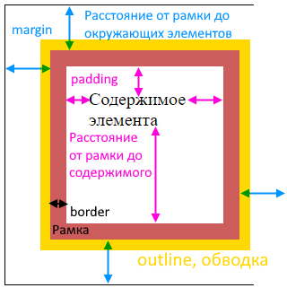
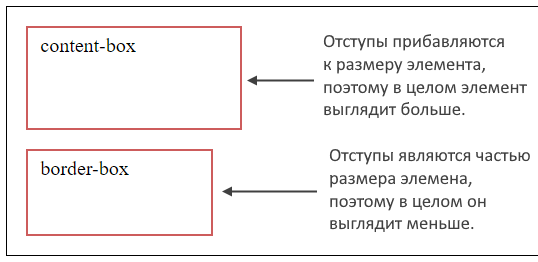
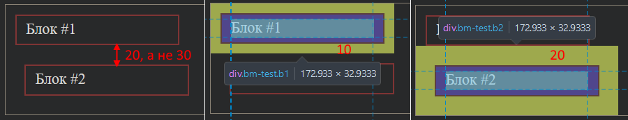

# Анатомия отступов

## Виды отступов, влияние на размер элемента



По умолчанию, padding и border влияют на общую ширину и высоту элемента, увеличивая их на свои значения, а margin - не влияет. Допустим, вот у такого элемента:

```css
.bm-test {
  width: 200px;
  height: 100px;
  border: 15px solid indianred;  /* Прибавляем к размерам */
  padding: 20px 50px;  /* Прибавляем к размерам */
  margin: 40px;   /* НЕ прибавляем к размерам */
}
```

итоговая ширина будет :

```
200    : исходная ширина, заданная через width
+ 15*2 : border  слева и справа по 15
+ 50*2 : padding слева и справа по 40
= 330 px
```

а высота:

```
100    : исходная высота, заданная через height
+ 15*2 : border  сверху и снизу по 15
+ 20*2 : padding сверху и снизу по 20
= 170 px
```

## Формула расчета размеров

Свойство `box-sizing`.

```css
box-sizing: border-box;
box-sizing: content-box;  /* По умолчанию */
```

Влияет на то, как учитываются размеры padding и border в итоговом размере элемента.

* `content-box` - значение по умолчанию. Размеры padding и border прибавляются к размерам элемента, увеличивая итоговые размеры. Т.е. если например ширина задана как 200, padding 10, border 5, то итоговая ширина будет 230, т.к. padding и margin прибавились к исходной ширине.
* `border-box` - размеры padding и border считаются как часть итогового размера. Т.е. если например ширина задана как 200, padding 10, border 5, то итоговая ширина останется 200, т.к. padding и margin уже в нее включены.

Пример:

```html
<body>
  <div class="bm-test">content-box</div>
  <div class="bm-test bbox">border-box</div>
</body>
```

```css
body {
  border: 1px solid black;
}

.bm-test {
  width: 150px;
  height: 70px;
  border: 2px solid indianred;
  padding: 5px 10px;
  margin: 15px;
  box-sizing: content-box;  /* default */
}

.bbox {
  box-sizing: border-box;
}
```



## Единицы измерения

Несмотря на то, что единиц измерения довольно много, для задания размеров отступов и рамки в большинстве случаев используются пиксели `px`.

## Схлопывание отступов

Когда у двух рядом стоящих элементов задан margin, то за расстояние между ними будет взята не сумма этих маргинов, а наибольший из них. Пример:

```html
<body>
  <div class="bm-test b1">Блок #1</div>  <!-- У этого margin 10px -->
  <div class="bm-test b2">Блок #2</div>  <!-- А у этого 20px -->
  <!-- Расстояние между ними будет 20, а не 30px -->
</body>
```

```css
body {
  border: 1px solid black;
}

.bm-test {
  width: 150px;
  height: 20px;
  border: 2px solid indianred;
  padding: 5px 10px;
}

.b1 {
  margin: 10px;
}

.b2 {
  margin: 20px;
}
```



# padding

## Формат

Это отступ от рамки элемента до контента. Применяется, когда надо оттолкнуть контент от границы элемента.

```css
padding: 40px;       /* Одинаковый отступ со всех сторон */
padding: 20px 40px;  /* Верх+низ Лево+право */
padding: 20px 40px 30px;      /* Верх лево+право низ */
padding: 20px 40px 10px 5px;  /* Верх право низ лево */

padding-top: 10px;     /* Только сверху */
padding-left: 10px;    /* Только слева  */
padding-bottom: 10px;  /* Только снизу  */
padding-right: 10px;   /* Только справа */

padding-block: 10px;   /* Сверху+снизу */
padding-inline: 10px;  /* Слева+справа */
```

# margin

## Формат

Это отступ от рамки до соседних элементов. Применяется, когда надо оттолкнуть соседние элементы.

```css
margin: 40px;       /* Одинаковый отступ со всех сторон */
margin: 20px 40px;  /* Верх+низ Лево+право */
margin: 20px 40px 30px;      /* Верх лево+право низ */
margin: 20px 40px 10px 5px;  /* Верх право низ лево */

margin-top: 10px;     /* Только сверху */
margin-left: 10px;    /* Только слева  */
margin-bottom: 10px;  /* Только снизу  */
margin-right: 10px;   /* Только справа */

margin-block: 10px;   /* Сверху+снизу */
margin-inline: 10px;  /* Слева+справа */
```

## Значение auto

Для margin можно задать значение `auto`. Это довольно популярный способ центрировать элемент по горизонтали в родительском элементе:

```html
<body>
  <div class="bm-test">margin: 15px</div>
  <div class="bm-test m-auto">margin-inline: auto</div>
</body>
```

```css
body {
  border: 1px solid black;
}

.bm-test {
  width: 150px;
  height: 20px;
  border: 2px solid indianred;
  padding: 5px 10px;
  margin: 15px;
}

.m-auto {
  margin-inline: auto;  /* Центрирует элемент в родительском элементе по горизонтали */
}
```


## Отрицательное значение

Отрицательный margin приводит к смещению элемента в указанную сторону, в результате чего он может визуально "наехать" на другой элемент.

# border

Это рамка вокруг элемента.

```css
border: 5px solid black;
```

Параметры:

* Толщина рамки
* Тип линии
* Цвет

