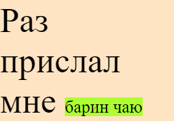
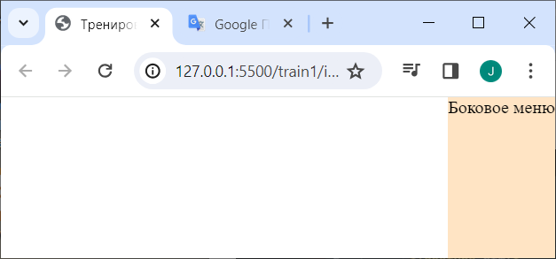

# Единицы измерения

Здесь речь пойдет о единицах измерения *расстояния*. Они делятся на:

* Относительные - рассчитываются относительно чего-либо. Например, от текущего размера окна браузера или от размера шрифта.
* Абсолютные - связаны с реальными физическими величинами. Например, пиксель или сантиметр.

В верстке есть стандартное правило: стараться не задавать элементам фиксированные размеры, потому что при изменении содержимого элемента (например, текста стало больше), это содержимое визуально вылезет за границы элемента. Например, кнопкам не задаем width и пусть браузер сам посчитает ширину, исходя из подписи кнопки.


# Относительные

## %, проценты

Характеристики:

* Считаются от размера родительского элемента.
* Для высоты проценты работают только в том случае, если у родителя явно задана высота.
* У absolute-элементов (см. конспект про позиционирование) высота в процентах будет считаться относительно первого не-static родителя.

## em, от шрифта

Характеристики:

* em задают размеры относительно размера шрифта родительского элемента.
* Могут применяться не только для задания размера шрифта, но и для любых размеров - ширина, высота и т.д.

```html
<body>
  <p class="par">
    Раз прислал мне <span class="chil">барин чаю</span>
  </p>
</body>
```

```css
body {
  font-size: 40px;
}

.par {
  background-color: bisque;
  width: 5em;  /* 40px * 5 = 200px */
}

.chil {
  font-size: 0.5em;  /* 40px * 0.5 = 20px */
  background-color: greenyellow;
}
```



## rem, от шрифта html

`rem` - означает "root" em и означает рассчет от размера шрифта корневого элемента разметки, т.е. `<html>`.

## vw, vh

Характеристики:

* `v` означает viewport, или проще говоря, текущий размер окна браузера. `w` и `h` очевидно width и height.
* 1 единица означает 1% от размера окна.

```html
<body>
  <nav class="menu">
    Боковое меню
  </nav>
</body>
```

```css
.menu {
  position: fixed;
  top: 0;
  right: 0;
  background-color: bisque;
  height: 100vh;
}
```



# Абсолютные

## px, пиксель

Пиксель - самая широко распространенная единица измерения. 