# Структура грида


## Контейнер

Грид-контейнер - это элемент, у которого установлено свойство:

```css
display: grid;
display: inline-grid;
```


## Элемент, ячейка

Грид-элемент - прямой дочерний элемент грид-контейнера. Элементы подчиняются правилам, установленным в контейнере.


P.S. Пока не знаю, можно ли приравнять понятия элемент и ячейка. Элементов здесь пять, а ячеек как будто шесть.

## Линия

Грид-линии - это линии, которые делят контейнер на части. Каждая линия имеет порядковый номер.


Чтобы отобразить линии в инспекторе для удобства, на примере Chrome: "F12 > Вкладка Elements > Подвкладка Layout > Галочка grid-container". Тут же можно поставить отображение имен линий вместо порядковых номеров.

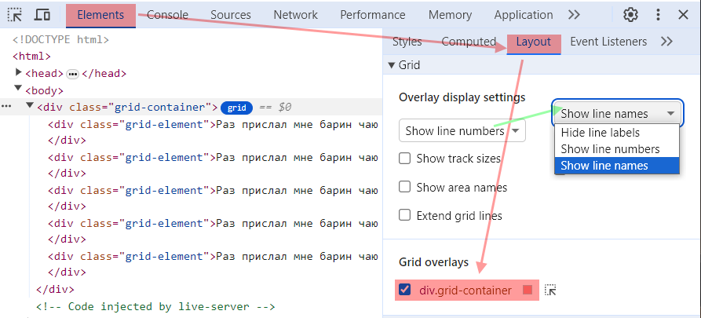

## Полоса

Грид-полоса - это пространство между двумя *соседними* грид-линиями, горизонтальными или вертикальными.

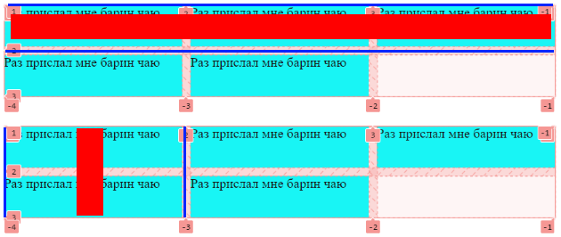

## Область

Грид-область - это пространство, находящееся между четырьмя грид линиями, не обязательно соседними. Проще говоря, это прямоугольная область, охватывающая несколько ячеек.


# Контейнер

## Автозаполнение, grid-auto-flow

```css
.grid-container {
  grid-auto-flow: row;  /* По умолчанию */
}
```

Грид состоит из строк и колонок. Автозаполнение определяет, какой из этих компонентов будет формироваться динамически. Например, мы хотим отобразить карточки товаров в три колонки, т.е. статическим компонентом будет колонка и их 3 штуки. Если товаров 9, то при трех колонках получится 3 строки. Если товаров 30, то понадобится десять строк и т.д. Т.е. динамическим компонентом являются строки.

Можно думать и от обратного. Допустим, эти же товары мы захотим отобразить в четыре строки, т.е. статическим компонентом на этот раз является строка. Тогда для 12 товаров понадобится 3 колонки, а для 80 товаров - 20 колонок.

Исходная разметка:

```html
<div class="grid-container">
  <div class="grid-element">Раз</div>
  <div class="grid-element">Два</div>
  <div class="grid-element">Три</div>
  <div class="grid-element">Четыре</div>
  <div class="grid-element">Пять</div>
  <div class="grid-element">Шесть</div>
  <div class="grid-element">Семь</div>
  <div class="grid-element">Восемь</div>
  <div class="grid-element">Девять</div>
  <div class="grid-element">Десять</div>
  <div class="grid-element">Одиннадцать</div>
  <div class="grid-element">Двенадцать</div>
  <div class="grid-element">Тринадцать</div>
  <div class="grid-element">Четырнадцать</div>
  <div class="grid-element">Пятнадцать</div>
  <div class="grid-element">Шестандцать</div>
</div>
```

### Динамические строки

Для начала сделаем пример с динамическими строками. Это значение и так по умолчанию, но напишем его явно для наглядности. Если у нас строки динамические, тогда мы должны явно задать структуру столбцов. Более подробные настройки для столбцов и строк будут дальше в отдельных разделах, а тут для наглядности сделаем просто три колонки автоматической ширины:

```css
.grid-container {
  display: grid;
  grid-auto-flow: row;  /* Динамическими у нас будут строки */
  grid-template-columns: auto auto auto;  /* Зададим 3 колонки с автоматической шириной */
  gap: 10px;
}

.grid-element {
  background-color: aqua;
}
```

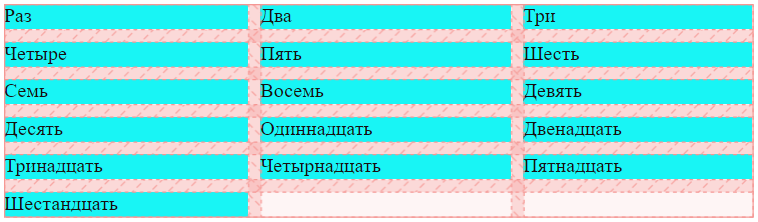

Как видно, заполнение идет по колонкам. Когда все колонки заполнены, добавляется новая строка и элементы помещаются в нее, пока снова не заполнятся все колонки и т.д. до тех пор, пока не отрисуются все элементы.

### Динамические колонки

Теперь сделаем наоборот - фиксированное число строк и динамические колонки.

```css
.grid-container {
  display: grid;
  grid-auto-flow: column;  /* Динамическими будут колонки */
  grid-template-rows: auto auto auto auto;  /* Строки "статические", четыре штуки */
  gap: 10px;
}

.grid-element {
  background-color: aqua;
}
```

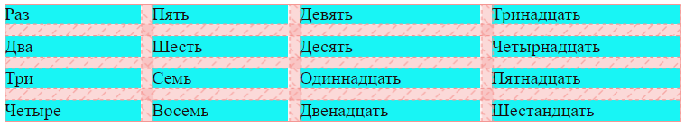

Теперь видно, что заполняются сначала строки (сверху вниз), а потом добавляется столбец и снова заполняются строки и т.д.

## Шаблон колонок и столбцов

### Колонки, grid-template-columns

```css
.grid-container {
  grid-template-columns: auto auto 100px;  /* Шаблон колонок  */
}
```

Задает фиксированное количество колонок в гриде и их *ширину*.

### Строки, grid-template-rows

```css
.grid-container {
  grid-template-rows: 150px auto 300px;    /* Шаблон строк */
}
```

Задает фиксированное количество строк в гриде и их *высоту*.

### Формат значений для grid-template-x

Показано на примере grid-template-columns и колонках, но у grid-template-rows и строк все аналогично:

```css
grid-template-columns: auto auto 100px;   /* 3 колонки */
grid-template-columns: repeat(3, 150px);  /* 3 колонки */
grid-template-columns: repeat(3, 150px) repeat(2, 50px);  /* 5 колонок */
grid-template-columns: 1fr repeat(3, 150px) 2fr;          /* 5 колонок */
```

Форматы указания значений:

* `auto` - ширина (или высота) вычисляется автоматически, так чтобы заполнить весь контейнер по соответствующей оси. Например, `auto auto 100px` означает, что третья колонка будет шириной 100px, а оставшееся в контейнере место разделят пополам первые две колонки.
* `100` - конкретное значение ширины, заданное в любых единицах, `px`, `%` и т.д.
* `fr` - от "fraction", позволяет делить пространство на основе коэффициентов. Например:
  * `1fr 2fr 3fr` - сделает три колонки, вторая будет в два раза больше первой, а третья - в три раза больше первой.
  * `1fr 2fr 100px` - три колонки. Третья имеет фиксированную ширину, а оставшееся пространство разделится между первыми двумя согласно коэффициентам.
* `repeat(3, 150px)` - когда нужно несколько колонок с одинаковой шириной, можно использовать функцию repeat. В данном случае она сделает три колонки по 150px каждая. Можно чередовать repeat с другими способами задания и использовать любые единицы, например, те же fr.
* `minmax(a, b)` - ширина будет не меньше `a` и не больше `b`, а между этими значениями будет занимать столько, сколько нужно.

## Размеры для автострок и автостолбцов, паттерны

### Для строк, grid-auto-rows

```css
.grid-container {
  grid-auto-rows: 20px;
  grid-auto-rows: 20px 40px;
}
```

Если для динамических строк требуется задать высоту явно, это делается с помощью `grid-auto-rows`. Если указать одно значение, то все строки будут одинаковой высоты. Если два значения, как в примере выше например, то первая строка будет высотой 20px, вторая 40px, а дальше они будут повторять этот паттерн, т.е. третья будет 20, четвертая 40 и т.д. Аналогично для трех значений и больше.


Можно комбинировать с grid-template-rows, чтобы задавать для первых нескольких строк отдельные значения, а дальше по паттерну:

```css
.grid-container {
  grid-template-rows: 20px 30px 40px;  /* Для первых трех строк */
  grid-auto-rows: 100px 200px;  /* Для всех последующих - паттерн */
}
```

Полный пример:

```css
.grid-container {
  display: grid;
  grid-auto-flow: row;
  grid-template-columns: auto auto auto;
  grid-auto-rows: 40px 90px;
  gap: 10px;
}

.grid-element {
  background-color: aqua;
}
```

### Для колонок, grid-auto-columns

```css
.grid-container {
  grid-auto-rows: 20px;
  grid-auto-rows: 20px 40px;
}
```

Принцип аналогичный как и у строк.

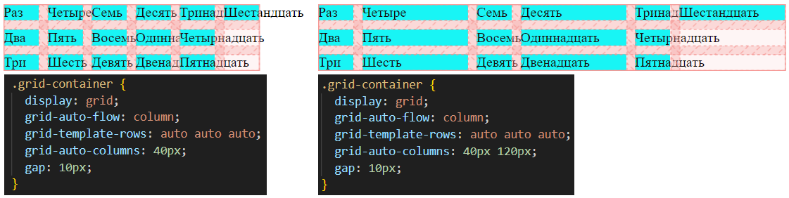

Можно комбинировать с grid-template-columns, чтобы задавать для первых нескольких колонок отдельные значения, а дальше по паттерну:

```css
.grid-container {
  grid-template-columns: 10px 15px 20px;  /* Для первых трех колонок */
  grid-auto-columns: 40px 120px;  /* Для всех последующих - паттерн */
}
```

Полный пример:

```css
.grid-container {
  display: grid;
  grid-auto-flow: column;
  grid-template-rows: auto auto auto;
  grid-auto-columns: 40px 120px;
  gap: 10px;
}

.grid-element {
  background-color: aqua;
}
```

## Расстояние между строками и столбцами

```css
row-gap: 20px
column-gap: 40px;
gap: 20px 40px;  /* row + column */
gap: 40px;  /* row + column, одно значение и для того, и для другого */
```

## Порядок

```css
.grid-element {
  order: -1;
}
```

* `-1` элемент встает в самое начало.
* `1` элемент встает в конец.

# Шаблон областей, grid-template-areas

```css
.grid-container {
  display: grid;
  grid-template-columns: 25% auto 15%;  /* Сначала указываем количество колонок */
  grid-template-areas:  /* Шаблон, явно описывающий структуру ячеек */
    "ga-menu ga-catalog ga-ad"
    "ga-menu ga-catalog ga-ad"
    "ga-menu ga-catalog ."
    "ga-menu ga-order   ga-order";
}
...
.menu {
  grid-area: ga-menu;  /* Настройки для конкретной ячейки */
  background-color: lightskyblue;
}
```

Позволяет задать структуру грида, используя шаблон с именами будущих ячеек. В каждой строке обязательно должно быть полное количество колонок. Если какой-то сегмент должен занимать несколько строк \ колонок, пишем его имя несколько раз. Если какая-то ячейка должна быть пустая, пишем точку `.` на ее месте в шаблоне.

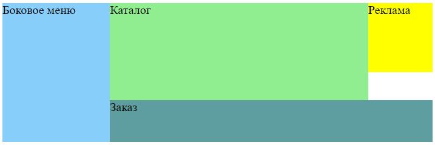

```html
<body>
  <div class="grid-container">
    <aside class="menu">Боковое меню</aside>
    <section class="catalog">Каталог</section>
    <section class="ad">Реклама</section>
    <section class="order">Заказ</section>
  </div>
</body>
```

```css
.grid-container {
  display: grid;
  grid-template-columns: 25% auto 15%;
  grid-template-areas:
    "ga-menu ga-catalog ga-ad"
    "ga-menu ga-catalog ga-ad"
    "ga-menu ga-catalog ."
    "ga-menu ga-order   ga-order";
  min-height: 20vh;
}

.menu {
  grid-area: ga-menu;
  background-color: lightskyblue;
}

.catalog {
  grid-area: ga-catalog;
  background-color: lightgreen;
}

.ad {
  grid-area: ga-ad;
  background-color: yellow;
}

.order {
  grid-area: ga-order;
  background-color: cadetblue;
}
```

# Выравнивание

## Разметка для примеров

Работает так же, как в гридах, все принципы одинаковые.

```html
<body>
  <div class="grid-container">
    <div class="grid-element">Раз</div>
    <div class="grid-element">Два</div>
    <div class="grid-element">Три</div>
    <div class="grid-element">Четыре</div>
    <div class="grid-element">Пять</div>
    <div class="grid-element">Шесть</div>
    <div class="grid-element">Семь</div>
    <div class="grid-element">Восемь</div>
  </div>
</body>
```

```css
.grid-container {
  display: grid;
  grid-auto-flow: row;
  grid-template-columns: auto auto auto;
  background-color: bisque;
  min-height: 150px;
}

.grid-element {
  background-color: aqua;
  border: 1px solid black;
}
```

## justify-content

```css
.grid-container {
  justify-content: normal;  /* По умолчанию */
}
```

Выравнивание контента по горизонтали, т.е. в случае гридов, это колонки.

### Значения

#### normal \ stretch

```css
justify-content: normal;  /* Дефолт, то же самое, что stretch */
```

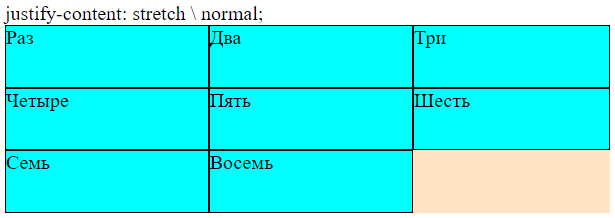

Колонки растянуты, чтобы занять всю ширину контейнера.

#### start, end

```css
justify-content: start;
```

```css
justify-content: end;
```

```css
justify-content: center;
```

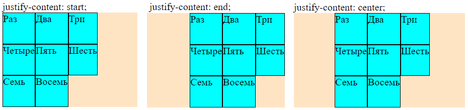

Колонки прижаты к началу \ концу \ центру контейнера.

#### space-between

```css
justify-content: space-between;
```

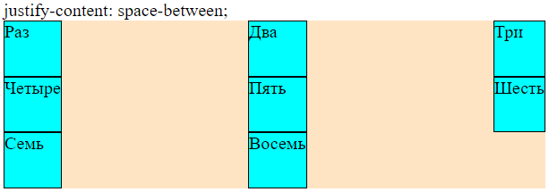

Расстояние между колонками одинаковое, крайние прижимаются к краям контейнера.

#### space-around

```css
justify-content: space-around;
```


Расстояния между колонками равны, а по краям - половина от этого расстояния.

#### space-evenly

```css
justify-content: space-evenly;
```


Расстояния между колонками и по краям колонок одинаковое.

## align-items

```css
.grid-container {
  align-items: normal;  /* По умолчанию */
}
```

Выравнивание ячеек по горизонтали.

### Значения

#### normal \ stretch

```css
align-items: normal;  /* Дефолт, то же самое, что stretch */
```


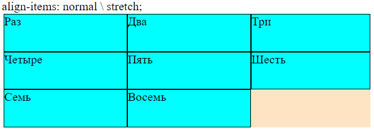

Ячейки растянуты до высоты строк. Если высота контейнера не задана явно, то ячейки будут высотой как их содержимое.

#### start, end, center

```css
align-items: start;
```

```css
align-items: end;
```

```css
align-items: center;
```


Ячейки прижимаются к верху \ низу \ центру своих строк.

## place-items

Это комбинированное свойство для `align-items` + `justify-content`:

```css
place-items: center;  /* Одинаковое значение для обоих */
place-items: center end;
```

# Линии

## Разметка для примеров

```html
<body>
  <div class="grid-container">
    <div class="grid-element">Раз</div>
    <div class="grid-element">Два</div>
    <div class="grid-element grid-element-big special">Три</div>
    <div class="grid-element">Четыре</div>
    <div class="grid-element">Пять</div>
    <div class="grid-element">Шесть</div>
    <div class="grid-element">Семь</div>
    <div class="grid-element">Восемь</div>
  </div>
</body>
```

```css
.grid-container {
  display: grid;
  grid-auto-flow: row;
  grid-template-columns: auto auto auto;
  background-color: bisque;
  min-height: 150px;
  gap: 10px;
}

.grid-element {
  background-color: aqua;
  border: 1px solid black;
}

.grid-element-big {
}

.special {
  border: 3px solid red;
  background-color: indianred;
}
```


## Растягивание ячеек

### Явное

Одну ячейку можно растянуть так, чтобы она занимала несколько строк и колонок. Это делается через указание конкретных линий, от которых ячейка должна начинаться и до которых должна идти:

```css
.grid-element-big {  
  grid-column-start: 2;  /* От какой линии колонка начинается */
  grid-column-end: 4;    /* До какой линии колонка идет */
  grid-row-start: 1;  /* От какой линии строка начинается */
  grid-row-end: 3;    /* До какой линии строка идет */
}
```

Альтернативный синтаксис:

```css
.grid-element-big {  
  grid-column: 2 / 4;  /* От / до */
  grid-row: 1 / 3;
}
```


### Автоматическое

#### span

Есть еще синтаксис - ключевое слово `span`, просто указываем, на сколько колонок надо растянуть ячейку. При этом, правда, грид сам решает, куда поместить растянутый элемент:

```html
.grid-element-big {  
  grid-column: span 2;
  grid-row: span 2;
}
```


#### -1 / 1

Значение `-1 / 1` позволяет растянуть ячейку на все колонки по ширине. Главное отличие от явного задания в том, что здесь растягивание произойдет на все колонки, сколько бы их ни было:

```css
.grid-element-big {  
  grid-column: -1 / 1;
  grid-row: span 2;
}
```

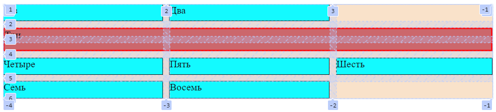

P.S. Растягивание на строки через `-1 / 1` как будто не работает.

## Имена для линий

```css
grid-template-columns: [foo] auto [bar] auto [qwe] auto [zxc];  /* Линии колонок, вертикальные */
```

```css
grid-template-rows: [ra] auto [rb] auto [rc] auto [rd];  /* Линии строк, горизонтальные */
```

`[foo] размер [bar]` - линиям можно давать имена, используя квадратные скобки. Важно: это имена именно для линий, а не для колонки. Колонка формируется двумя линиями - левой и правой. Вот эти имена именно для них.

Тогда пример из растягивания ячеек можно было бы написать вот так:

```css
.grid-element-big {  
  grid-column-start: bar;
  grid-column-end: zxc;
  grid-row-start: ra;
  grid-row-end: rc;
}
```

