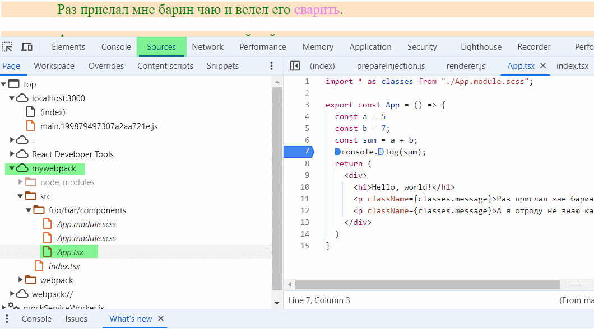

# Source map

## Для чего нужны

Поскольку результирующий упакованный код выглядит нечитабельно, то чтобы понять где именно возникла ошибка в исходном коде (и для отладки), нужны промежуточные файлы, которые сопоставляют упакованный код с исходным. Это и есть source map'ы.

## Разновидности

Виды сорс мэпов https://webpack.js.org/configuration/devtool/ отличаются влиянием на скорость билда и ребилда.

## Включение

### webpack.config.js

В конфиге вебпака добавляем секцию `devtool` и указываем, карты какого типа хотим использовать:

```javascript
module.exports = (settings, argv) => {
  return {
    // Остальная часть конфига
    devtool: "source-map"  // <-- Активируем генерацию SM указанного типа
  }
};
```

### tsconfig.json

Если в проекте используется typescript, нужно добавить в его конфиг опцию компиляции `sourceMap`:

```yaml
{
  "compilerOptions": {
    # Остальные опции компиляции
    "sourceMap": true
  }
}
```

## Использование в браузере

После активации SM, файлы в браузере будут выглядеть так же как исходный код и отлаживать станет удобнее:



`mywebpack` - это имя проекта.

## P.S.

Некоторые вопросы и подозрительные вещи:

* Должны ли генерироваться .map-файлы при запуске dev-сервера?
  * Когда мы билдим, то они появляются в папке dist, но когда запускаем dev-сервер, то во-первых, папка dist  не появляется, и во-вторых, раз ее нет, то не понятно, сгенерировались ли .map-файлы.