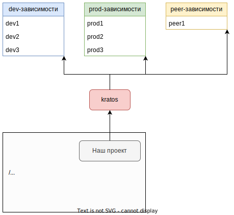

# Предисловие

Для начала я решил попробовать такую структуру:

* В основных разделах лежит core-информация. Например, ключи для указания типа устанавливаемой зависимости.
* В разделе "Дополнительно" разные пояснения к core-информации. Например, объяснение что концептуально означает каждый тип зависимости.

# Установка пакетов

## npm install

Запускается из корневой папки проекта, для которого устанавливаем пакет.

### Установка конкретных пакетов

* Команда `npm install имяПакета` (или просто `i`). Существуют и другие псевдонимы, например `add` и еще менее распространенные.
* Если пакетов несколько, их имена разделяются пробелом.

```
npm i имяПакета1 имяПакета2
```

### Установка конкретной версии пакета

Версия указывается через `@` после имени пакета:

```
npm i имяПакета@2.7.0
```

### Установка всех пакетов

`npm install` можно использовать для установки всех пакетов, перечисленных в package.json. Для этого надо запустить команду без имен пакетов:

```
npm install
```

Обычно используется, когда мы скачали исходники какого-то проекта и хотим установить все нужные ему пакеты.

# Удаление пакетов

## npm uninstall

* Команда `npm uninstall` (или просто `r`):
* Если пакетов несколько, их имена разделяются пробелом.

```
npm r имяПакета1 имяПакета2
```

*  Пакеты, установленные глобально, при удалении исчезают из списка зависимостей, но не удаляются с диска. Удалять их надо вручную.
* Пакеты, установленные не глобально, при удалении исчезают из списка зависимостей, а также удаляются с диска.

# Обновление пакетов

## npm update

```
npm update имяПакета
```

Обновление происходит до максимальной допустимой версии. Допустимость определяется тем, как был установлен пакет, с ключом `-E` или без него.

# Ключи npm install

[Документация](https://docs.npmjs.com/cli/v8/commands/npm-install)

## Формат указания ключей

### Полная и сокращенная формы

Ключи могут иметь полную форму или сокращенную:

* Например, `-P` - сокращенная форма, а `--save-prod` - полная форма того же самого ключа.
* Некоторые ключи имеют только одну из форм, некоторые - обе.

### Несколько ключей

Можно указывать сразу несколько ключей:

* Полные формы указываются раздельно через пробел, например `npm install --sample-k1 --sample-k2`.
* Краткие формы можно указывать отдельно `npm install -x -Y` или совмещать для краткости `npm install -xY`

## -g, обычная установка пакета и глобальная

Для глобальной установки есть флаг `-g`

```
npm install typescript -g
```

Установка пакета подразумевает скачивание пакета в определенную директорию:

* Если пакет устанавливается глобально, то он скачивается в глобальную директорию модулей Node. В Windows это

  ```
  C:\Users\ИМЯ-ПОЛЬЗОВАТЕЛЯ\AppData\Roaming\npm\node_modules
  ```

* Если пакет устанавливается не глобально (без флага `-g`), то он скачивается в папку `node_modules`, которая есть в корне каждого node-проекта.

Если нескольким проектам требуется один и тот же пакет, то глобальная установка избавляет их от необходимости иметь собственную копию пакета.

## -D, -P и т.д. тип зависимости 

Тип определит раздел конфига package.json, в который попадет зависимость.

### Где в конфиге перечисляются зависимости

Зависимости перечисляются в определенных разделах конфига проекта, файл `package.json`. Раздел, в который попадает зависимость, определяется тем, с каким ключом зависимость была установлена. Например, установка пакета eslint с ключом `-D` установит его как dev-зависимость *нашей программы* в раздел `devDependencies`:

```
npm install eslint -D
```

Т.е. таким образом мы говорим "для нашей программы пакет eslint является dev-зависимостью".

Пример конфига с разделами зависимостей:

```yaml
{
  # ...
  "author": "",
  "license": "ISC",
  "devDependencies": {  # <-- Раздел dev-зависимостей
    "html-webpack-plugin": "^5.6.0",
    "terser-webpack-plugin": "^5.3.10",
    "ts-loader": "^9.5.1",
    "typescript": "^5.5.4",
    "webpack": "^5.93.0",
    "webpack-bundle-analyzer": "^4.10.2",
    "webpack-cli": "^5.1.4",
    "webpack-dev-server": "^5.0.4",
    "webpack-merge": "^6.0.1"
  },
  "dependencies": {  # <-- prod-зависимости
    "some-fake-dependency": "^4.0.0"
  }
}
```

### Возможные ключи

```
npm install eslint -D
```

* `-D` (или `--save-dev`) - dev-зависимость.

  ```yaml
  "devDependencies": {  # <-- dev-зависимости появляются в этом разделе
    "some-fake-dependency": "^4.0.0"
  }
  ```

* `-P` (или `--save-prod`) - prod-зависимость.

  ```yaml
  "dependencies": {  # <-- prod-зависимости
    "some-fake-dependency": "^4.0.0"
  }
  ```

* `--save-peer` (нет краткой формы) - пир-зависимость.

  ```yaml
  "peerDependencies": {  # <-- peer-зависимости
    "some-fake-dependency": "^4.0.0"
  }
  ```

* `-O` (или `--save-optional`) - TODO

  ```yaml
  "optionalDependencies": {  # <-- optional-зависимости
    "some-fake-dependency": "^4.0.0"
  }
  ```

* `-B` (или `--save-bundle`) - TODO

  ```yaml
  "dependencies": {  # <-- B-зависимости появляются
    "some-fake-dependency": "^4.0.0"
  },
  "bundleDependencies": [  # <-- в двух разделах
    "some-fake-dependency"
  ]
  ```


## -E, зависимость конкретной версии

`-E`(или `--save-exact`) - установить пакет и зафиксировать установленную версию. Фиксация версии означает, что обновить пакет не получится. Устанавливается самая свежая версия пакета:

```
npm install имяПакета -E
```

Если ставить пакет без ключа `-E`, то рядом с версией появляется символ `^`:

```yaml
"dependencies": {
  "webpack": "^2.7.0"
}
```

Это означает "совместимость на уровне мажорной версии". При обновлении пакета установится максимально возможная *минорная* версия в пределах мажорной версии установленного пакета. Например, у нас стоит пакет версии 2.7.0, а максимально доступная уже 4.3.0. Но поскольку у текущего установленного пакета мажорная версия 2, то обновление ограничивается ее пределом и обновится, например, до 2.14.3.

Еще есть символ `~`:

```yaml
"dependencies": {
  "webpack": "~2.7.0"
}
```

Он означает "совместимость на уровне минорной версии". При обновлении пакета установится максимально доступный патч в пределах текущей минорной версии. Например, у нас стоит пакет версии 2.7.0, а максимально доступная уже 4.3.0. Но поскольку у текущего установленного пакета минорная версия 7, то обновление ограничивается ее пределом и обновится, например, до 2.7.8.

Про семантическое версионирование написано в разделе "Дополнительно".

# Дополнительно

## Разные виды зависимостей

Важно понимать концепцию разных видов зависимостей, чтобы разобраться с ключами установки пакетов вроде `-D`, `-P` и т.д.

### Зависимость выполнения (prod-зависимость)

Зависимости выполнения нужны программе для работы ("работа в продакшене"). Например, `axios` - если программа использует для отправки запросов пакет axios, то он должен присутствовать в системе, где выполняется программа.

### Зависимость разработки (dev-зависимость)

Зависимости разработки не нужны самой программе для работы, но они нужны на этапе ее разработки. Например, `typescript` - типичная dev-зависимость для программы на Typescript, т.к. чтобы скомпилировать TS-программу, нужен компилятор. Но компилятор очевидно не нужен, чтобы пользоваться уже скомпилированной программой. Еще примеры dev-зависимостей: линтеры, минификаторы, библиотеки для юнит-тестов. Здесь аналогично - минификатор сжимает программу и больше не нужен. Юнит-тесты проверяют программу и потом не нужны и т.д.

### Peer-зависимость

Программа *полагается* на пир-зависимость, работает с ней *в паре*, и обычно без пир-зависимости сама по себе смысла не имеет. Обычно такие программы являются плагинами, а их пир-зависимости - это системы, для которых они написаны. Соответственно, пир-зависимостей у пакета много не бывает. Обычно всего одна.

Например, программа `html-webpack-plugin` является плагином к `webpack`, значит вебпак является ее пир-зависимостью ([ссылка](https://github.com/jantimon/html-webpack-plugin/blob/main/package.json) на ее package.json, где webpack можно увидеть в разделе peerDependencies). Логично, что если плагин написан для вебпака, то нет смысла устанавливать этот плагин, если мы не используем в проекте вебпак. Или например `webpack-cli` - это тоже плагин для вебпака ([ссылка](https://github.com/webpack/webpack-cli/blob/master/package.json) на package.json), и у него в peerDependencies тоже находится вебпак. Сам вебпак может ничего о своих плагинах не знать и соответственно не зависит от них.

Т.о., для одной системы может существовать много плагинов и несколько плагинов могут использоваться с ней одновременно. Например, мы ставим себе в проект вебпак и к нему плагины `webpack-cli`, `html-webpack-plugin` и еще какие-то. Из этого следует, что "головная" программа (вебпак в данном случае) должна быть установлена в единственном экземпляре и при этом такая ее версия, чтобы все плагины были с ней совместимы.

Для плагинов характерно то, как они взаимодействуют со своими пир-зависимостями. Обычно взаимодействие сводится к подписке на события, через которые плагин получает всю нужную ему для работы информацию.

### Практическое отличие видов зависимостей

Представим гипотетический модуль kratos, у которого есть все три вида зависимостей:



На рисунке показано, куда устанавливаются зависимости кратоса: prod-зависимости попадают в личную папку модулей, пир-зависимость устанавливается "параллельно" самой папке кратоса, а dev-зависимости вообще не устанавливаются.

Базовых сценариев два:

* Мы являемся исключительно пользователями пакета, т.е. устанавливаем его в свой проект командой `npm install имяПакета`. В этом случае пакет скачивается в папку node_modules нашего проекта, а также скачиваются prod-зависимости этого пакета и помещаются в его собственную папку node_modules.
  * Если у пакета есть пир-зависимости, то они тоже могут скачаться (а могут и нет, зависит от конкретного случая). Но логичнее ставить такие пакеты либо после установки основного пакета, либо одновременно с ним. Например, сначала ставим вебпак, а потом плагины к нему, а не наоборот.
* Мы скачиваем пакет с целью доработать \ самостоятельно сбилдить \ подебажить-поковыряться. В этом случае мы сначала скачиваем непосредственно исходники пакета, например с гита, а затем выполняем из корня `npm install`. В этом случае нам скачиваются и prod-, и dev-зависимости пакета.

Есть конечно нюансы, т.к. бывает установишь один пакет, а в директории с модулями появляется 20 папок каких-то пакетов. И разбираться, почему оно так как-то не хочется без явной необходимости. Но в качестве базы две верхних ситуации сгодятся. Когда мы просто пользователи пакета, то нам по умолчанию скачиваются только пакеты, нужные для его работы, а не разработки.

## Семантическое версионирование (SEMVER)

Семантическое версионирование (оно же SEMVER, [документация](https://semver.org/lang/ru/)) - это соглашение писать номер версии программы так, чтобы было понятно, что именно изменилось в программе и сохранилась ли обратная совместимость.

Семвер предполагает, что версия состоит из трех цифр, например, `1.5.3`:

* Первая цифра - это *мажорная* версия.
* Вторая цифра - это *минорная* версия.
* Третья цифра - это патч.

Патч подразумевает исправление ошибок без внесения новой функциональности в программу. Т.е. когда мы не добавляем в программу ничего нового, а просто фиксим ошибки, то наращиваем цифру патча. При этом пользователи смело могут ставить новые версии, не боясь, что они не будут корректно работать в уже существующей системе. Например, если стоит версия 1.5.3, то ее спокойно можно обновить до 1.5.8.

Минорная версия подразумевает внесение дополнительной функциональности или изменение существующей, но без нарушения обратной совместимости. Например, версию 1.5.8 можно обновить до 1.7.0 и не бояться, что она не будет работать.

Мажорная версия предполагает серьезные изменения в программе и не гарантирует обратную совместимость. Т.е. когда пользователи обновляются с 1.5.8 на 2.1.0, то должны понимать, что у них может что-то сломаться и что-то придется в существующей системе переделать, чтобы она корректно работала с новой версией.

