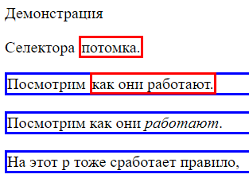
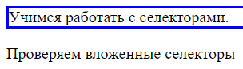
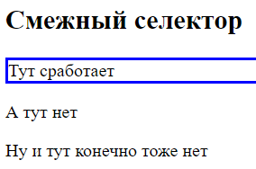

# Селекторы

## По тегу

```css
p {
  color: green;
}
```

Просто указываем тег и селектор выбирает все элементы, выраженные указанным тегом. В данном случае выбрали все абзацы.

## По классу

### Для одного из классов

Для элементов мы можем указывать *классы* через атрибут `class`, а потом выбирать элементы по этим классам, используя синтаксис `.имя-класса`. Классов элементу можно приписать сколько угодно, разделяются они пробелом. Стилизация через классы - самый предпочтительный способ.

```html
<!-- Задали элементу два класса: spec-p и cl-demo -->
<p class="spec-p cl-demo">Специальный абзац</p>
```

```css
.spec-p {  /* Задали правило для всех элементов, у которых есть класс spec-p */
  color: whitesmoke;
  background-color: crimson;
}

.cl-demo {  /* Задали правило для всех элементов, у которых есть класс cl-demo */
  color: greenyellow;
  background-color: green;
}
```

Если у элемента несколько классов и правила в них противоречат друг другу, как в примере выше, то будет выбрано более специфичное правило. В данном случае более специфичным считается то, что описано ниже в файле стилей, т.е. в итоге у этого абзаца цвет текста будет светло-зеленый и зеленый цвет фона.

### По нескольким классам

Чтобы задать стиль элементу, у которого одновременно есть несколько классов, нужно эти классы записать цепочкой, без пробелов:

```css
.button {
  background-color: lightgray;
}

.button.is-active {  /* Стиль для кнопки, у которой разом есть классы button и is-active */
  background-color: coral;
}
```

```html
<button class="button">Открыть меню</button>
<button class="button is-active">Закрыть меню</button>
```


## По идентификатору

Идентификатор для элемента задается через атрибут `id`, а в css используем синтаксис `#имяИдентификатора`. Задавать стили через id считается плохим тоном.

```html
<!-- Задали элементу атрибут id -->
<p id="foobar">Специальный абзац</p>
```

```css
#foobar {
  color: whitesmoke;
  background-color: crimson;
}
```

## По атрибуту и его значению

Можно выбрать элемент, если:

* У него просто есть какой-то атрибут, синтаксис `[имяАтрибута]` 
* Если у этого атрибута конкретное значение, синтаксис `[имяАтрибута="значение"]`

```html
<p><input type="text" placeholder="ФИО" /></p>
<p><input type="tel" placeholder="+7 (999) 999-99-99"/></p>
<p><input type="email" placeholder="foobar@mail.ru" /></p>
```

```css
[placeholder] {  /* Для всех тегов, у которых есть атрибут placeholder */
  border: 3px solid darkturquoise
}

[type="text"] {  /* Для всех тегов, у которых есть атрибут type со значением text */
  box-shadow: 3px 3px 3px 3px whitesmoke;
}

[type="tel"] {  /* Кавычки по желанию, можно и не ставить */
  box-shadow: 3px 3px 3px 3px blue;
}

[type=email] {  
  box-shadow: 3px 3px 3px 3px red;
}
```

### Дополнительные возможности для указания значения

Есть несколько дополнительных синтаксисов, которые позволяют расширить набор значений атрибута, на которые будет срабатывать селектор:

* `[attr*="ax"]` - конструкция `*=`. Найдутся все элементы, у которых в значении атрибута attr есть значение "ax". Не важно, в начале, конце или середине.

  ```css
  [type*="ax"] {
    box-shadow: 3px 3px 3px 3px red;
  }
  ```

  ```html
  <p><input type="ax" /></p>    <!-- Сработает -->
  <p><input type="axe" /></p>   <!-- Сработает -->
  <p><input type="taxe" /></p>  <!-- Сработает -->
  ```

* `[attr^="ax"]` - конструкция `^=`. Элементы, у которых атрибут attr *начинается* со значения ax.

  ```css
  [type^="ax"] {
    box-shadow: 3px 3px 3px 3px red;
  }
  ```

  ```html
  <p><input type="ax" /></p>    <!-- Сработает -->
  <p><input type="axe" /></p>   <!-- Сработает -->
  <p><input type="taxe" /></p>  <!-- Нет -->
  ```

* `[attr$="ax"]` - конструкция `$=`. Элементы, у которых атрибут attr *заканчивается* на значение ax.

  ```css
  [type$="ax"] {
    box-shadow: 3px 3px 3px 3px red;
  }
  ```

  ```html
  <p><input type="ax" /></p>   <!-- Сработает -->
  <p><input type="axe" /></p>  <!-- Нет -->
  <p><input type="tax" /></p>  <!-- Сработает -->
  ```

* `[attr~="ax"]` - конструкция `~=`. Элементы, у которых в атрибуте attr есть *отдельное* слово "ax".

  ```css
  [type~="ax"] {
    box-shadow: 3px 3px 3px 3px red;
  }
  ```

  ```html
  <p><input type="ax" /></p>   <!-- Сработает -->
  <p><input type="axe" /></p>  <!-- Нет -->
  <p><input type="tax" /></p>  <!-- Нет -->
  ```

* `[attr|="ax"]` - конструкция `|=`. Элементы, у которых атрибут attr целиком равен "ax", либо начинается с "ax-" (с дефисом).

  ```css
  [type|="ax"] {
    box-shadow: 3px 3px 3px 3px red;
  }
  ```

  ```html
  <p><input type="ax-warn" /></p>  <!-- Сработает -->
  <p><input type="axe" /></p>      <!-- Нет -->
  <p><input type="ax" /></p>       <!-- Сработает -->
  ```

  Ключевое отличие от `^=`, что крышечка бы выбрала и "axe" тоже.

* `[attr="ax" i]` - буква `i` в конце (также подойдет и большая `I`). Применимо ко всем селекторам по атрибутам. Означает игнорировать регистр значения. Однако у меня и без этой буквы регистр игнорировался, т.е. селектору было все равно, "ax" или "AX" написано.

## Универсальный

Синтаксис `*`. Выбирает вообще все элементы на странице. Часто используется для так называемого сброса стилей, например, чтобы обнулить отступы.

Особенности:

* Не затрагивает псевдоэлементы `before` и `after`.

```css
* {
  border: 1px solid black;
}
```

```html
<body>
  <p><input type="ax-warn" /></p>
  <p><input type="axe" /></p>
  <p><input type="ax" /></p>
</body>
```

Сработает на все теги: `<body>`, `<p>` и `<input>`.

## Селектор потомка

### Любая вложенность

Описывается вложенность селекторов, для которых срабатывает стиль. Глубина вложения любая. Реализуется перечислением селекторов через пробел. Зачастую проще воспользоваться классами, чем использовать вложенные селекторы.

```css
p span {
  border: 1px solid red;
}

section p {
  border: 1px solid blue;
}
```

```html
<body>
  <p>Демонстрация</p>
  <p>Селектора <span>потомка.</span></p>
  <section>
    <p>
      Посмотрим <span>как они работают.</span>
    </p>
  </section>
  <section>
    <p>
      Посмотрим как они <cite>работают</cite>.
    </p>
  </section>
  <section>
    <div>
      <p>На этот p тоже сработает правило,</p>  <!-- хотя он внутри div -->
    </div>
  </section>
</body>
```



Замечания, на что обратить внимание:

* Вложенность не обязательно непосредственная, а любая. Т.е. `section p` например означает, что `<p>` не обязательно должен находиться *сразу* внутри `<section>`:

  ```html
  <section>
    <div>
      <p>На этот p тоже сработает правило,</p>  <!-- хотя он внутри div -->
    </div>
  </section>
  ```

* Комбинация работает только непосредственно на тег из селектора, т.е. `section p` сработает только на `<p>`, но не на теги внутри `<p>`. Я об этом пишу, потому что изначально в примере задавалось свойство цвета текста и текст красился не только внутри `<p>`, но и внутри, например, `<cite>`, из чего я сделал вывод, что правило работает не только на сам тег, но и на вложенные в него тоже. Однако пример с цветом - не показательный, потому что цвет относится к тем свойствам, которые наследуются. А вот пример с border явно показывает, что стиль работает только непосредственно на выбранный селектором тег, но не на вложенные в него. Если бы это было не так, тогда и `<cite>` был бы обведен собственной синей рамкой.

### Непосредственная вложенность

А вот когда нужно, чтобы работало только на элемент, *непосредственно* вложенный, используется синтаксис `селектор > селектор`.

```css
section > p {
  border: 3px solid blue;
}
```

```html
<body>
  <section>
    <p>  <!-- Тут сработает, т.к. вложение непосредственное -->
      Учимся работать <span>с селекторами.</span>
    </p>
  <section>
    <div>
      <p>Проверяем вложенные селекторы</p>  <!-- А тут нет -->
    </div>
  </section>
</body>
```



## Смежный селектор

### Один следующий элемент

Синтаксис `s1 + s2` позволяет задать стиль для s2, который находится на одном уровне вложенности с s1 и идет в разметке *сразу же* после него:

```css
h2 + p {  /* Сработает на абзацы, которые находятся непосредственно после h2 */
  border: 3px solid blue;
}
```

```html
<body>
  <h2>Смежный селектор</h2>
  <p>Тут сработает</p>  <!-- Потому что он в разметке идет сразу же за h2 -->
  <p>А тут нет</p>
  <p>Ну и тут конечно тоже нет</p>
</body>
```



Пример из интернета: рядом с полем ввода есть элемент с текстом ошибки. Изначально он невидимый, но надо показать его, когда в поле ошибка:

```html
<input class="input" />
<div class="error-message">Неправильно введен адрес</div>
```

```css
.error-message {
  color: red;
  visibility: hidden;
}

.input.is-invalid + .error-message {
  visibility: visible;
}
```

### Все следующие элементы

Синтаксис `s1 ~ s2` позволяет задать стиль для всех элементов s2, которые находятся на одном уровне вложенности с s1:

```css
h2 ~ p {  /* Сработает на все абзацы, которые находятся после h2 */
  border: 3px solid blue;
}
```

```html
<body>
  <h2>Смежный селектор</h2>
  <p>Тут сработает</p>
  <div>Разорвем абзацы дивом для примера.</div>
  <p>И тут сработает</p>
  <p>Ну и тут конечно тоже сработает</p>
</body>
```


# Группировка селекторов

## Независимая

Можно перечислить селекторы через запятую и тогда указанное правило сработает для нескольких групп. Можно писать все в одну строку, но для улучшения читаемости лучше располагать селекторы на разных строках. Например:

```css
[type="text"],  /* Через запятую перечисляем несколько любых селекторов */
[type="tel"] {  
  box-shadow: 3px 3px 3px 3px red;
}

p span, 
section p {
  color: aqua;
}
```

## Комбинация

Задает стиль для комбинации селекторов, т.е. когда условия выборки срабатывают одновременно. Например:

```css
div#some-id {  /* Элемент, который одновременно является div'ом и имеет id = some-id */
  color: red;
}

p.some-class {  /* Элемент, который одновременно является абзацем и имеет класс some-class */
  color: red;
}

#some-id.some-class {  /* Элемент одновременно имеет id = some-id и класс = some-class */
  color: red;
}

div#some-id.some-class {  /* You know the rules */
  color: red;
}
```

# Специфичность

Специфичность определяет, какой стиль применится к элементу, если он одновременно подходит под несколько селекторов. В идеальном случае для стилизации лучше всего использовать классы, потому что у них понятная специфичность - выше чем у тегов, и ниже чем у id.

Таблица для расчета специфичности:


Правила расчета:

* Для селектора из идентификатора вес 1.0.0. или 100.
* Для селектора из класса или атрибута вес 0.1.0. или 10.
* Для селектора из тега вес 0.0.1. или 1.
* Комбинация селекторов - сумма вышеперечисленных. Например, селектор из тега и идентификатора, например, `div:some-id` это 100 + 1 = 101.
* У какого селектора в итоге цифра специфичности больше, значит того правило и сработает.

Пример:

```html
<p class="text" id="my-super-text">Какого цвета этот текст?</p>
```

Какой цвет текста будет при таких стилях?

```css
p {
  color: red;
}

.text {
  color: green;
}

#my-super-text {
  color: blue;
}
```

А при таких?

```css
p {
  color: red;
}

p#my-super-text {
  color: pink;
}

.text {
  color: green;
}

#my-super-text {
  color: blue;
}
```

Ответы: 

* В первом случае - синий
* Во втором - розовый.

Потому что в первом случае по специфичности выигрывает `#my-super-text`, у него 100 очков, а во втором - `p#my-super-text`, потому что у него 100 + 1 = 101.