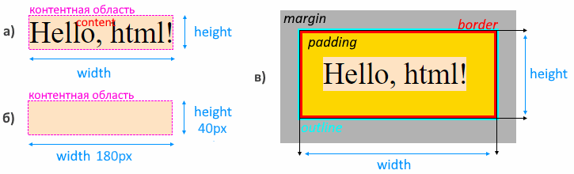

# Анатомия элемента

Все элементы на странице являются прямоугольниками. Во время отрисовки элементов браузер применяет к ним css-свойства.

У элемента есть размер, выраженный свойствами `width`(ширина) и `height` (высота). Основу элемента составляет `контентная область`. На рисунке `а)` контентная область показана бежевым цветом, а *контентом* является строка "Hello, html!". Если в элементе нет контента, т.е. контентная область пустая, как на рисунке `б)`, тогда элемент будет иметь нулевые размеры и фактически мы его не увидим. В этом случае можно задать ему размеры явно, тогда он визуально проявится.

Размер элемента зависит от нескольких вещей (рисунок `в)`):

* От *типа элемента* (блочный, строчный, блочно-строчный).
* От *контента* - т.е. того, что находится внутри элемента.
* От дополнительных свойств:
  * `padding` - внутренний отступ. Расстояние от контентной области до границы элемента.
  * `border` - рисует рамку вокруг элемента.

Кроме того, есть еще два свойства, которые НЕ влияют на размер:

* `outline` - визуальная обводка элемента.
* `margin` - внешний отступ. Расстояние от границы элемента до границ окружающих элементов.