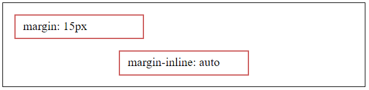
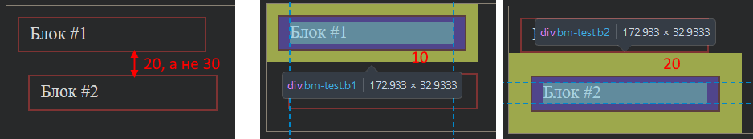
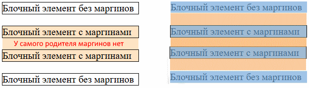

# padding, Внутренний отступ

## Механика

```css
.item {
  padding: 30px;
}
```

Свойство `padding` задает *внутренний отступ* - расстояние от контентной области элемента до *его* границы. Т.е. если по умолчанию граница элемента проходит по контентной области (рисунок `a)`), то padding эту границу как бы отталкивает от нее (рисунок `б)`).


Важные характеристики padding:

* Влияет на размер элемента.

## Варианты синтаксиса

Обобщенное свойство:

```css
padding: 40px;       /* Одинаковое значение для всех сторон */

padding: 20px 40px;           /* Верх+низ, лево+право   */
padding: 20px 40px 30px;      /* Верх, лево+право, низ  */
padding: 20px 40px 10px 5px;  /* Верх, право, низ, лево */
```

Отдельные свойства:

```css
padding-block: 10px;   /* Верх+низ   */
padding-inline: 10px;  /* Лево+право */

padding-top: 10px;     /* Только сверху */
padding-left: 10px;    /* Только слева  */
padding-bottom: 10px;  /* Только снизу  */
padding-right: 10px;   /* Только справа */
```

# margin, Внешний отступ

## Механика

```css
.item {
  margin: 30px;
}
```

Свойство `maring` задает *внешний отступ* - расстояние от границ элемента до границ окружающих элементов.


Важные характеристики margin:

* НЕ влияет на размер элемента.
* Есть механика *схлопывания* маргинов.

## Варианты синтаксиса

Обобщенное свойство:

```css
margin: 40px;       /* Одинаковое значение для всех сторон */

margin: 20px 40px;           /* Верх+низ, лево+право   */
margin: 20px 40px 30px;      /* Верх, лево+право, низ  */
margin: 20px 40px 10px 5px;  /* Верх, право, низ, лево */
```

Отдельные свойства:

```css
margin-block: 10px;   /* Верх+низ   */
margin-inline: 10px;  /* Лево+право */

margin-top: 10px;     /* Только сверху */
margin-left: 10px;    /* Только слева  */
margin-bottom: 10px;  /* Только снизу  */
margin-right: 10px;   /* Только справа */
```

## Значение auto

Для margin можно задать значение `auto`. Это довольно популярный способ центрировать элемент по горизонтали в родительском элементе:

```html
<body>
  <div class="bm-test">margin: 15px</div>
  <div class="bm-test m-auto">margin-inline: auto</div>
</body>
```

```css
body {
  border: 1px solid black;
}

.bm-test {
  width: 150px;
  height: 20px;
  border: 2px solid indianred;
  padding: 5px 10px;
  margin: 15px;
}

.m-auto {
  margin-inline: auto;  /* Центрирует элемент в родительском элементе по горизонтали */
}
```



Работает только для горизонтали. Центрировать таким же образом по вертикали не получится, написав например `margin-block: auto`. Ну и по обоим осям через `margin: auto` тоже не выйдет.

## Отрицательное значение

Отрицательный margin приводит к смещению элемента в указанную сторону, в результате чего он может визуально "наехать" на другой элемент.

## Схлопывание отступов

[Документация](https://developer.mozilla.org/ru/docs/Web/CSS/CSS_box_model/Mastering_margin_collapsing) для полноты картины.

### Из двух соседних маргинов выбирается больший

Когда у двух рядом стоящих элементов задан margin, то за расстояние между ними будет взята не сумма этих маргинов, а наибольший из них. Пример:



```html
<body>
  <div class="bm-test b1">Блок #1</div>  <!-- У этого margin 10px -->
  <div class="bm-test b2">Блок #2</div>  <!-- А у этого margin 20px -->
  <!-- Из-за схлопывания, расстояние по вертикали между ними будет 20px, а не 30 -->
  <!-- А если убрать border у контейнера, то еще исчезнет зазор между верхом и низом контейнера и элементами -->
</body>
```

```css
body {
  border: 1px solid black;
}

.bm-test {
  width: 150px;
  height: 20px;
  border: 2px solid indianred;
  padding: 5px 10px;
}

.b1 {
  margin: 10px;
}

.b2 {
  margin: 20px;
}
```

### Маргин потомка выходит за пределы родителя

Если у элемента есть вложенные элементы и у первого и последнего ребенка заданы маргины, то они выпадают за границы родителя. Т.е. они не не просто схлопываются и исчезают, а именно начинают отталкивать элементы, расположенные вокруг родителя:



```html
<body>
  <div class="el-out">Блочный элемент без маргинов</div>
  <div class="el-cont">
    <div class="el-in">Блочный элемент с маргинами</div>
    <div class="el-in">Блочный элемент с маргинами</div>
  </div>
  <div class="el-out">Блочный элемент без маргинов</div>
</body>
```

```css
.el-cont {  /* Тут маргинов нет */
  background-color: bisque;
  width: 220px;
}

.el-in {
  outline: 1px solid black;
  margin-block: 20px;
}

.el-out {
  outline: 1px solid black;
  width: 220px;
}
```

Это поведение можно исправить:

* Задать родителю border. Тогда маргины будут отталкиваться от бордера и не вылезут за пределы родителя.
* Задать родителю overflow любое кроме visible.
* Сделать родителя флексом или гридом.