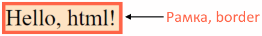
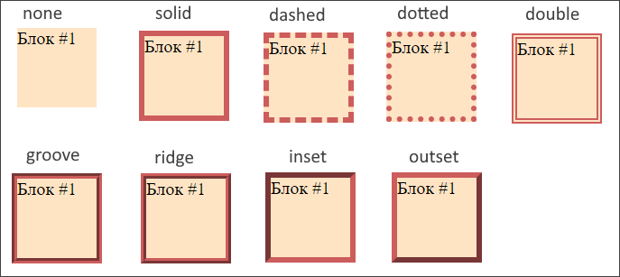
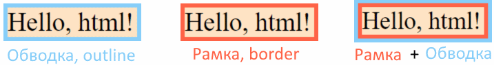
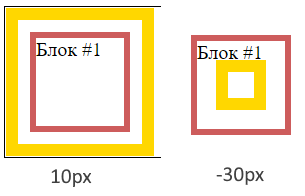

# border, Рамка

## Внешний вид

Рамка задается свойством `border` и представляет собой линию, проходящую по границе элемента:



Важные характеристики рамки:

* Влияет на размер элемента.

Вариации внешнего вида рамки:



## Синтаксис

Общее свойство, для задания всех параметров разом, для всех сторон:

```css
border: 5px solid black;  /* Порядок не важен, каждое значение опциональное */
```

Общие свойства, но для каждой стороны отдельно:

```css
border-top: 5px solid black;
border-bottom: 5px solid black;
border-left: 5px solid black;
border-right: 5px solid black;
```

Отдельные свойства:

```css
border-width: 5px;
border-style: solid;
border-color: black;
/* Можно использовать синтаксис с несколькими значениями для задания значений для нескольких сторон:
  a       - Верх, право, низ, лево (т.е. для всех второн разом)
  a b     - Верх+низ, лево+право
  a b c   - Верх, лево+право, низ
  a b c d - Верх, право, низ, лево
*/
```

```css
border-top-style: solid;  /* Все остальные, -bottom- -left- и т.д. тоже работают */
border-top-color: green;  /* Все остальные, -bottom- -left- и т.д. тоже работают */
border-top-width: 10px;   /* Все остальные, -bottom- -left- и т.д. тоже работают */
```

# outline, Обводка

## Внешний вид

Обводка задается свойством `outline` и представляет собой линию, проходящую по границе элемента:



Важные характеристики рамки:

* НЕ влияет на размер элемента.
* Обводка идет вокруг рамки, если задано и то, и другое.

## Синтаксис

Общее свойство, для задания всех параметров разом, для всех сторон:

```css
outline: 5px solid black;  /* Порядок не важен, каждое значение опциональное */
```

Отдельные свойства для каждого параметра:

```css
outline-width: 5px;
outline-style: solid;
outline-color: black;
```

Обводка не поддерживает разные параметры для отдельных сторон, т.е. значение можно задать только разом для всех сторон.

## Смещение обводки

Через свойство `outline-offset` обводку можно смещать относительно ее естественного положения:

```css
outline-offset: 20px;   /* Смещение во вне   */
outline-offset: -10px;  /* Смещение вовнутрь */
```

