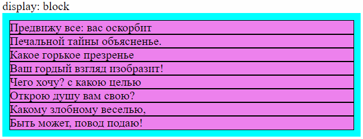
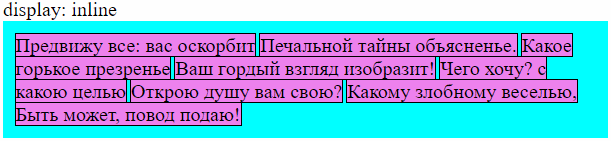

# Свойство display

Свойство `display` определяет две вещи:

* Внешнее поведение элемента - как он взаимодействует с соседями. Например, элемент с `display: block` занимает все доступное место по горизонтали, поэтому в одной строке не может быть двух таких элементов. А элемент с `display: inline` занимает по горизонтали ровно столько места, сколько нужно чтобы поместился его контент, поэтому в одной строке может быть несколько таких элементов.
* Внутреннее поведение элемента - как он влияет на размещение вложенных в него элементов. Например, элемент с `display: flex` имеет свойства, которые позволяют по-разному размещать внутренние элементы - прижимать их к началу, к концу контейнера, размещать в середине и т.д.

# Типы элементов

## Блочные

```css
display: block;
```



Характеристики:

* Блочный элемент всегда создает новую строку.
* По горизонтали блочный элемент растягивается на всю доступную ширину родителя.
* По вертикали блочный элемент занимает столько места, сколько надо его контенту.
* Блочному элементу можно явно задать ширину и высоту.

Примеры блочных элементов: `<div>`, `<p>`, `<form>`, `<nav>`, `<section>`.

```html
<body>
  <div>display: block</div>
  <div class="container">
    <div class="item">Предвижу все: вас оскорбит</div>
    <div class="item">Печальной тайны объясненье.</div>
    <div class="item">Какое горькое презренье</div>
    <div class="item">Ваш гордый взгляд изобразит!</div>
    <div class="item">Чего хочу? с какою целью</div>
    <div class="item">Открою душу вам свою?</div>
    <div class="item">Какому злобному веселью,</div>
    <div class="item">Быть может, повод подаю!</div>
  </div>
</body>
```

```css
.container {
  background-color: aqua;
  padding: 10px;
}

.item {
  background-color: violet;
  outline: 1px solid black;
}
```

## Строчные

```css
display: inline;
```



Характеристики:

* Строчный элемент начинается в текущей строке.
* По горизонтали и по вертикали строчный элемент занимает ровно столько места, сколько нужно его контенту.
* Строчному элементу нельзя явно задать ни ширину, ни высоту.
* Строчный элемент может разрываться, если не помещается в текущую строку, и оставшаяся часть отображается уже на следующей строке.
* По вертикали строчный элемент всегда остается на своем месте:
  * Вертикальный margin не работает вообще (горизонтальный - работает).
  * Вертикальный padding сработает, элементы визуально станут больше, но перекроют друг друга, т.к. физически останутся на своих местах.

Примеры строчных элементов: `<span>`, ``, `<a>`, `<i>`, `<bm>`.

```html
<body>
  <div>display: inline</div>
  <div class="container">
    <span class="item">Предвижу все: вас оскорбит</span>
    <span class="item">Печальной тайны объясненье.</span>
    <span class="item">Какое горькое презренье</span>
    <span class="item">Ваш гордый взгляд изобразит!</span>
    <span class="item">Чего хочу? с какою целью</span>
    <span class="item">Открою душу вам свою?</span>
    <span class="item">Какому злобному веселью,</span>
    <span class="item">Быть может, повод подаю!</span>
  </div>
</body>
```

```css
.container {
  background-color: aqua;
  padding: 10px;
}

.item {
  background-color: violet;
  outline: 1px solid black;
}
```

## Блочно-строчные

```css
display: inline-block;
```

https://css-live.ru/articles-css/udivitelnyj-i-neizvestnyj-inline-block.html

Своеобразный "переходник" между строчным и блочным элементом. Позволяет вставить блочный элемент посреди строчных.

Характеристики:

* Блочно-строчный элемент по горизонтали и вертикали занимает ровно столько места, сколько нужно его контенту.
* Блочно-строчному элементу можно явно задать ширину и высоту.