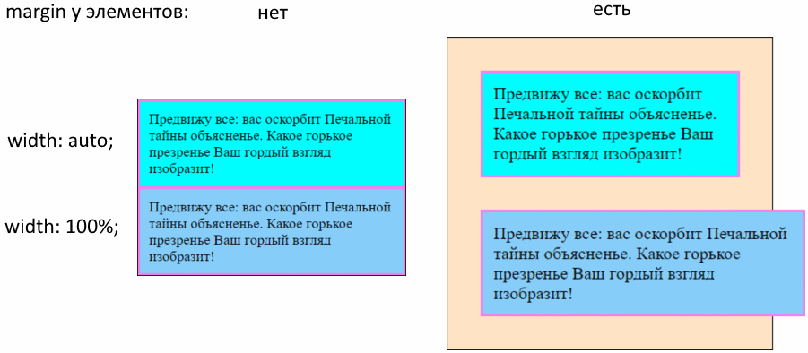

# width, Ширина

## auto и 100%, разница

> Примечание: предполагается, что у всех элементов установлено `box-sizing: border-box`. Иначе к размерам элемента надо будет прибавлять не только размеры маргинов, но и падинга и бордера.

Когда у вложенных элементов нет маргинов, то `100%` и `auto` выглядят одинаково. Однако, когда маргины появляются, ситуация становится хуже:



Почему так:

* При `width: auto` элемент занимает всю доступную ширину родителя, и при этом учитываются маргины (падинг и бордер учитывается за счет border-box алгоритма, но даже если бы алгоритм был content-box, они бы все равно учитывались). Т.о., итоговый размер элемента вычисляется корректно и он нормально вписывается в контейнер.
* При `width: 100%` ширина элемента становится как ширина *контента* родителя, но маргины при этом не учитываются. Соответственно, после прибавления маргинов к этой ширине итоговый размер элемента получается больше размера контейнера и элемент вылазит за границы.

```html
<body>
  <div class="container">
    <div class="item item-width-auto">
      Предвижу все: вас оскорбит
      Печальной тайны объясненье.
      Какое горькое презренье
      Ваш гордый взгляд изобразит!
    </div>
    <div class="item item-width-100pers">
      Предвижу все: вас оскорбит
      Печальной тайны объясненье.
      Какое горькое презренье
      Ваш гордый взгляд изобразит!
    </div>
  </div>
</body>
```

```css
* {
  box-sizing: border-box;  /* <-- Важно! */
}

.container {
  background-color: bisque;
  border: 1px solid black;
  width: 300px;
}

.item {
  border: 3px solid violet;
  padding: 10px;
  margin: 30px;
}

.item-width-auto {
  width: auto;
  background-color: aqua;
}

.item-width-100pers {
  width: 100%;
  background-color: lightskyblue;
}
```

## 0

При `width: 0px` элемент схлопнется, а его контент сожмется до минимально возможного значения. Например, до самого широкого слова. Если несколько элементов идут друг за другом (например в флекс-контейнере), то это приведет к их визуальному наложению друг на друга.

# Высота

Высота элемента, если не задана явно, определяется по контенту.