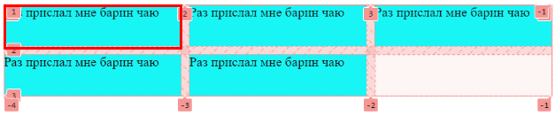
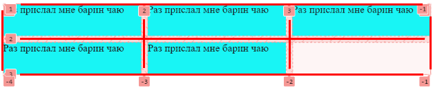

# Структура грида

## Контейнер

Грид-контейнер - это элемент, у которого установлено свойство:

```css
display: grid;
display: inline-grid;
```


## Элемент и ячейка

Грид-элемент - прямой дочерний элемент грид-контейнера. Элементы подчиняются правилам, установленным в контейнере.



P.S. Пока не знаю, можно ли приравнять понятия элемент и ячейка. Элементов здесь пять, а ячеек как будто шесть.

## Линия

Грид-линии - это линии, которые делят контейнер на части. Каждая линия имеет порядковый номер. С помощью номеров линий (или их имен, как задать имена - в отдельном конспекте) можно растягивать элемент на несколько колонок \ строк, просто указывая, откуда докуда надо тянуть.

Нумерация линий идет с 1. Если использовать отрицательные значение, то это отсчет с конца. Т.е. если 1 - это первая линия, то -1 это последняя.



Чтобы отобразить линии в инспекторе для удобства, на примере Chrome: "F12 > Вкладка Elements > Подвкладка Layout > Галочка grid-container". Тут же можно поставить отображение имен линий вместо порядковых номеров.


## Полоса

Грид-полоса - это пространство между двумя *соседними* грид-линиями, горизонтальными или вертикальными.


## Область

Грид-область - это пространство, находящееся между четырьмя грид линиями, не обязательно соседними. Проще говоря, это прямоугольная область, охватывающая несколько ячеек.

