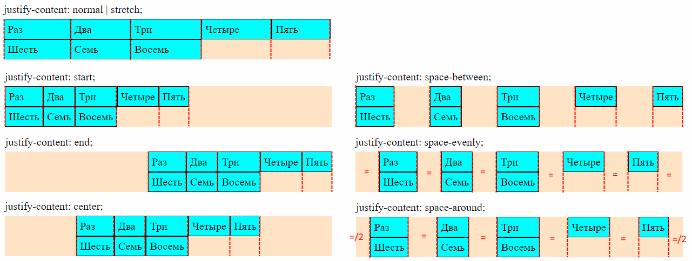
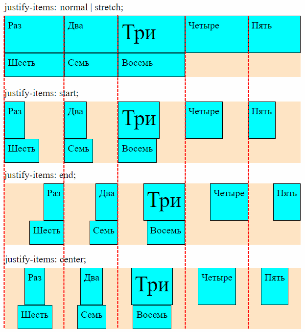
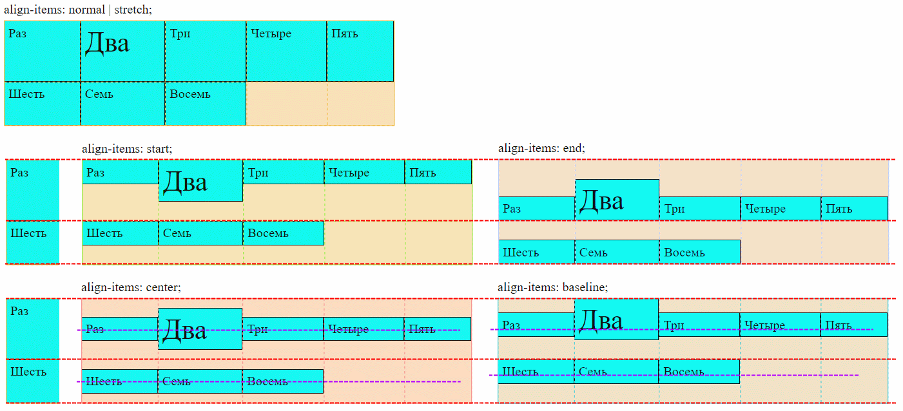

# Разметка для примеров

```html
<body>
  <div>Для писем и газет</div>
  <div class="grid-container">
    <div class="grid-element">Раз</div>
    <div class="grid-element">Два</div>
    <div class="grid-element">Три</div>
    <div class="grid-element">Четыре</div>
    <div class="grid-element">Пять</div>
    <div class="grid-element">Шесть</div>
    <div class="grid-element">Семь</div>
    <div class="grid-element">Восемь</div>
  </div>
</body>
```

```css
.grid-container {
  display: grid;
  grid-auto-flow: rows;
  grid-template-columns: auto auto auto;
  /* grid-template-rows: 50px 75px; */
  /* grid-auto-rows: 30px; */
  /* grid-auto-columns: 120px; */
  /* justify-items: start; */
  /* justify-content: start; */
  /* align-items: start; */
  /* align-content: start; */
  /* height: 100px; */
  background-color: bisque;
}

.grid-element {
  background-color: aqua;
  border: 1px solid black;
  padding: 5px;
}

.large {
  font-size: 35px;
}

.ghost {
  background-color: #EAEAEA;
  border: 1px dashed #404040;
}
```

# Резюме по выравниванию в гридах

В гридах, в отличие от флексов, одновременно всегда есть и строки, и столбцы. Причем на их природу не влияет направление заполнения грида. Т.е. строка всегда остается строкой, а столбец - столбцом.

Соответственно, в гриде мы можем одновременно выравнивать:

* Непосредственно строки \ колонки.
* Элементы внутри строк \ колонок.


| Свойство выравнивания | Значение по умолчанию | Что делает                           | Документация                                                 |
| --------------------- | --------------------- | ------------------------------------ | ------------------------------------------------------------ |
| `justify-content`     | `stretch`             | Выравнивает колонки по горизонтали.  | [MDN](https://developer.mozilla.org/en-US/docs/Web/CSS/justify-content) |
| `align-content`       | `stretch`             | Выравнивает строки по вертикали.     | [MDN](https://developer.mozilla.org/en-US/docs/Web/CSS/align-content) |
| `justify-items`       | `stretch`             | Выравнивает элементы по горизонтали. | [MDN](https://developer.mozilla.org/en-US/docs/Web/CSS/justify-items) |
| `align-items`         | `stretch`             | Выравнивает элементы по вертикали.   | [MDN](https://developer.mozilla.org/en-US/docs/Web/CSS/align-items) |

# Выравнивание колонок и строк

Значения для обоих свойств (`justify-content` и `align-content`) одинаковые:

* `normal | stretch` - строки \ колонки растягиваются, чтобы занять всю высоту \ ширину контейнера. Растягиваются пропорционально своему содержимому.
* `start` - колонки жмутся к левому краю контейнера, а строки - к верху контейнера.
* `end` - колонки жмутся к правому краю контейнера, а строки - к низу контейнера.
* `center` - колонки жмутся к центру контейнера по горизонтали, а строки - к центру контейнера по вертикали.
* `space-between` - первая \ последняя колонки жмутся к левому \ правому краям контейнера, а центральные располагаются между ними на равном удалении. Первая \ последняя строки жмутся к верху \ низу контейнера, а центральные располагаются между ними на равном удалении.
* `space-evenly` - колонки располагаются на равном удалении от краев контейнера и друг от друга. Строки располагаются на равном удалении от верха \ низа контейнера и друг от друга.
* `space-around` - расстояние от краев до строк \ колонок в два раза меньше, чем между строками \ колонками.

## Выравнивание колонок по горизонтали, justify-content



## Выравнивание строк по вертикали, align-content


# Выравнивание элементов

Значения для обоих свойств (`justify-items` и `align-items`) одинаковые:

* `normal | stretch` - элемент растягивается на всю ширину колонки \ высоту строки.
* `start` - элемент прижимается к левому краю колонки \ к верху строки.
* `end` - элемент прижимается в правому краю колонки \ к низу строки.
* `center` - элемент становится по горизонтали в центре колонки \ по вертикали в центре строки.
* `baseline` - что такое baseline см. в конспекте про флексы. Для align-items выравнивает элементы по базовой линии, а для justify-items не понятно (вроде не работает).

## Внутри колонок по горизонтали, justify-items



## Внутри строк по вертикали, align-items



# place-items

Это комбинированное свойство для `align-items` + `justify-content`:

```css
place-items: center;  /* Одинаковое значение для обоих */
place-items: center end;
```

