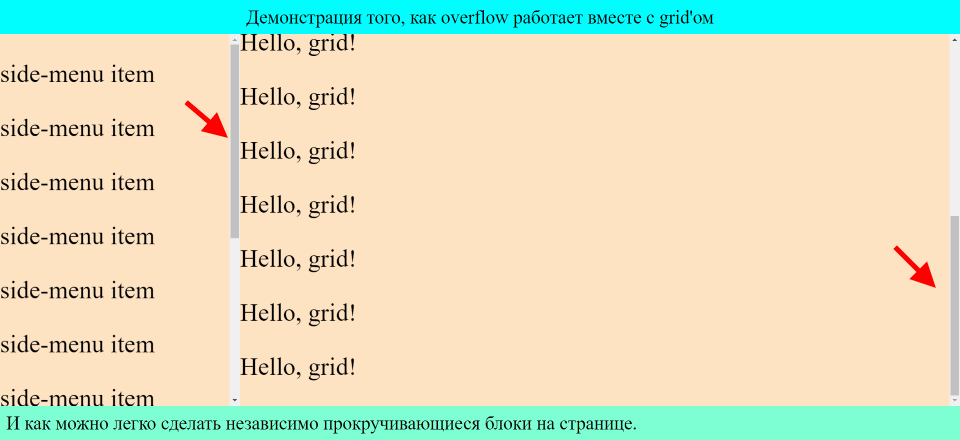

# grid и переполнение overflow

За счет того, что грид можно растянуть на весь экран, в нем легко можно сделать независимую прокрутку отдельных блоков:



Примерное такое же на ютубе, но там сделано через флекс и с виду через какие-то грязные ухищрения.

Разметка и стили:

```html
<body>
  <div class="grid-container">
    <div class="header">Демонстрация того, как overflow работает вместе с grid'ом</div>
    <div class="side-menu">
      <p class="side-menu__item">side-menu item</p>
      <p class="side-menu__item">side-menu item</p>
      <p class="side-menu__item">side-menu item</p>
      <p class="side-menu__item">side-menu item</p>
      <p class="side-menu__item">side-menu item</p>
      <p class="side-menu__item">side-menu item</p>
      <p class="side-menu__item">side-menu item</p>
      <p class="side-menu__item">side-menu item</p>
      <p class="side-menu__item">side-menu item</p>
      <p class="side-menu__item">side-menu item</p>
      <p class="side-menu__item">side-menu item</p>
      <p class="side-menu__item">side-menu item</p>
    </div>
    <div class="content">
      <p class="post">Hello, grid!</p>
      <p class="post">Hello, grid!</p>
      <p class="post">Hello, grid!</p>
      <p class="post">Hello, grid!</p>
      <p class="post">Hello, grid!</p>
      <p class="post">Hello, grid!</p>
      <p class="post">Hello, grid!</p>
      <p class="post">Hello, grid!</p>
      <p class="post">Hello, grid!</p>
      <p class="post">Hello, grid!</p>
      <p class="post">Hello, grid!</p>
      <p class="post">Hello, grid!</p>
      <p class="post">Hello, grid!</p>
    </div>
    <div class="footer">И как можно легко сделать независимо прокручивающиеся блоки на странице.</div>
  </div>
</body>
```

```css
* {
  box-sizing: border-box;
}

body {
  margin: 0;
  padding: 0;
}

.grid-container {
  display: grid;
  grid-auto-flow: row;
  grid-template-columns: 1fr 3fr;
  grid-template-rows: auto 1fr auto;
  background-color: bisque;
  height: 100vh;
}

.header {
  grid-column: span 2;
  background-color: aqua;
  font-size: 30px;
  text-align: center;
  padding: 10px;
}

.side-menu {
  overflow-y: auto;
}

.content {
  overflow-y: auto;
}

.footer {
  grid-column: span 2;
  background-color: aquamarine;
  font-size: 30px;
  padding: 10px;
}

.post, 
.side-menu__item {
  font-size: 40px;
}
```

