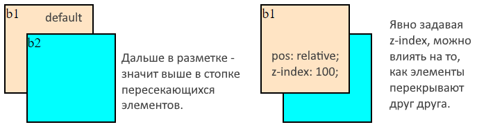
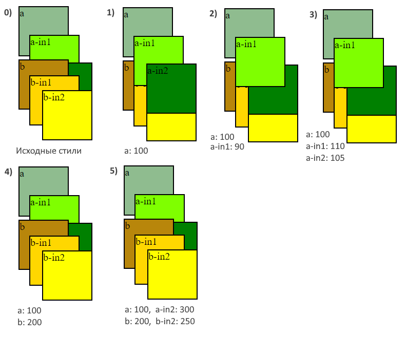

# z-index, Глубина

```css
z-index: 100;  /* Или любое другое положительное или отрицательное целое число */
```

Каждый элемент кроме позиции по горизонтали и вертикали еще имеет позицию по оси Z, или глубину.

* `z-index` явно можно задать только не-static элементам.
* По умолчанию, z-index больше у тех элементов, которые ниже по разметке.
* Элементы с бОльшим z-index визуально находятся поверх элементов с меньшим z-index.
  * Как запомнить? Представить, что мы смотрим на город сверху. Z-index - как этажи домов. Самый последний этаж - это крыша. Мы ее видим, а этажи под ней - нет.
* У всех элементов z-index равен auto, если его не трогать. Браузер автоматически расставляет глубину элементам.
* Если у элемента явно указан z-index, то этот элемент считается выше любого, у кого z-index не указан.
* Хорошей практикой является задание индексов кратных 100, в пределах от 100 до 1000. Это позволяет при необходимости легко впихнуть новый слой между существующими.

```html
<body>
  <div class="box b1">b1</div>
  <div class="box b2">b2</div>  <!-- Этот блок выше блока b1 по оси Z -->
</body>
```

```css
.box {
  width: 100px;
  height: 100px;
  border: 2px solid black;
  margin: 5px;
}

.b1 {
  background-color: bisque;
  /* position: relative; 
     z-index: 100;       */  /* Можем явно указать, какой элемент должен быть выше в стопке */
}

.b2 {
  background-color: aqua;
  position: relative;
  top: -75px;
  left: 25px;
}
```



# z-index и вложенные элементы

Что можно сказать на эту тему:

* z-index вложенных элементов зависит от индекса родителя.
  * Если у родительского элемента задан z-index, то у вложенных элементов не будут работать z-index с меньшим значением. С большим - будут. Например, если у родителя 100, то у потомка может быть 110, но не 90.
    * Т.о., вложенный элемент визуально не может встать "позади" родителя.
* z-index'ы двух элементов `q` и `w`, вложенных в разные родительские элементы, не влияют на взаимное отображение q и w. Отображение будет определяться z-index'ами их родителей.
  * Т.о., z-index'ы вложенных элементов влияют на отображение только в пределах родителя.

Пример:

```html
<body>
  <div class="box a">a
    <div class="box a-in1">a-in1</div>
    <div class="box a-in2">a-in2</div>
  </div>
  <div class="box b">b
    <div class="box b-in1">b-in1</div>
    <div class="box b-in2">b-in2</div>
  </div>
</body>
```

```css
.box {
  width: 75px;
  height: 75px;
  border: 2px solid black;
  margin: 5px;
}

.a {
  background-color: darkseagreen;
  position: relative;
}

.a-in1 {
  background-color: chartreuse;
  position: relative;
  top: 20px;
  left: 10px;
}

.a-in2 {
  background-color: green;
  position: relative;
  top: -20px;
  left: 30px;
}

.b {
  background-color: darkgoldenrod;
  position: relative;
}

.b-in1 {
  background-color: gold;
  position: relative;
  left: 10px;
}

.b-in2 {
  background-color: yellow;
  position: relative;
  top: -60px;
  left: 30px;
}
```



0. Исходные стили - именно в таком виде, как в css-сниппете сверху. Ни у кого не указан индекс, поэтому глубина определяется по расположению в разметке. `b` в разметке находится дальше, чем `a`, поэтому `b` и его вложенные элементы визуально перекрывают `a` с его элементами.
1. Задаем `a` индекс. У `b` индекса нет, поэтому `a` считается выше и его вложенные элементы тоже вылезают вперед.
2. Задаем `a-in1` индекс меньше, чем у родителя и убеждаемся в том, что вложенный элемент не может визуально оказаться позади родителя. Но зато `a-in1` оказывается впереди `a-in2`, потому что у того не задан индекс вообще.
3. Задаем `a-in2` индекс явно, просто чтобы было. Если бы задали 115, он бы оказался впереди.
4. Задаем `a` индекс 100, а `b` 200. Видим, что `b` и его вложенные элементы снова впереди.
5. Задаем `a-in2` индекс 300, а `b-in2` 250, но видим что `a-in2` не вылезает вперед. Все потому, что у его родителя индекс меньше, чем у родителя `b-in2`.
