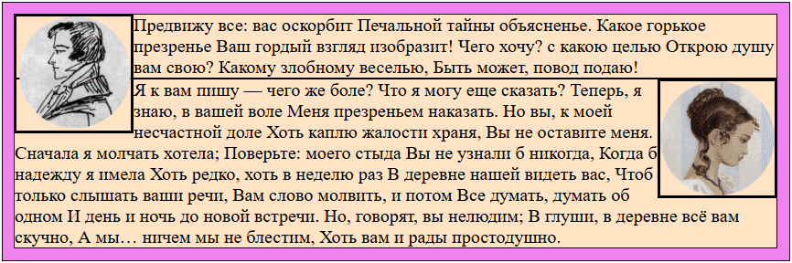
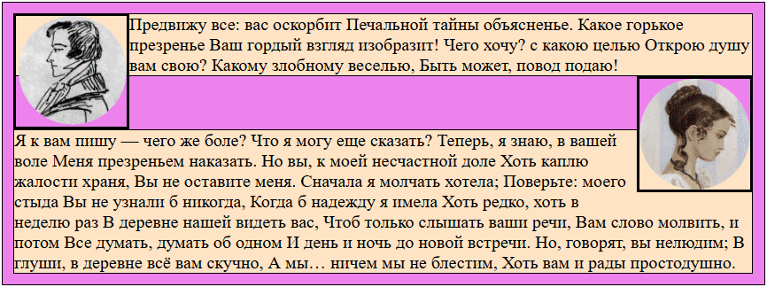
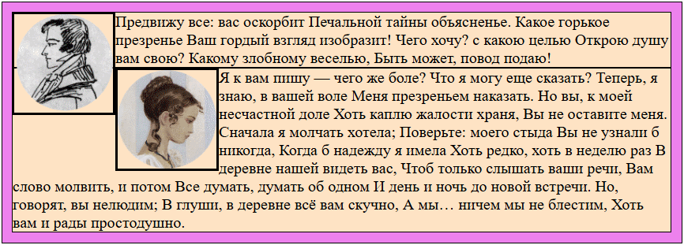
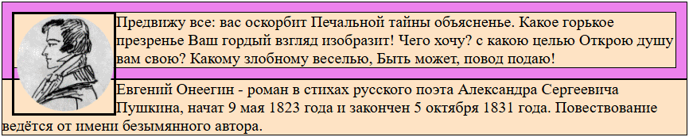
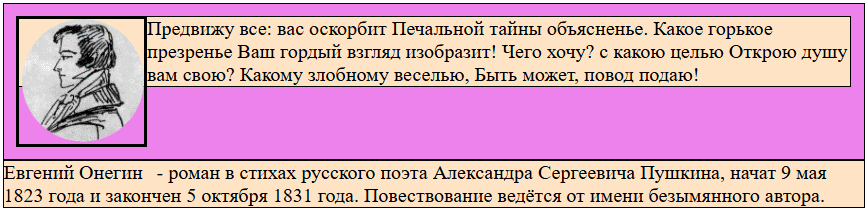

# Разметка для примера

```html
<body>
  <div class="container">
    
    <p class="text text_onegin">Предвижу все: вас оскорбит
      Печальной тайны объясненье.
      Какое горькое презренье
      Ваш гордый взгляд изобразит!
      Чего хочу? с какою целью
      Открою душу вам свою?
      Какому злобному веселью,
      Быть может, повод подаю!
    </p>
    
    <p class="text text_tatyana">Я к вам пишу — чего же боле?
      Что я могу еще сказать?
      Теперь, я знаю, в вашей воле
      Меня презреньем наказать.
      Но вы, к моей несчастной доле
      Хоть каплю жалости храня,
      Вы не оставите меня.
      Сначала я молчать хотела;
      Поверьте: моего стыда
      Вы не узнали б никогда,
      Когда б надежду я имела
      Хоть редко, хоть в неделю раз
      В деревне нашей видеть вас,
      Чтоб только слышать ваши речи,
      Вам слово молвить, и потом
      Все думать, думать об одном
      И день и ночь до новой встречи.
      Но, говорят, вы нелюдим;
      В глуши, в деревне всё вам скучно,
      А мы… ничем мы не блестим,
      Хоть вам и рады простодушно.
    </p>
  </div>
  <p class="text">Евгений Онегин - роман в стихах русского поэта Александра Сергеевича Пушкина,  начат 9 мая 1823 года и закончен 5 октября 1831 года.  Повествование ведётся от имени безымянного автора.</p>
</body>
```

```css
* {
  margin: 0;
}

body {
  padding: 10px;
}

.container {
  border: 1px solid black;
  background-color: violet;
  padding: 10px;
}

.pic {
  width: 150px;
  border: 3px solid black;
}

.pic_onegin {
  float: left;
}

.pic_tatyana {
  float: right;
}

.text {
  background-color: bisque;
  border: 1px solid black;
}

.text_onegin {
}

.text_tatyana {
}
```

# float

Сегодня float нужно использовать исключительно по его исходному назначению - делать обтекание блока текстом. У float есть свои алгоритмы работы и некоторые особенности, которые проще понять на конкретных примерах.

```css
float: none;  /* Дефолт */
float: left;
float: right;
```

# float и поток

## float выпадает из потока

float-элемент сам по себе является блочным, но его ширина равна ширине его контента.

float-элемент выпадает из потока, а следовательно перестает занимать в нем место. Поэтому блочные элементы не видят float-элемент и он как бы возвышается над ними. Это можно видеть на картинке ниже. Картинки сделаны как float и обведены границей. Картинки - это png с прозрачной частью. Благодаря ей видно, что блоки с текстом находятся *под* картинками:



Хотя блок с текстом не видит float-элемент, но сам текст внутри блока - видит. Поэтому здесь текст упирается в картинку.

## float и горизонтальные отступы

Если требуется сделать отступ для float-элемента, то надо задавать его через margin этого элемента. Попытки сделать это, например, через padding блока с текстом будут бесполезны, т.к. он будет задавать отступ от края блока, а текст-то находится не у края блока, а у границы float-элемента.

```css
.pic_onegin {
    margin-right: 15px;  /* Правильно */
}
```

```css
.text_onegin {
    padding-left: 15px;  /* Тщетно */
}
```

## float и вертикальный геймплей, clear

Поскольку float выпадает из потока, мы видели что два блока текста идут непосредственно друг под другом, т.к. для них картинка с Онегиным как бы не существует. Если необходимо сделать, чтобы блок "увидел" float, нужно этому блоку поставить свойство `clear`, выбрав тип float'ов, которые он должен видеть:

```
clear: left | right | both;
```



```css
.text_tatyana {
  clear: left;
}
```

Теперь блок текста с письмом Татьяны увидел картинку Онегина и расположился под ним, т.к. float является блочным.

## float и другие float

float элементы видят друг друга. Поэтому если картинке Татьяны поставить `float: left`, она упрется в картинку Онегина:

```css
.pic_tatyana {
  float: left;
}
```



 ## Контейнер с float внутри

Если у контейнера внутри есть float-элемент, то контейнер не выделяет под него высоту, потому что не видит его. Из-за этого может получиться вот такой эффект:



float-элемент вылез за пределы контейнера и текст, который должен находиться под контейнером, начал обтекать портрет Онегина. Чтобы это поправить, в контейнер со float-элементом надо добавить `display: flow-root`:

```css
.container {
  display: flow-root;  /* Добавляем это контейнеру, внутри которого есть float-элемент */
}
```

Это решает проблему:

