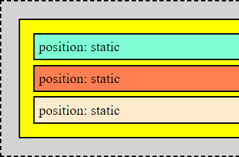
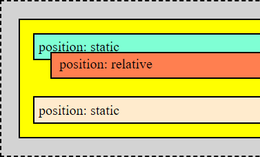
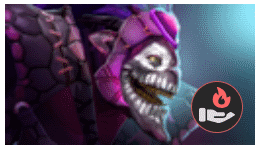

# Позиционирующие свойства

Свойство `position` определяет *модель позиционирования*.

В помощь ему есть позиционирующие свойства, позволяющие выполнить коррекцию позиции:

* `top`,  `bottom`, `right`, `left` - отступ "от". Например, `top: 20px` это "отступ сверху", `left: 20px` это "отступ слева". Можно использовать одно значение для смещения по каждой оси. Т.е. например одновременно указывать left и right - бессмысленно.
  * `inset` - это краткая запись для всех вышеописанных свойств разом. Т.е. если например нужно все их поставить в ноль, можно просто написать `inset: 0`. Тут также действует правило "по часовой стрелке", т.е. `inset: 5px 10px 20px 15px` задает отступы сверху, справа, снизу, слева (см. конспект про обводку, отступы, рамку про этот синтаксис).
* `z-index` - у браузера есть еще третья ось, влияющая на конечный результат отрисовки.

Работают любые единицы измерения. Замечания:

* `%` - если единица смещения задана в процентах, тогда величина смещения рассчитывается от:
  * Размера самого элемента, если у него position:relative
  * Размера родительского элемента, если position:absolute, fixed или sticky.

# Значения для position

## static (дефолт)

```css
position: static;
```

Характеристики:

* Это значение по умолчанию.
* Элемент в потоке документа находится на своем "нормальном" месте.
* На static-элементы не действуют позиционирующие свойства.



```html
<body>
  <div class="pocket">
    <div class="pos-test b1">position: static</div>
    <div class="pos-test b2">position: static</div>
    <div class="pos-test b3">position: static</div>
  </div>
</body>
```

```css
body {
  background-color: lightgrey;
  border: 2px dashed black;
}

.pocket {
  background-color: yellow;
  border: 2px solid black;
  padding: 10px;
  margin: 20px;
}

.pos-test {
  border: 2px solid black;
  padding: 5px;
  margin: 5px;
}

.b1 {
  background-color: aquamarine;
}

.b2 {
  background-color: coral;
  top: -15px;  /* Игнорируется, потому что position: static */
  left: 20px;  /* Игнорируется, потому что position: static */
}

.b3 {
  background-color: blanchedalmond;
}
```

## relative

```css
position: relative;
```

Характеристики:

* Элемент занимает свое "нормальное" место в общем потоке и не влияет на положение других элементов - он не отдает им свое место и не отталкивает их.
* На элемент действуют позиционирующие свойства. Они смещают его относительно его "нормального" положения.



```html
<body>
  <div class="pocket">
    <div class="pos-test b1">position: static</div>
    <div class="pos-test b2">position: relative</div>
    <div class="pos-test b3">position: static</div>
  </div>
</body>
```

```css
body {
  background-color: lightgrey;
  border: 2px dashed black;
}

.pocket {
  background-color: yellow;
  border: 2px solid black;
  padding: 10px;
  margin: 20px;
}

.pos-test {
  border: 2px solid black;
  padding: 5px;
  margin: 5px;
}

.b1 {
  background-color: aquamarine;
}

.b2 {
  background-color: coral;
  position: relative;  /* Относительное позиционирование */
  top: -15px;  /* Поэтому свойство влияет на расположение */
  left: 20px;  /* И это тоже */
}

.b3 {
  background-color: blanchedalmond;
}
```

## absolute

```css
position: absolute;
```

Характеристики:

* Это значение выбивает элемент из потока документа и элемент перестает занимать место в нем.

* Ширина абсолютного элемента берется как ширина его контента.

* Абсолютный элемент позиционируется относительно ближайшего *нестатического* родительского элемента. Родители сканируются до самого верха, включая `<body>`. Если не-static родитель не найден, то позиционирование ведется от body, т.е. по сути от краев экрана.

  Пример: слева у желтого блока position:static, поэтому отсчет ведется от body. А справа у желтого блока position:relative, поэтому отсчет ведется от него.

* Часто absolute используют в комбинации с relative.


```html
<body>
  <div class="pocket">
    <div class="pos-test b1">position: static</div>
    <div class="pos-test b2">position: absolute</div>
    <div class="pos-test b3">position: static</div>
  </div>
</body>
```

```css
body {
  background-color: lightgrey;
  border: 2px dashed black;
}

.pocket {
  background-color: yellow;
  border: 2px solid black;
  padding: 10px;
  margin: 20px;
  position: relative;  /* Если есть не-static родитель, тогда отсчет от него, иначе от body */
}

.pos-test {
  border: 2px solid black;
  padding: 5px;
  margin: 5px;
}

.b1 {
  background-color: aquamarine;
}

.b2 {
  background-color: coral;
  position: absolute;  /* Абсолютное позиционирование */
  top: 20px;   /* Поэтому свойство влияет на расположение */
  left: 20px;  /* И это тоже */
}

.b3 {
  background-color: blanchedalmond;
}
```

### Растянуть внутренний элемент под размер внешнего

Просто небольшой трюк. Например, один элемент вложен в другой и нужно растянуть внутренний до размеров внешнего. Исходная разметка и стили:

```html
<body>
  <div class="box-out">
    Внешний элемент
    <div class="box-in">in</div>
  </div>
</body>
```

```css
.box-out {
  width: 100px;
  height: 100px;
  background-color: antiquewhite;
  border: 1px solid black;
}

.box-in {
  width: 30px;
  height: 30px;
  background-color: lightgreen;
  border: 1px solid black;
}
```

Модифицированные стили: внешний элемент делаем relative, а внутренний absolute и задаем ему нулевые отступы:

```css
.box-out {
  width: 100px;
  height: 100px;
  background-color: antiquewhite;
  border: 1px solid black;
  position: relative;  /* Родительскому ставим relative */
}

.box-in {
  background-color: lightgreen;
  border: 1px solid black;
  
  position: absolute;  /* Вложенному - absolute */
  top: 0;  /* И обнуляем отступы */
  left: 0;
  right: 0;
  bottom: 0;
  /* inset: 0; */  /* Нули разом для всех отступов, краткий вариант */
}
```


## fixed

```css
position: fixed;
```

Характеристики:

* Элемент выпадает из потока документа.
* Его положение определяется относительно окна.


Хорошо подходит для создания модальных окон, когда нужно чтобы позиция блока оставалась на закрепленном месте.

## sticky

```css
position: sticky;
```

sticky - это своеобразная комбинация relative + fixed:

* Липкий элемент изначально находится на своей обычной позиции, как relative.
* Нужно указать "отдаление" элемента от видимого края контейнера. Когда при прокрутке контейнера отдаление достигает заданного значения, элемент закрепляется на месте и начинает крутиться вместе с контейнером дальше.
  * Отдаление можно указать от любого края, не только от верха. Верх просто выбран для примера как самый наглядный.
* Когда прокрутка достигает конца контейнера и уходит дальше, то липкий элемент остается в границах своего контейнера, а страница крутится дальше уже без него.

С помощью sticky удобно делать например хедер, если он должен постоянно находиться на экране. Если есть несколько sticky-элементов и у них одинаковое отдаление, то они наложатся друг на друга, а не будут выталкивать друг друга.

### Несколько дополнений

* Родитель у sticky не обязательно должен быть relative.
* sticky-элемент не ограничивает область просмотра, поэтому при прокрутке другие элементы оказываются непосредственно под sticky-элементом и происходит визуальное наложение одного на другое. Чтобы это скрыть, можно ставить фоновый цвет sticky-элементу.


* Если под sticky-элементом оказывается картинка, она визуально располагается поверх него. Чтобы исправить ситуацию, можно sticky-элементу назначить z-index.


### Пример


```html
<body>
  <div class="cont-1">
    <div class="info">Письмо Онегина Татьяне. Письмо Онегина Татьяне. Письмо Онегина Татьяне. Письмо Онегина Татьяне.</div>
    <p>Предвижу все: вас оскорбит</p>
    <p>Печальной тайны объясненье.</p>
    <div class="sticky">Это sticky-элемент, сначала на своем месте, потом крутится, потом остается в конце своего контейнера.</div>
    <p>Какое горькое презренье</p>
    <p>Ваш гордый взгляд изобразит!</p>
    <p>Чего хочу? с какою целью</p>
    <p>Открою душу вам свою?</p>
    <p>Какому злобному веселью,</p>
    <p>Быть может, повод подаю!</p>

    <p>Случайно вас когда-то встретя,</p>
    <p>В вас искру нежности заметя,</p>
    <p>Я ей поверить не посмел:</p>
    <p>Привычке милой не дал ходу;</p>
    <p>Свою постылую свободу</p>
    <p>Я потерять не захотел.</p>
    <p>Еще одно нас разлучило...</p>
    <p>Несчастной жертвой Ленский пал...</p>
    <p>Ото всего, что сердцу мило,</p>
    <p>Тогда я сердце оторвал;</p>
    <p>Чужой для всех, ничем не связан,</p>
    <p>Я думал: вольность и покой</p>
    <p>Замена счастью. Боже мой!</p>
    <p>Как я ошибся, как наказан.</p>
  </div>
  <div class="cont-2">
    <p>Предвижу все: вас оскорбит</p>
    <p>Печальной тайны объясненье.</p>
    <p>Какое горькое презренье</p>
    <p>Ваш гордый взгляд изобразит!</p>
    <p>Чего хочу? с какою целью</p>
    <p>Открою душу вам свою?</p>
    <p>Какому злобному веселью,</p>
    <p>Быть может, повод подаю!</p>

    <p>Случайно вас когда-то встретя,</p>
    <p>В вас искру нежности заметя,</p>
    <p>Я ей поверить не посмел:</p>
    <p>Привычке милой не дал ходу;</p>
    <p>Свою постылую свободу</p>
    <p>Я потерять не захотел.</p>
    <p>Еще одно нас разлучило...</p>
    <p>Несчастной жертвой Ленский пал...</p>
    <p>Ото всего, что сердцу мило,</p>
    <p>Тогда я сердце оторвал;</p>
    <p>Чужой для всех, ничем не связан,</p>
    <p>Я думал: вольность и покой</p>
    <p>Замена счастью. Боже мой!</p>
    <p>Как я ошибся, как наказан.</p>
  </div>
</body>
```

```css
.cont-1 {
  background-color: bisque;
}

.cont-2 {
  background-color: darkgrey;
}

.info {
  background-color: violet;
}

.sticky {
  background-color: aqua;
  position: sticky;
  top: 0px;
}
```

# Примеры

## relative + absolute

Сделаем вот такую карточку героя с портретом и ролью (демка есть в папке с демками):



```html
<div class="hero-container">
  
  <div class="hero-role-container">
    
  </div>
</div>
```

```css
.hero-container {
  position: relative;
  width: 200px;
}

.hero-portrait {
  width: 100%;
  display: block;
}

.hero-role-container {
  position: absolute;
  right: 5%;
  bottom: 8%;
  width: 20%;
  aspect-ratio: 1/1;
  background-color: #282828;
  border: 1px solid indianred;
  border-radius: 50px;
}

.hero-role-pic {
  position: absolute;
  width: 150%;
  top: 10%;
  left: 15%;
}
```

Задача делается через настройку позиционирования. Главная идея: есть контейнер под карточку целиком. Блок с картинкой роли позиционируется относительно этого контейнера, а картинка роли позиционируется относительно блока роли.

* Под карточку создаем контейнер.
  * Устанавливаем ему `position: relative`, чтобы блок под роль позиционировался относительно именно этого контейнера.
  * Задаем ширину контейнеру. Тут это можно использовать, чтобы потом изменять эту ширину и смотреть как меняются пропорции остальных частей. В реальной задаче размер возможно будет определяться внешним контейнером.
* Картинку с портретом героя вкладываем в контейнер.
  * Ставим картинке `display: block`, чтобы не было зазора между ней и контейнером.
  * Ширину задаем как `width: 100%`, чтобы размер картинки определялся размером контейнера целой карточки.
* Создаем контейнер под картинку роли. Он нужен для создания "кружка", в котором будет находиться картинка. Так симпатичнее, и к тому же демонстрирует дополнительные тонкости позиционирования.
  * Ставим контейнеру роли `position: absolute`, чтобы он позиционировался относительно своего родительского контейнера, т.е. контейнера карточки. Если бы мы поставили relative, то он бы позиционировался относительного своей исходной позиции, а это не то что нам нужно.
  * Ширину контейнеру роли задаем в процентах - это процент от ширины родительского контейнера.
    * Высоту задаем через `aspect-ratio: 1/1/`, чтобы она автоматически определилась и была такая же как и ширина.
  * Через свойства `right` и `bottom` позиционируем контейнер роли относительно правой и нижней сторон контейнера карточки.
  * Добавляем закругление, цвет и обводку по вкусу.
* Картинку роли тоже позиционируем через absolute, чтобы отсчет шел от контейнера роли.


