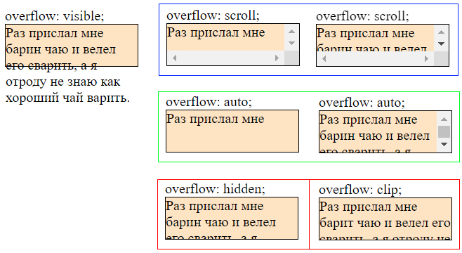
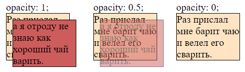
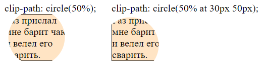

# Переполнение, overflow

```css
overflow: visible;  /* По умолчанию */
overflow: visible visible;  /* Ось x, ось y */
overflow-x: visible;
overflow-y: visible;
```

## Зачем нужно

Определяет поведение блочного элемента, когда содержимое превышает его размеры.

```html
<body>
  <div class="foobar overflow-demo">
    Раз прислал мне барин чаю и велел его сварить,
    а я отроду не знаю как хороший чай варить.
  </div>
  <br />
  <button>Прокрутить невидимое</button>
  <script>
    const box = document.querySelector(".foobar");
    const but = document.querySelector("button");
    but.addEventListener("click", () => box.scrollTop += 10);
  </script>
</body>
```

```css
.foobar {
  background-color: bisque;
  border: 1px solid black;
  width: 150px;
  height: 47px;
}

.overflow-demo {
    
}
```

## Значения



Как работают эти значения:

* `visible` - значение по умолчанию. Не влезающее содержимое просто отображается за пределами блока.
* `scroll` и `auto`
  * `scroll` - браузер добавляет элементу полосы прокрутки, которыми можно пролистать содержимое, если оно не влезает в блок. Полосы отображаются в любом случае, даже если все влезает и они по сути не нужны.
  * `auto` - браузер добавляет элементу полосы прокрутки только при реальной необходимости.
* `hidden` и `сlip`:
  * `hidden` - не влезающее содержимое визуально обрезается, но его можно пролистать программно.
  * `clip` - не влезающее содержимое визуально обрезается и его *нельзя* пролистать программно.

# Видимость

## opacity

```css
opacity: 1;  /* По умолчанию, непрозрачное */
```

`opacity` отвечает за прозрачность элемента. Значения от 0 до 1.



Характеристики:

* Влияет исключительно на видимость. Полностью прозрачный элемент визуально невидимый, однако занимает место в потоке документа и реагирует на все события. Например, прозрачную кнопку можно кликать точно также, как видимую.

```html
<body>
  opacity: 0;
  <div class="container">
    <div class="foo">
      Раз прислал мне барит чаю и велел его сварить.
    </div>
    <div class="bar opacity-demo">
      а я отроду не знаю как хороший чай варить.
    </div>
  </div>
</body>
```

```css
.opacity-demo {
  opacity: 0;
}

.container {
  position: relative;
}

.foo {
  background-color: bisque;
  border: 1px solid black;
  width: 100px;
}

.bar {
  background-color: indianred;
  border: 1px solid black;
  width: 100px;
  position: absolute;
  top: 10px;
  left: 10px;
}
```

## visibility

```css
visibility: visible | hidden;
```

Характеристики:

* У `visibility` нет переходных состояний. Элемент либо полностью видим, либо полностью невидим.
* Невидимый элемент занимает место в потоке документа, но с ним никак нельзя взаимодействовать. Например, невидимую кнопку нельзя щелкнуть.

# Обрезка

## clip-path

```css
clip-path: none;  /* По умолчанию */
clip-path: circle(50%);
clip-path: circle(50% at 30px 50px);
```



Характеристики:

* Обрезать можно любой элемент, а не только например картинки.

Возможные значения:

* `none` - по умолчанию, без обрезки.
* `форма(50%)`, `форма(50% at 50% 50%)` - обрезает по указанной форме до указанной степени. После at можно указать стартовую точку обрезки. По умолчанию - из центра элемента. Возможные значения формы:
  * `circle`
  * `ellipse`
  * `polygon(x1 y1, x2 y2, ... xn yn)` - например, `polygon(`20% 0%`, `80% 0%`, `100% 100%`, `0% 100%`)`
  * `path` - сложная форма в формате svg-координат. Можно даже связать svg-элемент на странице с, например, картинкой, и она обрежется по его форме. [Тут](https://www.youtube.com/watch?v=p0Hb2RtISOU&list=PL0MUAHwery4o9I7QQVj_RP4ZVpmdx6evz&index=16) на 7:54 можно посмотреть пример. TODO: прикольно, но слишком декоративно.
    * Сервис для генерации [форм обрезки](https://bennettfeely.com/clippy/).

```html
<body>
  <div class="foobar">
    Раз прислал мне барин чаю и велел его сварить.
  </div>
</body>
```

```css
.foobar {
  background-color: bisque;
  border: 1px solid black;
  width: 100px;
  clip-path: circle(50%);
}
```