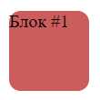
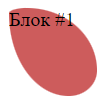
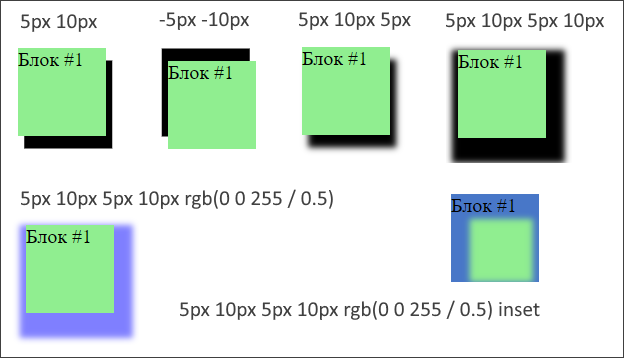
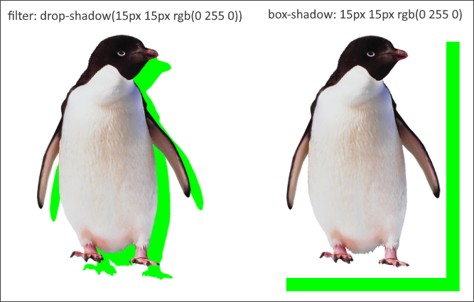

# border-radius, закругление краев элемента

Несмотря на то, что свойство называется `border-radius`, к рамке border оно не имеет никакого отношения. У этого элемента вообще нет border, но есть закругление:



```css
.bm-test {
  width: 70px;
  height: 70px;
  margin: 20px;
  background-color: indianred;
  border-radius: 10px;
}
```

В старых браузерах закругление не действует на обводку. Но в современных все в порядке.

## Синтаксис

```css
border-radius: 50px;  /* Получится круг, кстати */
border-radius: 0 30px 50px 30px;  /* Левый верхний угол, правый верх., правый нижний, левый нижний */
```

```css
border-top-left-radius: 25px;
border-top-right-radius: 25px;
border-bottom-right-radius: 25px;
border-bottom-left-radius: 25px;
```

## Хитрые фигуры

С помощью закругления можно придавать элементу разные экзотические формы. Для этого даже есть специальные генераторы, например [этот](https://9elements.github.io/fancy-border-radius/):

```css
border-radius: 20% 80% 32% 68% / 6% 71% 29% 94%;
```



Получилось нечто похожее на листок дерева.

# box-shadow, тени

```css
box-shadow: 5px 10px        3px       15px    rgb(0 0 255 / 0.5)         inset, следующая тень;
/* Смещение x,  смещение y, размытие, размер, цвет + коэф. прозрачности, направление внутрь */
```



Замечания:

* Отдельно задавать параметры размытия и размера тени нельзя. Впрочем, как будто бы это и не особо нужно.
* Через запятую можно задать несколько теней.

# filter, фильтры

```css
filter: none;
filter: sepia(80%);
```

Фильтры можно применить к изображениям, добившись какого-то визуального эффекта.

[Примеры](https://html5css.ru/cssref/css3_pr_filter.php) как выглядят изображения с фильтрами и список доступных фильтров.

Единственный интересный и неочевидный ход здесь - это эффект drop-shadow в комбинации с png-изображениями. Он позволяет сделать тень непосредственно от содержимого картинки, а не от самого элемента:

```css
/* Почувствуй разницу */
filter: drop-shadow(15px 15px rgb(0 255 0));
box-shadow: 15px 15px rgb(0 255 0);
```

