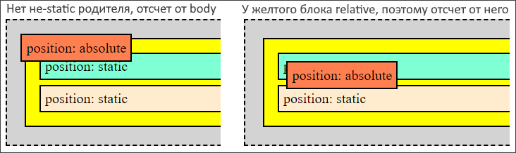

# position, позиционирование

## Позиционирующие свойства

Свойство `position` определяет модель позиционирования, позволяет позиционировать элемент разными способами.

Свойства, позволяющие выполнить коррекцию позиции (дальше буду называть их "позиционирующие свойства"):

* `top`,  `bottom`, `right`, `left` - отступ "от". Например, `top: 20px` это "отступ сверху", `left: 20px` это "отступ слева". Можно использовать одно значение для смещения по каждой оси. Т.е. например одновременно указывать left и right - бессмысленно.
  * `inset` - это краткая запись для всех вышеописанных свойств разом. Т.е. если например нужно все их поставить в ноль, можно просто написать `inset: 0`. Тут также действует правило "по часовой стрелке", т.е. `inset: 5px 10px 20px 15px` задает отступы сверху, справа, снизу, слева (см. конспект про обводку, отступы, рамку про этот синтаксис).
* `z-index` - у браузера есть еще третья ось, влияющая на конечный результат отрисовки.

Работают любые единицы измерения. Замечания:

* `%` - если единица смещения задана в процентах, тогда величина смещения рассчитывается от:
  * Размера самого элемента, если у него position:relative
  * Размера родительского элемента, если position:absolute, fixed или sticky.

## static

```css
position: static;
```

Характеристики:

* Это значение по умолчанию.
* Элемент в потоке документа находится на своем "нормальном" месте.
* На static-элементы не действуют позиционирующие свойства.


```html
<body>
  <div class="pocket">
    <div class="pos-test b1">position: static</div>
    <div class="pos-test b2">position: static</div>
    <div class="pos-test b3">position: static</div>
  </div>
</body>
```

```css
body {
  background-color: lightgrey;
  border: 2px dashed black;
}

.pocket {
  background-color: yellow;
  border: 2px solid black;
  padding: 10px;
  margin: 20px;
}

.pos-test {
  border: 2px solid black;
  padding: 5px;
  margin: 5px;
}

.b1 {
  background-color: aquamarine;
}

.b2 {
  background-color: coral;
  top: -15px;  /* Игнорируется, потому что position: static */
  left: 20px;  /* Игнорируется, потому что position: static */
}

.b3 {
  background-color: blanchedalmond;
}
```

## relative

```css
position: relative;
```

Характеристики:

* Элемент занимает свое "нормальное" место в общем потоке и не влияет на положение других элементов - он не отдает им свое место и не отталкивает их.
* На элемент действуют позиционирующие свойства. Они смещают его относительно его "нормального" положения.


```html
<body>
  <div class="pocket">
    <div class="pos-test b1">position: static</div>
    <div class="pos-test b2">position: relative</div>
    <div class="pos-test b3">position: static</div>
  </div>
</body>
```

```css
body {
  background-color: lightgrey;
  border: 2px dashed black;
}

.pocket {
  background-color: yellow;
  border: 2px solid black;
  padding: 10px;
  margin: 20px;
}

.pos-test {
  border: 2px solid black;
  padding: 5px;
  margin: 5px;
}

.b1 {
  background-color: aquamarine;
}

.b2 {
  background-color: coral;
  position: relative;  /* Относительное позиционирование */
  top: -15px;  /* Поэтому свойство влияет на расположение */
  left: 20px;  /* И это тоже */
}

.b3 {
  background-color: blanchedalmond;
}
```

## absolute

```css
position: absolute;
```

Характеристики:

* Это значение выбивает элемент из потока документа и элемент перестает занимать место в нем.

* Ширина абсолютного элемента берется как ширина его контента.

* Абсолютный элемент позиционируется относительно ближайшего *нестатического* родительского элемента. Родители сканируются до самого верха, включая `<body>`. Если не-static родитель не найден, то позиционирование ведется от body, т.е. по сути от краев экрана.

  Пример: слева у желтого блока position:static, поэтому отсчет ведется от body. А справа у желтого блока position:relative, поэтому отсчет ведется от него.

* Часто absolute используют в комбинации с relative.



```html
<body>
  <div class="pocket">
    <div class="pos-test b1">position: static</div>
    <div class="pos-test b2">position: absolute</div>
    <div class="pos-test b3">position: static</div>
  </div>
</body>
```

```css
body {
  background-color: lightgrey;
  border: 2px dashed black;
}

.pocket {
  background-color: yellow;
  border: 2px solid black;
  padding: 10px;
  margin: 20px;
  position: relative;  /* Если есть не-static родитель, тогда отсчет от него, иначе от body */
}

.pos-test {
  border: 2px solid black;
  padding: 5px;
  margin: 5px;
}

.b1 {
  background-color: aquamarine;
}

.b2 {
  background-color: coral;
  position: absolute;  /* Абсолютное позиционирование */
  top: 20px;   /* Поэтому свойство влияет на расположение */
  left: 20px;  /* И это тоже */
}

.b3 {
  background-color: blanchedalmond;
}
```

### Растянуть внутренний элемент под размер внешнего

Просто небольшой трюк. Например, один элемент вложен в другой и нужно растянуть внутренний до размеров внешнего. Исходная разметка и стили:

```html
<body>
  <div class="box-out">
    Внешний элемент
    <div class="box-in">in</div>
  </div>
</body>
```

```css
.box-out {
  width: 100px;
  height: 100px;
  background-color: antiquewhite;
  border: 1px solid black;
}

.box-in {
  width: 30px;
  height: 30px;
  background-color: lightgreen;
  border: 1px solid black;
}
```

Модифицированные стили: внешний элемент делаем relative, а внутренний absolute и задаем ему нулевые отступы:

```css
.box-out {
  width: 100px;
  height: 100px;
  background-color: antiquewhite;
  border: 1px solid black;
  position: relative;  /* Родительскому ставим relative */
}

.box-in {
  background-color: lightgreen;
  border: 1px solid black;
  
  position: absolute;  /* Вложенному - absolute */
  top: 0;  /* И обнуляем отступы */
  left: 0;
  right: 0;
  bottom: 0;
  /* inset: 0; */  /* Нули разом для всех отступов, краткий вариант */
}
```


## fixed

```css
position: fixed;
```

Характеристики:

* Элемент выпадает из потока документа.
* Его положение определяется относительно окна.


Хорошо подходит для создания модальных окон, когда нужно чтобы позиция блока оставалась на закрепленном месте.

## sticky

```css
position: sticky;
```

TODO: выглядит замороченно, вернуться потом. Если что, вот тут https://www.youtube.com/watch?v=jQCzxM2dPWU&list=PL0MUAHwery4o9I7QQVj_RP4ZVpmdx6evz&index=10 с седьмой минуты про него.

# z-index

## Глубина

```css
z-index: 100;  /* Или любое другое положительное или отрицательное целое число */
```

Каждый элемент кроме позиции по горизонтали и вертикали еще имеет позицию по оси Z, или глубину.

* `z-index` явно можно задать только не-static элементам.
* По умолчанию считается, что какой элемент ниже по разметке, тот выше по Z.
* Больше Z - значит ближе к пользователю. Если у d1 z = 100, а у d2 z = 200, то d2 находится поверх d1, перекрывает его.
* У всех элементов z-index равен auto, если его не трогать. Браузер автоматически расставляет глубину элементам.
* Если у элемента явно указан z-index, то этот элемент считается выше любого, у кого z-index не указан.
* Хорошей практикой является задание индексов кратных 100, в пределах от 100 до 1000. Это позволяет при необходимости легко впихнуть новый слой между существующими.

```html
<body>
  <div class="box b1">b1</div>
  <div class="box b2">b2</div>  <!-- Этот блок выше блока b1 по оси Z -->
</body>
```

```css
.box {
  width: 100px;
  height: 100px;
  border: 2px solid black;
  margin: 5px;
}

.b1 {
  background-color: bisque;
  /* position: relative; 
     z-index: 100;       */  /* Можем явно указать, какой элемент должен быть выше в стопке */
}

.b2 {
  background-color: aqua;
  position: relative;
  top: -75px;
  left: 25px;
}
```


## z-index и вложенные элементы

Что можно сказать на эту тему:

* z-index вложенных элементов зависит от индекса родителя.
  * Если у родительского элемента задан z-index, то у вложенных элементов не будут работать z-index с меньшим значением. С большим - будут. Например, если у родителя 100, то у потомка может быть 110, но не 90.
    * Т.о., вложенный элемент визуально не может встать "позади" родителя.
* z-index'ы двух элементов `q` и `w`, вложенных в разные родительские элементы, не влияют на взаимное отображение q и w. Отображение будет определяться z-index'ами их родителей.
  * Т.о., z-index'ы вложенных элементов влияют на отображение только в пределах родителя.

Пример:

```html
<body>
  <div class="box a">a
    <div class="box a-in1">a-in1</div>
    <div class="box a-in2">a-in2</div>
  </div>
  <div class="box b">b
    <div class="box b-in1">b-in1</div>
    <div class="box b-in2">b-in2</div>
  </div>
</body>
```

```css
.box {
  width: 75px;
  height: 75px;
  border: 2px solid black;
  margin: 5px;
}

.a {
  background-color: darkseagreen;
  position: relative;
}

.a-in1 {
  background-color: chartreuse;
  position: relative;
  top: 20px;
  left: 10px;
}

.a-in2 {
  background-color: green;
  position: relative;
  top: -20px;
  left: 30px;
}

.b {
  background-color: darkgoldenrod;
  position: relative;
}

.b-in1 {
  background-color: gold;
  position: relative;
  left: 10px;
}

.b-in2 {
  background-color: yellow;
  position: relative;
  top: -60px;
  left: 30px;
}
```


0. Исходные стили - именно в таком виде, как в css-сниппете сверху. Ни у кого не указан индекс, поэтому глубина определяется по расположению в разметке. `b` в разметке находится дальше, чем `a`, поэтому `b` и его вложенные элементы визуально перекрывают `a` с его элементами.
1. Задаем `a` индекс. У `b` индекса нет, поэтому `a` считается выше и его вложенные элементы тоже вылезают вперед.
2. Задаем `a-in1` индекс меньше, чем у родителя и убеждаемся в том, что вложенный элемент не может визуально оказаться позади родителя. Но зато `a-in1` оказывается впереди `a-in2`, потому что у того не задан индекс вообще.
3. Задаем `a-in2` индекс явно, просто чтобы было. Если бы задали 115, он бы оказался впереди.
4. Задаем `a` индекс 100, а `b` 200. Видим, что `b` и его вложенные элементы снова впереди.
5. Задаем `a-in2` индекс 300, а `b-in2` 250, но видим что `a-in2` не вылезает вперед. Все потому, что у его родителя индекс меньше, чем у родителя `b-in2`.

# Примеры

## На позиционирование, position

Сделаем вот такую карточку героя с портретом и ролью:


```html
<div class="hero-container">
  
  <div class="hero-role-container">
    
  </div>
</div>
```

```css
.hero-container {
  position: relative;
  width: 200px;
}

.hero-portrait {
  width: 100%;
  display: block;
}

.hero-role-container {
  position: absolute;
  right: 5%;
  bottom: 8%;
  width: 20%;
  aspect-ratio: 1/1;
  background-color: #282828;
  border: 1px solid indianred;
  border-radius: 50px;
}

.hero-role-pic {
  position: absolute;
  width: 150%;
  top: 10%;
  left: 15%;
}
```

Задача делается через настройку позиционирования. Главная идея: есть контейнер под карточку целиком. Блок с картинкой роли позиционируется относительно этого контейнера, а картинка роли позиционируется относительно блока роли.

* Под карточку создаем контейнер.
  * Устанавливаем ему `position: relative`, чтобы блок под роль позиционировался относительно именно этого контейнера.
  * Задаем ширину контейнеру. Тут это можно использовать, чтобы потом изменять эту ширину и смотреть как меняются пропорции остальных частей. В реальной задаче размер возможно будет определяться внешним контейнером.
* Картинку с портретом героя вкладываем в контейнер.
  * Ставим картинке `display: block`, чтобы не было зазора между ней и контейнером.
  * Ширину задаем как `width: 100%`, чтобы размер картинки определялся размером контейнера целой карточки.
* Создаем контейнер под картинку роли. Он нужен для создания "кружка", в котором будет находиться картинка. Так симпатичнее, и к тому же демонстрирует дополнительные тонкости позиционирования.
  * Ставим контейнеру роли `position: absolute`, чтобы он позиционировался относительно своего родительского контейнера, т.е. контейнера карточки. Если бы мы поставили relative, то он бы позиционировался относительного своей исходной позиции, а это не то что нам нужно.
  * Ширину контейнеру роли задаем в процентах - это процент от ширины родительского контейнера.
    * Высоту задаем через `aspect-ratio: 1/1/`, чтобы она автоматически определилась и была такая же как и ширина.
  * Через свойства `right` и `bottom` позиционируем контейнер роли относительно правой и нижней сторон контейнера карточки.
  * Добавляем закругление, цвет и обводку по вкусу.
* Картинку роли тоже позиционируем через absolute, чтобы отсчет шел от контейнера роли.


