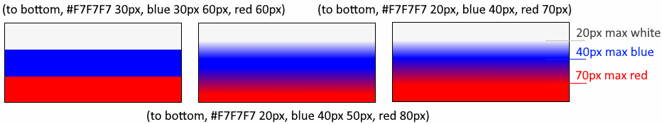
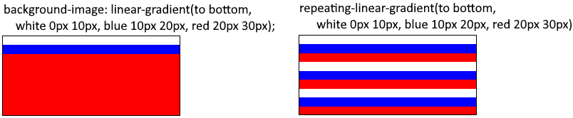
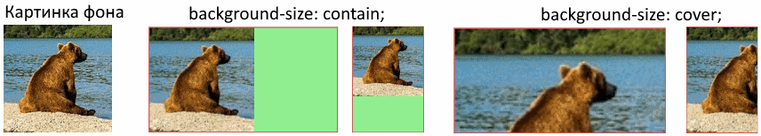
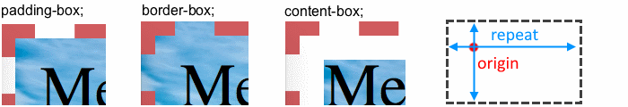
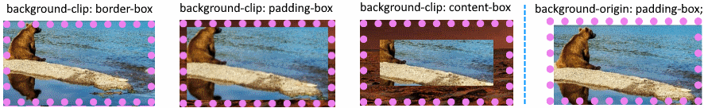
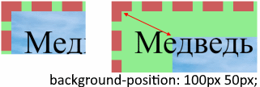
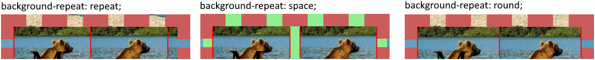
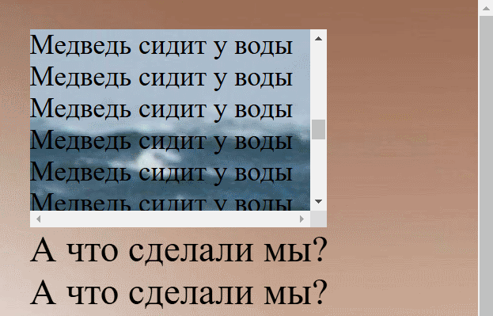

## Фон, background

Задает фон для блока. Это может быть цвет, картинка и т.д. Имеет множество отдельных свойств для каждой настройки.

* Само свойство `background` является обобщенным для задания всех настроек разом.

  TODO: А вот например свойства clip и origin имеют одинаковые значения, например, и там и там есть padding-box, border-box. Если задать одновременно padding-box и border-box, то как свойство поймет, что относится к clip, а что к origin?

* "Фоном" элемента может быть все пространство элемента внутри бордера (включая сам бордер). Маргин - не может.

* В случае "мультифона", т.е. когда для фона указано несколько картинок, любое свойство позволяет задать отдельные значения для каждой картинки, через запятую. Очередность соответствует очередности перечисления картинок.


## Картинка для фона, background-image

```css
background-image: none;  /* Дефолт, нет никакого фона */
background-image: url("foo/bar/image.jpg");
background-image: url("foo/bar/picture.png"), url("foo/bar/image.jpg");
```

* Путь до картинки отсчитывается от папки, в которой лежит файл стилей.
* Можно указывать сразу несколько фоновых картинок. На самом верху будет та, что идет в списке первой. Если она прозрачная, тогда картинки наложатся друг на друга. Если не прозрачная - то она перекроет ту, что под ней.
* По умолчанию картинка располагается в левом верхнем углу элемента (не заезжая под бордер) и повторяется по горизонтали и вертикали.


## Градиент для фона, background-image

* Градиент задается функцией. Есть несколько видов градиентов.
* Градиент не имеет размера и всегда заполняет элемент целиком.
* Градиент это разновидность картинки. Это значит, что градиент и картинка располагаются друг над другом в зависимости от того, что описано первее.

### linear-gradient(), repeating-linear-gradient()

```css
background-image: linear-gradient(direction, color_1 start stop, ..., color_n start stop);
background-image: repeating-linear-gradient(direction, color_1 start stop, ..., color_n start stop);
```

* `direction` - направление градиента, по сути это угол, задается ключевыми словами или числом:

  * угол:
    * `deg` - градусы от 0 до 360.
    * `turn` - "обороты", от 0 до 1. 1 - это целый оборот, 360 градусов. Соответственно, `0.25turn` - это четверть оборота или 90 градусов.
    
  * слова:

    * `to top` (снизу вверх, аналогично 0deg), `to right` (слева направо, 90deg) `to left`, `to bottom`.

    Можно сочетать слова, например `to bottom right` означает градиент к нижнему правому углу.

* границы цвета - задаются в пикселях или процентах. Если задано только одно значение, то это будет stop.

  * `start` - точка, в которой заканчивается плавный переход из предыдущего цвета в текущий. Можно сказать, это начальная точка "максимума" текущего цвета.
  * `stop` - точка, в которой начинается плавный переход из текущего цвета в следующий. Можно сказать, что это конечная точка "максимума" текущего цвета. После нее он уже начинает переходить в следующий цвет.

  Соответственно, между start и stop идет сплошной текущий цвет. Если конец текущего цвета и начало следующего совпадают, то переход будет резкий.



> PS. Сначала я сформулировал так: `start` - точка, в которой сплошной цвет начинается. `stop` - точка, в которой сплошной цвет заканчивается. Между концом одного цвета и началом другого будет плавный переход.
>
> Но такая формулировка затрудняла понимание, когда у промежуточного цвета только одно число, т.е. как бы есть начало, но нет конца. Так что итоговая формулировка, хотя и может выглядеть чуть сложнее, но лучше отражает суть.

repeating-градиент имеет такой же синтаксис. Только если точки расставлены так, что градиент не покрывает весь блок, то он начнет повторяться, а не растягиваться:



### conic-gradient(), repeating-conic-gradient()

TODO

### radial-gradient(), repeating-radial-gradient()

TODO


## Размер фоновой картинки, background-size

```css
background-size: auto;  /* Дефолт */
```

Значения:

* `auto` - картинка на фоне имеет свой оригинальный размер и не масштабируется.
* `200px` или `200px 50px` - конкретные значения для ширины и высоты в пикселях, rem и других единицах. Если только одно - то это ширина, а высота вычислится автоматически.
* `100%` или `100% 50%` - конкретные значения для ширины и высоты в процентах. Если только одно - то это ширина, а высота вычислится автоматически. Процент берется от размера элемента, фоном для которого является картинка.
* `contain` - картинка масштабируется так, чтобы быть полностью видимой (contain - "вместиться") и заполнить короткую сторону контейнера.
* `cover` - картинка масштабируется так, чтобы заполнить весь контейнер (cover - "покрыть"). Она растягивается и обрезается, без искажения пропорций.




## Цвет, background-color

```css
background-color: transparent;  /* Дефолт */
background-color: red;
background-color: #FF0000;
```

Задает цвет фона. Никаких особых настроек нет. Особенности:

* `background-image` имеет приоритет над `background-color`, т.е. картинка всегда отображается поверх цвета.

Возможные форматы значения:

* `transparent` (дефолт) - прозрачный, цвета нет.
* Цвет в любом из возможных форматов:
  * `white`, `blue`, `red` и т.д. - одно из предопределенных значений.
  * `#FF0000` - цвет в шестнадцатеричном формате.
  * `rgb(red, green, blue)` - каждое значение в диапазоне от 0 до 255, например красный rgb(255, 0, 0).
  * `rgba(red, gree, blue, %)` - rgb с затемненностью. Затемненность задается в процентах. 100% затемненность означает сплошной цвет. Соответственно, чем она меньше, тем цвет становится прозрачнее и через него просвечивается то, что под ним.
  * `hsl(hue, saturation, lightness)`
    * hue - оттенок, число от 0 до 360.
    * saturation - насыщенность, проценты 0 - 100. 100 означает чистый цвет, если меньше - оттенки серого.
    * lightness - светлота, процента 0 - 100.
  * `hsla(hue, saturation, lightness, opacity)` - расширение hsl с непрозрачностью. Она задается числом от 0 до 1. 1 - сплошной цвет, 0 - полностью прозрачный.


## Ориджин, точка начала фона, background-origin

```css
background-origin: padding-box;  /* Дефолт */
```

`background-origin` задает точку, от которой начинает отрисовываться фон.



* `padding-box` (дефолт) - фон начинается от бордера.
* `border-box` - фон начинается из-под бордера.
* `content-box` - фон начинается от области контента.

P.S. Для наглядности в этом примере отключено повторение фона, `background-repeat: none`, иначе фон будет повторяться и эффекты от origin могут быть не очевидны, если картинка однотонная.


## Обрезка фона, background-clip

```
background-clip: border-box;  /* Дефолт */
```

`background-clip` задает область, по которой фон обрезается.

* Обрезанная область становится прозрачной.
* Обрезанный фон не повторяется и поэтому background-repeat не дает никакого эффекта, если фон обрезан. Т.е. обрезка работает не на картинку, а именно на фон как на концепцию.

Эффект свойства видно нагляднее, если использовать одновременно два фона и обоим поставить `background-origin: border-box`, чтобы они начинались уже под бордером. Но для сравнения на последней картинке origin дефолтный (и clip дефолтный, border-box).



Значения:

* `border-box` - по сути, обрезки нет. В фон попадает все, включая бордер-зону.
* `padding-box` - фон обрезается по границе паддинга.
* `content-box` - фон обрезается по границе контента.

Т.е. по сути о clip можно думать как о вопросе "что оставить в фоне"?


## Смещение фона, background-position

```css
background-position: 50px;  /* Одновременно для x и y */
background-position: 50px center;  /* Раздельно для x и y */
background-position-x: 50px;
background-position-y: 50px;
```

`background-position` задает смещение фона относительно точки начала (origin'а).



Смещение задается для x и y и может иметь значения:

* `left`, `right`, `top`, `bottom`, `center`
* Числа в `%`, `px`, `rem` и т.д.


## Повторение фона, background-repeat

```css
background-repeat: repeat;  /* Дефолт */
```

Значения:

* `repeat` (дефолт) - повторение по обеим осям. Картинка не растягивается, повторяется впритык и поэтому в конце мы увидим только часть картинки.
* `repeat-x` - повторение только по x.
* `repeat-y` - повторение только по y.
* `no-repeat` - фон не повторяется.
* `space` - фон повторяется так, чтобы картинка не растягивалась, а оставшееся место пробелится.
* `round` - фон повторяется столько раз, чтобы заполнить все пространство, а пробелов нет, потому что картинка растягивается.




## Прокрутка фона, background-attachment

```css
background-attachment: scroll;  /* Дефолт */
```



Возможные значения:

* `scroll` (дефолт) - фон прокручивается вместе со страницей.

* `fixed` - фон НЕ прокручивается вместе со страницей.

* `local` - актуально для элементов, у которых есть собственная прокрутка. Без local фон такого элемента не будет прокручиваться, с local - будет.

  На примере сверху есть блок с текстом "Медведь сидит у воды". У этого блока фиксированные размеры, а контент привел к переполнению и появлению прокрутки. При стандартном режиме scroll мы будем крутить его ползунок, но медведя не увидим, потому что фон крутиться не будет. Изменив режим на local, и крутя до упора вниз, мы увидим медведя, потому что фон будет крутиться. При этом прокрутка страницы целиком не приводит к прокрутке этого локального блока.


## Смешивание фонов, background-blend-mode

```css
background-blend-mode: normal;  /* Дефолт */
```

Остальные режимы:

```css
background-blend-mode: multiply;
background-blend-mode: screen;
background-blend-mode: overlay;
background-blend-mode: darken;
background-blend-mode: lighten;
background-blend-mode: color-dodge;
background-blend-mode: saturation;
background-blend-mode: color;
background-blend-mode: luminosity;
```

