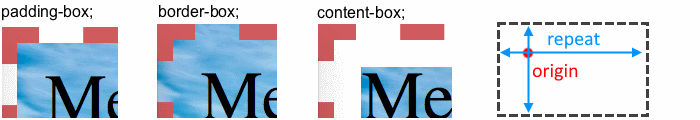

## Фон, background

Задает фон для блока. Это может быть цвет, картинка и т.д. Имеет множество отдельных свойств для каждого нюанса.

* Само свойство `background` является обобщенным для задания всех нюансов разом.
* "Фоном" элемента считается все пространство элемента внутри бордера. Маргин - не считается.

## background-image, Фоновая картинка

```css
background-image: none;  /* Дефолт, нет никакого фона */
background-image: url("foo/bar/image.jpg");
background-image: url("foo/bar/picture.png"), url("foo/bar/image.jpg");
```

* Путь отсчитывается от папки, в которой лежит файл стилей.
* Можно указывать сразу несколько фоновых картинок. На самом верху будет та, что идет в списке первой. Если она прозрачная, тогда картинки наложатся друг на друга. Если не прозрачная - то она перекроет ту, что под ней.
* По умолчанию картинка располагается в левом верхнем углу элемента и повторяется по горизонтали и вертикали.


## background-image, Градиент

TODO


## background-origin, Точка начала фона

`background-origin` задает точку, от которой начнет отрисовываться фон.




## Взаимодействие свойств

* `background-image` имеет приоритет над `background-color`, т.е. картинка всегда отображается поверх цвета.

