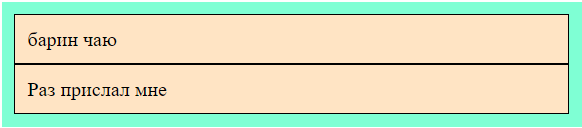
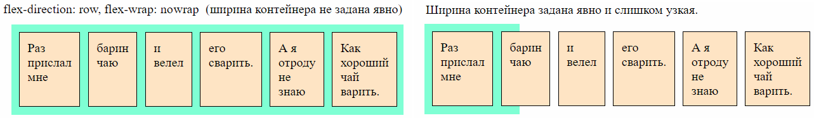
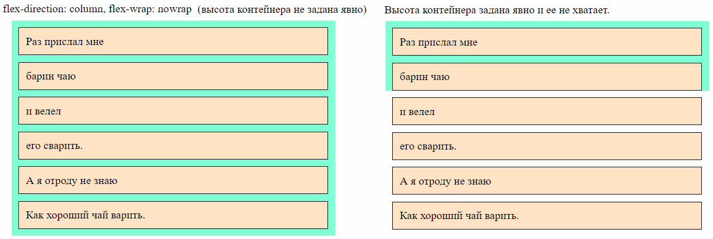
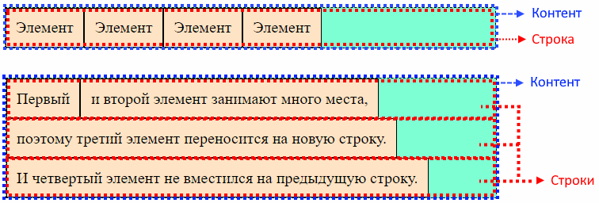
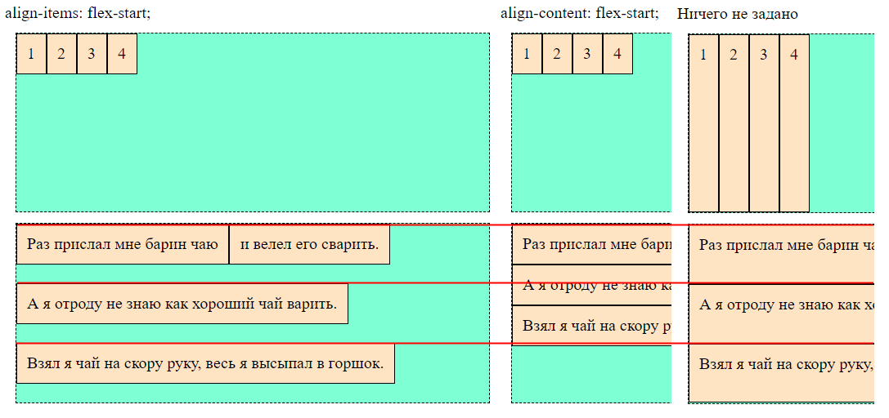
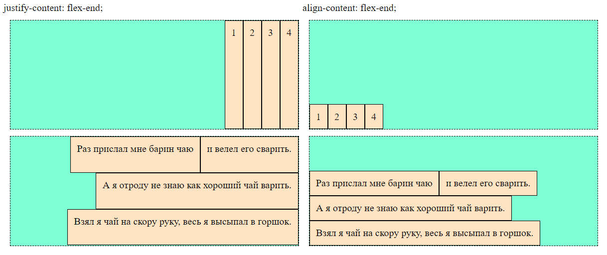
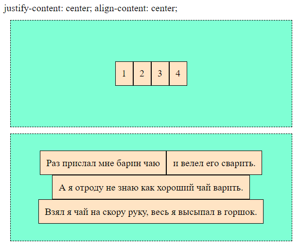
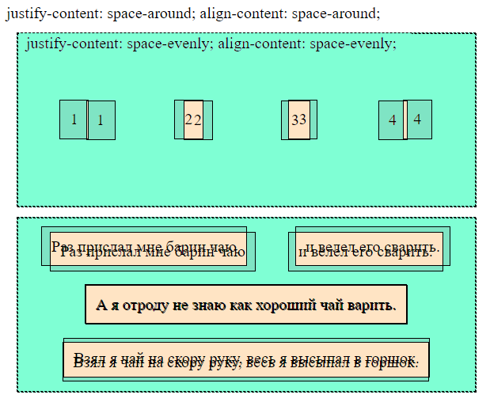
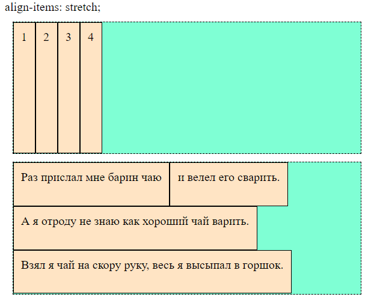
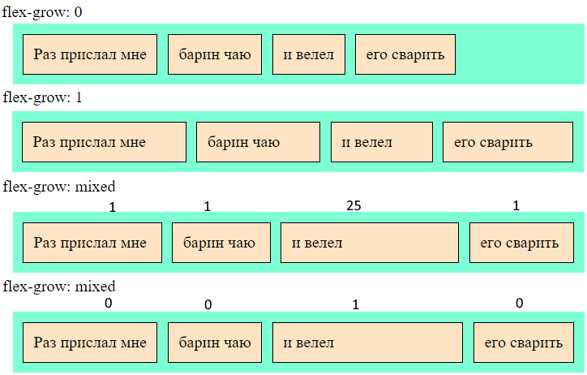

# Контейнер и элемент

* Флекс-контейнер - это элемент, для которого установлено свойство:

  ```css
  display: flex;         /* Контейнер ведет себя как блочный элемент  */
  display: inline-flex;  /* Контейнер ведет себя как строчный элемент */
  ```

* Флекс-элемент - элемент, который *непосредственно* вложен во флекс-контейнер. На эти элементы действуют правила, заданные в контейнере.

Когда контейнер как блочный, он занимает всю доступную ширину вьюпорта:


Когда как строчный, то контейнер занимает только нужную ему ширину. Поэтому на одну строку могут поместиться несколько контейнеров:


```html
<body>
  <div class="flex-container">
    <div class="flex-element">
      Раз прислал мне
    </div>
    <div class="flex-element">
      барин чаю
    </div>
  </div>
  <div class="flex-container">
    <div class="flex-element">
      и велел
    </div>
    <div class="flex-element">
      его сварить.
    </div>
  </div>
</body>
```

```css
.flex-container {
  display: flex;  /* Превращает элемент во flex-элемент */
  background-color: aquamarine;
  column-gap: 10px;
  padding: 10px;
  margin: 10px;
}

.flex-element {
  background-color: bisque;
  padding: 10px;
  border: 1px solid black;
}
```

# Свойства контейнера

## Направление оси, flex-direction

### Виды осей

Ось определяет расположение дочерних элементов. Осей две:

* Основная (main) - может быть горизонтальной или вертикальной.
* Побочная (поперечная, cross) - идет перпендикулярно основной. Т.е. если основная - горизонтальная, то побочная - вертикальная, и наоборот.

Ось задается в контейнере:

```css
.flex-container {
  flex-direction: row;
}
```

### Значения

#### row (default)

```css
flex-direction: row;
```

Элементы располагаются по горизонтали в прямом порядке, т.е. идут в том же порядке, как и в разметке.


#### row-reverse

```css
flex-direction: row-reverse;
```

Элементы располагаются по горизонтали + в обратном порядке.


#### column

```css
flex-direction: column;
```

Элементы располагаются по вертикали.


#### column-reverse

```css
flex-direction: column-reverse;
```

Элементы располагаются по вертикали + в обратном порядке.



### Пример

```html
<body>
  <div class="flex-container">
    <div class="flex-element">
      Раз прислал мне
    </div>
    <div class="flex-element">
      барин чаю
    </div>
  </div>
</body>
```

```css
.flex-container {
  display: flex;
  flex-direction: row-reverse;  /* Задаем ось */
  background-color: aquamarine;
  column-gap: 10px;
  padding: 10px;
  margin: 10px;
}

.flex-element {
  background-color: bisque;
  padding: 10px;
  border: 1px solid black;
}
```

## Перенос элементов, flex-wrap

```css
.flex-container {
  flex-wrap: nowrap;
}
```

Задает алгоритм переноса.

### Значения

#### nowrap (default)

```css
flex-wrap: nowrap;
```

Элементы не переносятся на следующую строку \ столбец, даже если не влезают в ширину \ высоту контейнера.

* Если направление флекса горизонтальное, то элементы стараются уместиться в доступную ширину. Если не помещаются, то они начинают сжиматься, чтобы поместиться (даже если им явно заданы размеры). Если ширина контейнера задана явно и слишком узкая, то элементы не смогут сжиматься бесконечно и вылезут за границу контейнера.

  

* Если направление флекса вертикальное, то контейнер будет расти в высоту по мере добавления новых элементов. Если высота контейнера задана явно, то элементы могут вылезти за его границы:

  

#### wrap


```css
flex-wrap: wrap;
```

Каждый элемент занимает нужную ему ширину, а не вмещающиеся элементы переносятся на следующую строку \ столбец.

#### wrap-reverse


```css
flex-wrap: wrap-reverse;
```

Порядок элементов инвертируется по вертикали. Редко используется. P.S. Вероятно, не обязательно по вертикали, а в зависимости от того, какая ось выбрана основной, но это не точно, а проверять впадлу, выглядит как что-то артхаусное.

### Пример

```html
<body>
  <div class="flex-container">
    <div class="flex-element">
      Раз прислал мне Раз прислал мне Раз прислал мне
    </div>
    <div class="flex-element">
      барин чаю
    </div>
    <div class="flex-element">
      и велел
    </div>
    <div class="flex-element">
      его сварить
    </div>
  </div>
</body>
```

```css
.flex-container {
  display: flex;
  flex-direction: row;
  flex-wrap: nowrap;  /* Задаем алгоритм переноса */
  background-color: aquamarine;
  column-gap: 10px;
  row-gap: 10px;
  padding: 10px;
  margin: 10px;
}

.flex-element {
  background-color: bisque;
  padding: 10px;
  border: 1px solid black;
}
```

## flex-flow = flex-direction + flex-wrap

```css
.flex-container {
  flex-flow: row wrap;
}
```

Комбинированное свойство, позволяющее разом задать и ось, и алгоритм переноса в формате `ось алгоритм-переноса`.

## Расстояние между элементами, gap

```css
.flex-container {
  column-gap: 20px;
  row-gap: 20px;
  gap: 20px 40px;  /* row-gap + column-gap */
}
```


# Выравнивание в контейнере

## Контент, строка и элементы



С первого взгляда может быть не очень понятно, в чем отличие align-content и align-items. Поэтому на картинках для align-items я разместил рядом align-content и скрин вообще без задания обоих свойств. Получилось имхо наглядно, но решил еще написать это предисловие, чтобы наверняка было понятно. P.S. Это собственные догадки, реальность может быть иной, но для себя я объясняю именно так и с виду это работает.

Внутри контейнера есть строки. Когда `flex-wrap: nowrap`, строка будет всегда одна, т.к. элементы сжимаются до усрачки, лишь бы вместиться в ширину контейнера. Когда `flex-wrap: wrap`, то не влезающие элементы переносятся на следующую строку и так получается несколько строк.

* `align-content` - воздействует на строки, а не на элементы непосредственно. Элементы затрагиваются косвенно, ведь они внутри строк.
* `align-items` - воздействует непосредственно на элементы, а строки не трогает.

Пример:



Справа скрин вообще без настроек. Как видно, в результате переносов элементов образовалось три строки. У контейнера явно задан height и поэтому элементы по высоте растянулись так, чтобы эти три строки заняли весь объем контейнера по вертикали. Как было сказано, align-content воздействует на строки, поэтому он притянул к началу оси именно строки, поэтому они сузились и прижались. А вот align-items строки не тронул - они остались исходной высоты, но каждый элемент прижался к началу своей строки.

Слышал мнение, что align-content применяется в реальности очень редко. Выглядит так, будто связка justify-content + align-items адекватнее и самодостаточна.

Как запомнить, что значит justify, а что align? Например, так: монитор по горизонтали длиннее, чем по вертикали. Слово justify длиннее, чем align. Значит justify - это выравнивание по горизонтали, а align - по вертикали. Ну а что именно выравнивается - строки или элементы, понятно из второго слова в justify-content, align-content, align-items. P.S. Есть нюанс. На самом деле justify отвечает за главную ось, а align за поперечную, так что если `flex-direction: column`, то justify будет работать на вертикаль. Однако поскольку изначально `flex-direction: row`, то можно начать вспоминать именно аналогию с монитором, а потом инвертировать.

P.S. По ощущениям, после разбора темы спустя длительное время, совет такой: четко усвоить про наличие строк и элементов и то что align-content воздействует на строки, а align-items - на элементы внутри строк по побочной оси. А justify-content - на элементы основной оси. justify-items для флексов не существует.

## Разметка для примеров

Базовая разметка, на которой основаны картинки из этого раздела:

```html
<body>
  <div class="flex-container">
    <div class="flex-element el-1">
      1
    </div>
    <div class="flex-element el-2">
      2
    </div>
    <div class="flex-element el-3">
      3
    </div>
    <div class="flex-element el-4">
      4
    </div>
  </div>
  <div class="flex-container">
    <div class="flex-element el-1">
      Раз прислал мне барин чаю
    </div>
    <div class="flex-element el-2">
      и велел его сварить.
    </div>
    <div class="flex-element el-3">
      А я отроду не знаю как хороший чай варить.
    </div>
    <div class="flex-element el-4">
      Взял я чай на скору руку, весь я высыпал в горшок.
    </div>
  </div>
</body>
```

```css
.flex-container {
  display: flex;
  flex-wrap: wrap;  /* Важно */
  height: 175px;    /* Важно */
  background-color: aquamarine;
  border: 1px dashed black;
  margin: 10px;
}

.flex-element {
  background-color: bisque;
  border: 1px solid black;
  padding: 10px;
}
```

Важно задать высоту контейнеру явно, потому что иначе она рассчитается автоматически по высоте контента и некоторое поведение будет не видно. И еще нужно поставить перенос элементов. Маленькие элементы при этом все равно не будут переноситься, а вот большие - будут. Это даст возможность сразу смотреть поведение при обоих случаях - с переносом и без.

## Главная ось, justify-content и align-content

| Свойство        | Документация                                                 | Ось                | Коммент           |
| --------------- | ------------------------------------------------------------ | ------------------ | ----------------- |
| justify-content | [Mozilla](https://developer.mozilla.org/en-US/docs/Web/CSS/justify-content) | Основная (main)    |                   |
| align-content   | [Mozilla](https://developer.mozilla.org/en-US/docs/Web/CSS/align-content) | Поперечная (cross) | Редко применяется |

```css
.flex-container {
  justify-content: flex-start;
}
```

`justify-content` задает, как браузер распределяет место между элементами и по краям элементов на *основной* оси (свойство `justify-items` игнорируется, во флексах его по сути нет).

```css
.flex-container {
  align-content: flex-start;
}
```

`align-content` задает, как браузер распределяет место между *строками* и по краям *стро*к на *поперечной* оси.

Я разместил эти свойства в одном разделе, потому что у них похожая цель и, главное, они принимают одинаковые значения. Демо-картинки размещу рядом, чтобы не дублировать описания.

### Значения

#### flex-start

```css
justify-content: flex-start;  /* default */
```

```css
align-content: flex-start;
```


Элементы жмутся к началу оси.

```css
justify-content: flex-start;
align-content: flex-start;
```


#### flex-end

```css
justify-content: flex-end;
```

```css
align-content: flex-end;
```



Элементы жмутся к концу оси.

```css
justify-content: flex-end;
align-content: flex-end;
```


#### center

```css
justify-content: center;
```

```css
align-content: center;
```


Все элементы зажаты в центр оси.

```css
justify-content: center;
align-content: center;
```



#### space-between

```css
justify-content: space-between;
```

```css
align-content: space-between;
```


Первый и последний элементы прижаты к краям, и между элементами одинаковое расстояние.

```css
justify-content: space-between;
align-content: space-between;
```


#### space-around

```css
justify-content: space-around;
```

```css
align-content: space-around;
```


Расстояние между элементами одинаковое, а между элементами и краями - половина от расстояния между элементами.

```css
justify-content: space-around;
align-content: space-around;
```


#### space-evenly

```css
justify-content: space-evenly;
```

```css
align-content: space-evenly;
```


"Evenly" переводится как "равномерно". Расстояние между элементами и элементами и краями одинаковое.

```css
justify-content: space-evenly;
align-content: space-evenly;
```


Разница между space-evenly и space-around:



## Поперечная ось, align-items

| Свойство    | Документация                                                 |
| ----------- | ------------------------------------------------------------ |
| align-items | [Mozilla](https://developer.mozilla.org/en-US/docs/Web/CSS/align-items) |

Воздействует на элементы внутри строк по побочной оси.

### Значения

#### stretch (default)

```css
align-items: stretch;
```



#### flex-start

```css
align-items: flex-start;
```


#### flex-end

```css
align-items: flex-end;
```


#### center

```css
align-items: center;
```


#### baseline

```css
align-items: baseline;
```


Элементы выравниваются по базовой линии текста. Базовая линия - это основание текста в первом блоке контейнера. Наглядное отличие от center:


```html
<div class="flex-container">
  <div class="flex-element el-1">
    <h1>1</h1>
  </div>
  <div class="flex-element el-2">
    <h2>2</h2>
  </div>
  <div class="flex-element el-3">
    <h3>3</h3>
  </div>
  <div class="flex-element el-4">
    <h4>4</h4>
  </div>
</div>
```

# Свойства элемента

## Растягивание и сужение, flex-grow и flex-shrink

```css
.flex-element {
  flex-grow: 0;  /* По умолчанию */
}
```

Определяет, будет ли элемент пытаться растянуться. Возможные значения - любое целое число больше или равное 0. При 0 элемент не пытается растянуться вообще. При других значениях результат зависит, у какого элемента что указано. Если всем поставить 1, тогда они попытаются растянуться равномерно, чтобы занять все горизонтальное пространство. Если у всех будет 1, а у кого-то 5, то "единичные" будут пытаться выглядеть одинаково, а "пятерной" - в пять раз больше них. Ключевое слово "пытаться".

```javascript
.flex-element {
  flex-shrink: 1;  /* По умолчанию */
}
```

Определяет, будет ли элемент пытаться сжаться, если в контейнере не хватает места для всех элементов. Возможные значения 0 и больше, принцип такой же как у растягивания, эти цифры - коэффициенты, определяющие пропорции между элементами.

На практике:

* Растягивание обычно у всех элементов оставляют в 0, а в 1 ставят одному элементу, если нужно растянуть его на все доступное место.
* Сужение обычно меняют на 0 тому элементу, для которого нужно оставить его естественные размеры.



```html
<body>
  <div class="flex-container">
    <div class="flex-element el-1">
      Раз прислал мне
    </div>
    <div class="flex-element el-2">
      барин чаю
    </div>
    <div class="flex-element el-3">
      и велел
    </div>
    <div class="flex-element el-4">
      его сварить
    </div>
  </div>
</body>
```

```css
.flex-container {
  display: flex;
  background-color: aquamarine;
  column-gap: 10px;
  row-gap: 10px;
  padding: 10px;
  margin: 10px;
}

.flex-element {
  background-color: bisque;
  padding: 10px;
  border: 1px solid black;
  flex-grow: 0;  /* Задаем коэффициент растягивания */
}

.el-3 {
  flex-grow: 1;  /* Чтобы он занял все свободное место */
}
```

## Базовый размер, flex-basis

```css
.flex-element {
  flex-basis: auto;  /* По умолчанию */
  flex-basis: 100px;
}
```

Задает элементу *базовый* размер. Это размер, который контейнер устанавливает элементу до начала распределения пространства между вложенными элементами. Он перекрывает размеры, заданные через width или height. Если направление элементов горизонтальное, то flex-basis задает ширину и перекрывает width, если вертикальное - то flex-basis задает высоту и перекрывает height.


```html
<body>
  <div class="flex-container">
    <div class="flex-element el-1">
      1
    </div>
    <div class="flex-element el-2">
      2
    </div>
    <div class="flex-element el-3">
      3
    </div>
    <div class="flex-element el-4">
      4
    </div>
  </div>
</body>
```

```css
.flex-container {
  display: flex;
  background-color: aquamarine;
  column-gap: 10px;
  row-gap: 10px;
  padding: 10px;
  margin: 10px;
}

.flex-element {
  background-color: bisque;
  padding: 10px;
  border: 1px solid black;
  flex-grow: 0;
}

.el-3 {
  width: 300px;  /* Перекроется базовым (если направление эл-тов горизонтальное) */
  flex-basis: 100px;  /* Задаем базовый размер */
}
```

## Растягивание + сужение + базис

```css
.flex-element {
  flex: 0 1 auto;  /* flex-grow, flex-shrink, flex-basis (указаны значения по умолчанию) */
}
```

Комбинированное свойство, позволяющее разом задать и растягивание, и сужение, и базовый размер.

На практике часто задают значения в виде `flex: 0 0 50%`. Это запрещает элементу произвольно сужаться и растягиваться и задает ему нужный размер явно (в данном случае 50% от размера контейнера).

TODO: Если в контейнере 4 элемента и мы им зададим 10, 30, 10, 50 процентов базиса, то они вылезут за пределы контейнера, хотя по идее должны ровно в него влезть, ведь в сумме получается 100%.

## Порядок

```css
.flex-element {
  order: 0;  /* По умолчанию */
}
```

Определяет, на каком месте визуально элемент будет находиться среди других элементов контейнера. Значение - любое целое число.

Злоупотреблять порядком и явно назначать его каждому элементу не нужно. На практике обычно используется значение `-1`, если нужно поместить элемент в начало и `1`, если нужно поместить его в конец.


```css
.el-2 {  /* Второй элемент поместим в конец */
  background-color: indianred;
  order: 1;  /* У других элементов order не задан */
}
```


