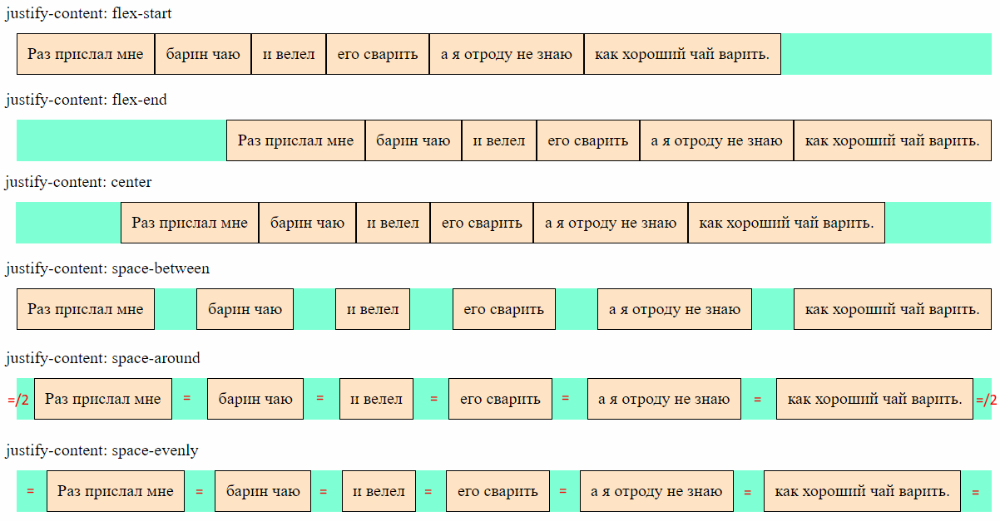

# Разметка для примеров

```html
<body>
  <div class="flex-container">
    <div class="flex-element">Раз прислал мне</div>
    <div class="flex-element">барин чаю</div>
    <div class="flex-element">и велел</div>
    <div class="flex-element">его сварить</div>
    <div class="flex-element">а я отроду не знаю</div>
    <div class="flex-element">как хороший чай варить.</div>
  </div>
</body>
```

```css
.flex-container {
  display: flex;
  flex-direction: row;
  /* flex-wrap: wrap; */
  /* justify-content: flex-start; */
  /* align-items: stretch; */
  /* align-content: normal; */
  background-color: aquamarine;
  /* height: 150px; */
  /* width: 150px; */
  margin: 10px;
}

.flex-element {
  background-color: bisque;
  padding: 10px;
  border: 1px solid black;
}
```


# Обзор свойств

| Свойство          | Дефолт       | Назначение                                    | Документация                                                 |
| ----------------- | ------------ | --------------------------------------------- | ------------------------------------------------------------ |
| `justify-content` | `flex-start` | Выравнивание *элементов* по *основной* оси.   | [MDN](https://developer.mozilla.org/en-US/docs/Web/CSS/justify-content) |
| `align-items`     | `stretch`    | Выравнивание *элементов* по *поперечной* оси. | [MDN](https://developer.mozilla.org/en-US/docs/Web/CSS/align-items) |
| `align-content`   | `normal`     | Выравнивание целиком строк \ столбцов.        | [MDN](https://developer.mozilla.org/en-US/docs/Web/CSS/align-content) |
| `justify-items`   |              | Не работает для флексов                       | [MDN](https://developer.mozilla.org/en-US/docs/Web/CSS/justify-items) |


# Выравнивание элементов

## По основной оси, justify-content

### Горизонтальный флекс



### Вертикальный флекс


### Комментарии

* ```css
  justify-content: flex-start;
  ```

  Элементы жмутся к началу основной оси.

* ```css
  justify-content: flex-end;
  ```

  Элементы жмутся к концу основной оси.

* ```css
  justify-content: center;
  ```

  Элементы жмутся к центру основной оси.

* ```css
  justify-content: space-between;
  ```

  Боковые элементы прижимаются к краям основной оси, а остальные делят оставшееся место поровну.

* ```css
  justify-content: space-evenly;
  ```

  Между всеми элементами одинаковое расстояние, по бокам такие же отступы.

* ```css
  justify-content: space-around;
  ```

  Между всеми элементами одинаковое расстояние, а по бокам половина этого расстояния.

ыва

## По поперечной оси, align-items


# Выравнивание строк \ столбцов