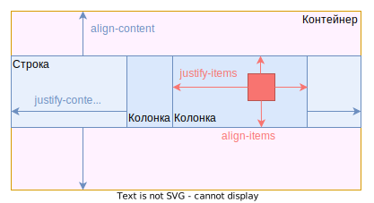
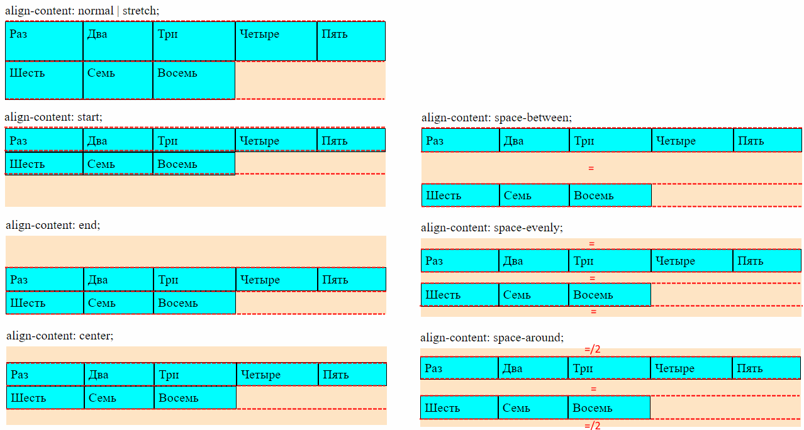

# Разметка для примеров

```html
<body>
  <div>Для писем и газет</div>
  <div class="grid-container">
    <div class="grid-element">Раз</div>
    <div class="grid-element">Два</div>
    <div class="grid-element">Три</div>
    <div class="grid-element">Четыре</div>
    <div class="grid-element">Пять</div>
    <div class="grid-element">Шесть</div>
    <div class="grid-element">Семь</div>
    <div class="grid-element">Восемь</div>
    <div class="grid-element">Девять</div>
    <div class="grid-element">Десять</div>
    <div class="grid-element">Одиннадцать</div>
    <div class="grid-element">Двенадцать</div>
    <div class="grid-element">Тринадцать</div>
    <div class="grid-element">Четырнадцать</div>
    <div class="grid-element">Пятнадцать</div>
    <div class="grid-element">Шестнадцать</div>
  </div>
</body>
```

```css
.grid-container {
  display: grid;
  grid-auto-flow: rows;
  grid-template-columns: auto auto auto;
  /* grid-template-rows: 50px 75px; */
  /* grid-auto-rows: 30px; */
  /* grid-auto-columns: 120px; */
  /* justify-items: start; */
  /* justify-content: start; */
  /* align-items: start; */
  /* align-content: start; */
  /* height: 100px; */
  background-color: bisque;
}

.grid-element {
  background-color: aqua;
  padding: 5px;
}

.large {
  font-size: 35px;
}
```

# Строки и колонки

## Направление автозаполнения, grid-auto-flow

Грид-контейнер состоит из строк и колонок (столбцов). Один из этих компонентов мы задаем жестко (например, хотим 3 колонки), а второй заполняется автоматически на основе количества элементов в контейнере. Нельзя одновременно жестко задать и количество колонок, и количество столбцов.

Например, надо отобразить фотографии в *три* колонки. Тогда при 30 фотографиях будет 10 строк, при 60 фотографиях - 20 строк и т.д. И наоборот: если надо отобразить фотографии в 4 строки, то при 8 фотографиях будет 2 колонки.

Для формирования строк и столбцов используется три свойства:

```
grid-auto-flow  +  (grid-template-columns  |  grid-template-rows)
```

## Жесткие колонки, динамические строки, grid-auto-flow: row

```css
.grid-container {
  grid-auto-flow: row;  /* Автоматически должны добавляться строки */
  grid-template-columns: auto auto auto auto auto;  /* Объявляем пять колонок, у всех авто-ширина */
  
  grid-template-rows: 40px 50px;  /* Первым двум строкам задаем персональную высоту */
  grid-auto-rows: 20px 30px;  /* Остальным строкам задаем высоту циклически */
}
```

| Свойство                | Зачем нужно                                                  |
| ----------------------- | ------------------------------------------------------------ |
| `grid-auto-flow: row`   | Указывает, что динамические у нас - строки. Значит количество колонок - постоянное. |
| `grid-template-columns` | 1) Объявляет количество колонок. <br /> 2) Задает ширину колонкам. |
| `grid-template-rows`    | Задает высоту нескольких первых строк.                       |
| `grid-auto-rows`        | Задает высоту строкам циклически.                            |


► Раз у нас динамические строки `grid-auto-flow: row`, значит фиксированным будет количество колонок. Поэтому `grid-template-columns` определит не только ширину колонок, но и их количество.

► С помощью `grid-auto-rows` можно задать высоту для строк. Задается она "циклически". Например, единственное значение `50px` сделает все строки высотой 50px. Двойное значение `25px 50px` даст первой строке высоту 25px, второй строке 50px, третьей строке снова 25px, четвертой 50px и т.д., "циклически". Аналогично три значения дадут высоту первым трем строкам, а дальше цикл повторится на 4, 5, 6 строку и т.д.

► С помощью `grid-template-rows` можно задать высоту нескольким первым строкам. Тогда значения, задаваемые через `grid-auto-rows`, начнут применяться после этих строк.

P.S. Как видно, свойства `grid-template-columns` и `grid-template-rows` не взаимоисключающие. Просто в зависимости от `grid-auto-flow`, шаблон может не только задавать высоту строк \ ширину колонок, но и их количество.

## Жесткие строки, динамические колонки, grid-auto-flow: column

```css
.grid-container {
  grid-auto-flow: column;  /* Автоматически должны добавляться колонки */
  grid-template-rows: auto auto auto;  /* Объявляем три строки, у всех авто-высота */
    
  grid-template-columns: 40px 60px;  /* Первым двум колонкам задаем персональную ширину */
  grid-auto-columns: 120px 200px;  /* Остальным колонкам задаем ширину циклически */
}
```

| Свойство                 | Зачем нужно                                                  |
| ------------------------ | ------------------------------------------------------------ |
| `grid-auto-flow: column` | Указывает, что динамические у нас - колонки. Значит количество строк - постоянное. |
| `grid-template-rows`     | 1) Объявляет количество строк. <br /> 2) Задает высоту строкам. |
| `grid-template-columns`  | Задает ширину нескольких первых колонок.                     |
| `grid-auto-columns`      | Задает ширину колонкам циклически.                           |


► Раз у нас динамические колонки `grid-auto-flow: column`, значит фиксированным будет количество строк. Поэтому `grid-template-rows` определит не только высоту строк, но и их количество.

► С помощью `grid-auto-columns` можно задать ширину для колонок. Задается она "циклически". Например, единственное значение `50px` сделает все колонки шириной 50px. Двойное значение `25px 50px` даст первой колонке ширину 25px, второй колонке 50px, третьей колонке снова 25px, четвертой 50px и т.д., "циклически". Аналогично три значения дадут ширину первым трем колонкам, а дальше цикл повторится на 4, 5, 6 колонки и т.д.

► С помощью `grid-template-columns` можно задать ширину нескольким первым колонкам. Тогда значения, задаваемые через `grid-auto-columns`, начнут применяться после этих колонок.

P.S. Как видно, свойства `grid-template-columns` и `grid-template-rows` не взаимоисключающие. Просто в зависимости от `grid-auto-flow`, шаблон может не только задавать высоту строк \ ширину колонок, но и их количество.

## Шаблон колонок и строк, grid-template-x

Показано на примере `grid-template-columns` и колонках, но у `grid-template-rows` и строк все аналогично:

```css
grid-template-columns: auto auto 100px;   /* Указываем ширину для трех колонок */
grid-template-columns: repeat(3, 150px);  /* Тоже указываем ширину для трех колонок */
grid-template-columns: repeat(3, 150px) repeat(2, 50px);  /* Указываем ширину для пяти колонок */
grid-template-columns: 1fr repeat(3, 150px) 2fr;          /* Тоже указываем ширину для пяти колонок */
```

Форматы указания значений:

* `auto` - ширина (или высота) вычисляется автоматически, так чтобы заполнить весь контейнер по соответствующей оси. Например, `auto auto 100px` означает, что третья колонка будет шириной 100px, а оставшееся в контейнере горизонтальное пространство разделят пополам первые две колонки.
* `100` - конкретное значение ширины, заданное в любых единицах, `px`, `%` и т.д.
* `fr` - от "fraction", позволяет делить пространство на основе коэффициентов. Например:
  * `1fr 2fr 3fr` - сделает три колонки, вторая будет в два раза больше первой, а третья - в три раза больше первой.
  * `1fr 2fr 100px` - три колонки. Третья имеет фиксированную ширину, а оставшееся пространство разделится между первыми двумя согласно коэффициентам.
* `repeat(3, 150px)` - когда нужно несколько колонок с одинаковой шириной, можно использовать функцию repeat. В данном случае она сделает три колонки по 150px каждая. Можно чередовать repeat с другими способами задания и использовать любые единицы, например, те же fr.
* `minmax(a, b)` - ширина будет не меньше `a` и не больше `b`, а между этими значениями будет занимать столько, сколько нужно.

## Расстояние между строками и колонками

```css
row-gap: 20px
column-gap: 40px;
gap: 20px 40px;  /* row + column */
gap: 40px;  /* row + column, одно значение и для того, и для другого */
```

## Порядок

```css
.grid-element {
  order: -1;
}
```

* `-1` элемент встает в самое начало.
* `1` элемент встает в конец.

# Выравнивание

В гриде мы можем выравнивать:

* Непосредственно строки \ колонки.
* Элементы внутри строк \ колонок.



## Выравнивание колонок и строк

Значения для обоих свойств одинаковые:

* `normal | stretch` - строки \ колонки растягиваются, чтобы занять всю высоту \ ширину контейнера. Растягиваются пропорционально своему содержимому.
* `start` - колонки жмутся к левому краю контейнера, а строки - к верху контейнера.
* `end` - колонки жмутся к правому краю контейнера, а строки - к низу контейнера.
* `center` - колонки жмутся к центру контейнера по горизонтали, а строки - к центру контейнера по вертикали.
* `space-between` - первая \ последняя колонки жмутся к левому \ правому краям контейнера, а центральные располагаются между ними на равном удалении. Первая \ последняя строки жмутся к верху \ низу контейнера, а центральные располагаются между ними на равном удалении.
* `space-evenly` - колонки располагаются на равном удалении от краев контейнера и друг от друга. Строки располагаются на равном удалении от верха \ низа контейнера и друг от друга.
* `space-around` - расстояние от краев до строк \ колонок в два раза меньше, чем между строками \ колонками.

### Выравнивание колонок по горизонтали, justify-content


### Выравнивание строк по вертикали, align-content



## Выравнивание элементов

Значения для обоих свойств одинаковые:

* `normal | stretch` - элемент растягивается на всю ширину колонки \ высоту строки.
* `start` - элемент прижимается к левому краю колонки \ к верху строки.
* `end` - элемент прижимается в правому краю колонки \ к низу строки.
* `center` - элемент становится по горизонтали в центре колонки \ по вертикали в центре строки.
* `baseline` - что такое baseline см. в конспекте про флексы. Для align-items выравнивает элементы по базовой линии, а для justify-items не понятно (вроде не работает).

### Внутри колонок по горизонтали, justify-items


### Внутри строк по вертикали, align-items


## place-items

Это комбинированное свойство для `align-items` + `justify-content`:

```css
place-items: center;  /* Одинаковое значение для обоих */
place-items: center end;
```
