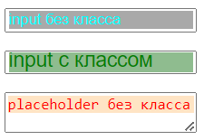
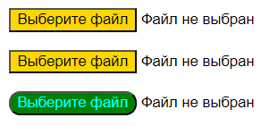
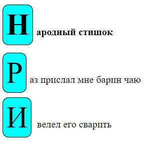
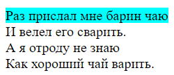
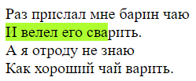
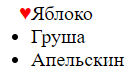
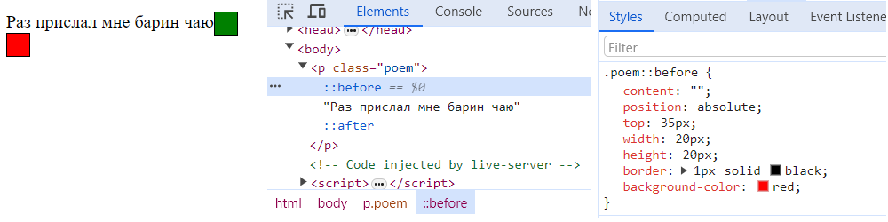

# Псевдоэлементы

Псевдоэлементы - это элементы, которых нет в разметке, но тем не менее мы их видим. Они создаются исключительно средствами css и могут быть полезны для создания разных визуальных эффектов, не захламляя при этом разметку.

Доступ к псевдоэлементам осуществляется через `::` Например:

```css
::placeholder {
  color: red;
}
```

Кроме того, это работает в комбинации с другими селекторами:

```css
.foobar::placeholder {  /* Комбинация с селектором класса */
  color: red;
}
```

# Специфичные

TODO: погуглить, какие свойства доступны для изменения для каждого псевдоэлемента, т.к. не все можно изменять. Конкретно сейчас мне не нужно, но когда будет время, поискать инфу.

## placeholder

`::placeholder` это псевдоэлемент, который содержит текст-заглушку для текстовых полей. Когда пользователь начинает что-то вводить в поле, заглушка исчезает.



```html
<body>
  <p><input placeholder="input без класса" /></p>
  <p><input class="ic" placeholder="input с классом" /></p>
  <textarea placeholder="placeholder без класса"></textarea>
</body>
```

```css
::placeholder {  /* Для всех плейсхолдеров */
  color: red;
  background-color: bisque;
}

input::placeholder {  /* Для плейсхолдеров в инпутах */
  color:aqua;
  background-color: darkgrey;
}

.ic::placeholder {  /* Для плейсхолдеров в элементах с классом ic */
  color: green;
  background-color: darkseagreen;
  font-size: large;
}
```

## file-selector-button

`::file-selector-button` это кнопка, которая находится рядом с input c типом file.



```html
<body>
  <p><input type="file" /></p>
  <p><input type="file" /></p>
  <p><input type="file" class="ic" /></p>
</body>
```

```css
::file-selector-button {
  background-color: gold;
}

.ic::file-selector-button {
  color: aqua;
  background-color: green;
  border-radius: 10px;
}
```

## first-letter

`::first-letter` это первая буква элемента, содержащего текст. TODO: однако, например cite не окрасился. Или отдельно поставленный span тоже. Погуглить, какие тут принципы.



```html
<body>
  <h4>Народный стишок</h4>
  <p>Раз прислал мне барин чаю</p>
  <div>И велел его сварить</div>
</body>
```

```css
::first-letter {
  font-size: 3em;
  background-color: aqua;
  padding: 5px;
  border: 1px solid black;
  border-radius: 10px;
  margin-right: 5px;
}
```

## first-line

`::first-line` это первая строка элемента, содержащего текст.



```html
<body>
  <p>
    Раз прислал мне барин чаю<br/>
    И велел его сварить.<br/>
    А я отроду не знаю<br/>
    Как хороший чай варить.<br/>
  </p>
</body>
```

```css
::first-line {
  background-color: aqua;
  padding: 5px;
  border: 1px solid black;
  border-radius: 10px;
  margin-right: 5px;
}
```

## selection

`::selection` это выделенный текст.



```html
<body>
  <p>
    Раз прислал мне барин чаю<br/>
    И велел его сварить.<br/>
    А я отроду не знаю<br/>
    Как хороший чай варить.<br/>
  </p>
</body>
```

```css
::selection {
  background-color: greenyellow;
}
```

## marker

`::marker` это маркер, расположенный слева от элемента списка.



```html
<body>
  <ul>
    <li class="nice">Яблоко</li>
    <li>Груша</li>
    <li>Апельскин</li>
  </ul>
</body>
```

```css
.nice::marker {
  content: "♥";
  color: red;
}
```

# Универсальные

## before и after

У элемента может быть один `::before` и один `::after`. Важное свойство `content`. Туда можно вставить текст, спецсимвол, url и всякий треш, но обычно ставят пустую строку `""` и просто декорируют, чтобы получить какой-то визуальный эффект.

Главный плюс в том, что в разметку можно вставить какой-нибудь элемент, поставить ему относительное позиционирование, а потом добавить псевдоэлемент и ему поставить абсолютное. Это позволит удобно крутить позиционирование псевдоэлемента относительно основного, при этом основной будет в потоке документа на своем нормальном месте. Таким образом делаются всякие красивые переключатели и т.д.

TODO: вернуться сюда и вставить какой-нибудь мощный пример.



```html
<body>
  <p class="poem">Раз прислал мне барин чаю</p>
</body>
```

```css
.poem::before {
  content: "";
  position: absolute;
  top: 35px;
  width: 20px;
  height: 20px;
  border: 1px solid black;
  background-color: red;
}

.poem::after {
  content: "";
  position: absolute;
  width: 20px;
  height: 20px;
  border: 1px solid black;
  background-color: green;
}
```

