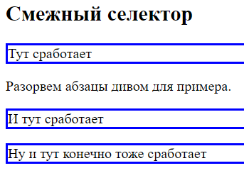

# Селектор потомка

## Любая вложенность

Описывается вложенность селекторов, для которых срабатывает стиль. Глубина вложения любая. Реализуется перечислением селекторов через пробел. Зачастую проще воспользоваться классами, чем использовать вложенные селекторы.

```css
p span {
  border: 1px solid red;
}

section p {
  border: 1px solid blue;
}
```

```html
<body>
  <p>Демонстрация</p>
  <p>Селектора <span>потомка.</span></p>
  <section>
    <p>
      Посмотрим <span>как они работают.</span>
    </p>
  </section>
  <section>
    <p>
      Посмотрим как они <cite>работают</cite>.
    </p>
  </section>
  <section>
    <div>
      <p>На этот p тоже сработает правило,</p>  <!-- хотя он внутри div -->
    </div>
  </section>
</body>
```


Замечания, на что обратить внимание:

* Вложенность не обязательно непосредственная, а любая. Т.е. `section p` например означает, что `<p>` не обязательно должен находиться *сразу* внутри `<section>`:

  ```html
  <section>
    <div>
      <p>На этот p тоже сработает правило,</p>  <!-- хотя он внутри div -->
    </div>
  </section>
  ```

* Комбинация работает только непосредственно на тег из селектора, т.е. `section p` сработает только на `<p>`, но не на теги внутри `<p>`. Я об этом пишу, потому что изначально в примере задавалось свойство цвета текста и текст красился не только внутри `<p>`, но и внутри, например, `<cite>`, из чего я сделал вывод, что правило работает не только на сам тег, но и на вложенные в него тоже. Однако пример с цветом - не показательный, потому что цвет относится к тем свойствам, которые наследуются. А вот пример с border явно показывает, что стиль работает только непосредственно на выбранный селектором тег, но не на вложенные в него. Если бы это было не так, тогда и `<cite>` был бы обведен собственной синей рамкой.

## Непосредственная вложенность

А вот когда нужно, чтобы работало только на элемент, *непосредственно* вложенный, используется синтаксис `селектор > селектор`.

```css
section > p {
  border: 3px solid blue;
}
```

```html
<body>
  <section>
    <p>  <!-- Тут сработает, т.к. вложение непосредственное -->
      Учимся работать <span>с селекторами.</span>
    </p>
  <section>
    <div>
      <p>Проверяем вложенные селекторы</p>  <!-- А тут нет -->
    </div>
  </section>
</body>
```


# Смежный селектор

## Один следующий элемент

Синтаксис `s1 + s2` позволяет задать стиль для s2, который находится на одном уровне вложенности с s1 и идет в разметке *сразу же* после него:

```css
h2 + p {  /* Сработает на абзацы, которые находятся непосредственно после h2 */
  border: 3px solid blue;
}
```

```html
<body>
  <h2>Смежный селектор</h2>
  <p>Тут сработает</p>  <!-- Потому что он в разметке идет сразу же за h2 -->
  <p>А тут нет</p>
  <p>Ну и тут конечно тоже нет</p>
</body>
```


Пример из интернета: рядом с полем ввода есть элемент с текстом ошибки. Изначально он невидимый, но надо показать его, когда в поле ошибка:

```html
<input class="input" />
<div class="error-message">Неправильно введен адрес</div>
```

```css
.error-message {
  color: red;
  visibility: hidden;
}

.input.is-invalid + .error-message {
  visibility: visible;
}
```

## Все следующие элементы

Синтаксис `s1 ~ s2` позволяет задать стиль для всех элементов s2, которые находятся на одном уровне вложенности с s1:

```css
h2 ~ p {  /* Сработает на все абзацы, которые находятся после h2 */
  border: 3px solid blue;
}
```

```html
<body>
  <h2>Смежный селектор</h2>
  <p>Тут сработает</p>
  <div>Разорвем абзацы дивом для примера.</div>
  <p>И тут сработает</p>
  <p>Ну и тут конечно тоже сработает</p>
</body>
```



