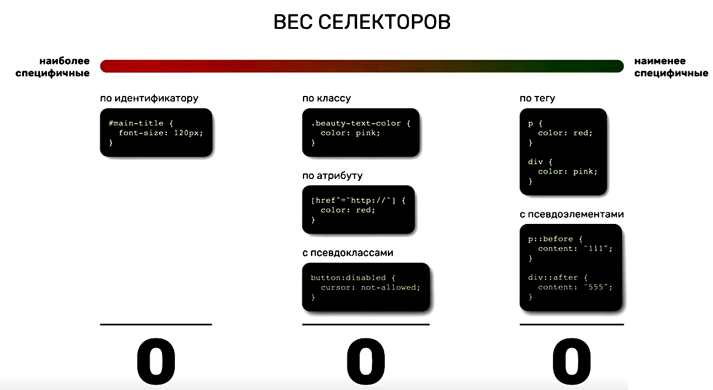

# Специфичность

Специфичность определяет, какой стиль применится к элементу, если он одновременно подходит под несколько селекторов. В идеальном случае для стилизации лучше всего использовать классы, потому что у них понятная специфичность - выше чем у тегов, и ниже чем у id.

Таблица для расчета специфичности:



Правила расчета:

* Для селектора из идентификатора вес 1.0.0. или 100.
* Для селектора из класса или атрибута вес 0.1.0. или 10.
* Для селектора из тега вес 0.0.1. или 1.
* Комбинация селекторов - сумма вышеперечисленных. Например, селектор из тега и идентификатора, например, `div:some-id` это 100 + 1 = 101.
* У какого селектора в итоге цифра специфичности больше, значит того правило и сработает.

Пример:

```html
<p class="text" id="my-super-text">Какого цвета этот текст?</p>
```

Какой цвет текста будет при таких стилях?

```css
p {
  color: red;
}

.text {
  color: green;
}

#my-super-text {
  color: blue;
}
```

А при таких?

```css
p {
  color: red;
}

p#my-super-text {
  color: pink;
}

.text {
  color: green;
}

#my-super-text {
  color: blue;
}
```

Ответы: 

* В первом случае - синий
* Во втором - розовый.

Потому что в первом случае по специфичности выигрывает `#my-super-text`, у него 100 очков, а во втором - `p#my-super-text`, потому что у него 100 + 1 = 101.