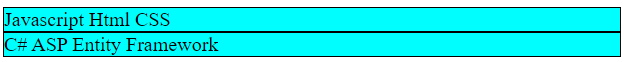
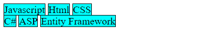
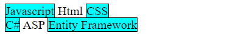
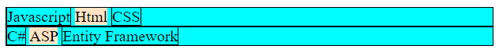

# :where

`:where` - это функция, которая принимает список селекторов и для *каждого* из них применяет указанный стиль.

Особенности:

* У where нулевая специфичность. Это значит, что любой другой селектор, который выберет те же элементы, что и where, будет приоритетнее.
* where - это "forgiving"-селектор. Это значит, что если внутри where какой-нибудь селектор будет неправильный, то он просто проигнорируется, а остальные сработают.

Разметка для примеров:

```html
<body>
  <div class="block-1">
    <span class="tech tech-1">Javascript</span>
    <span class="tech tech-2">Html</span>
    <span class="tech tech-3">CSS</span>
  </div>
  <div class="block-2">
    <span class="tech tech-1">C#</span>
    <span class="tech tech-2">ASP</span>
    <span class="tech tech-3">Entity Framework</span>
  </div>
</body>
```

### Самый простой пример

```css
:where(.block-1, .block-2) {
  background-color: aqua;
  border: 1px solid black;
}
```

Повлияет на элементы, у которых есть класс `block-1` *или* `block-2`.



### Пример с комбинацией селекторов

```css
:where(.block-1, .block-2) .tech {
  background-color: aqua;
}
```

То же самое что

```css
.block-1 .tech,
.block-2 .tech {
  background-color: aqua;
}
```

Т.е. когда у нас несколько селекторов, в которых можно заметить общую часть (в данном случае класс `tech`) и изменяющиеся части (классы `block-1` и `block-2`), то where нам позволяет изменяющую часть взять в скобки. Получается как бы "возьми по очереди каждый элемент из скобок и скомбинируй с общей частью":



Поэтому в данном случае окрасились tech'и, вложенные в block'и.

### Пример с несколькими where

Можно использовать несколько where:

```css
:where(.block-1, .block-2) :where(.tech-1, .tech-3) {
  background-color: aqua;
  border: 1px solid black;
}
```



Получается комбинация "каждый с каждым":

```css
.block-1 .tech-1,
.block-1 .tech-3,
.block-2 .tech-1,
.block-2 .tech-3 {
  ...
}
```

### Дальнейшее напутствие

В общем, о where надо запомнить:

* Что это по сути перебор каждого элемента в скобках и комбинация с остальной частью селектора, которая тоже может содержать where и другие вещи.
* Внутри where можно писать и более сложные селекторы, чем простой класс.
* Сам where стоит воспринимать так же как элементарный селектор, т.е. если мы можем написать `.c1, .c2`, то значит можем написать и так:

```css
.tech-2 {
  background-color: bisque;
}

:where(.block-1, .block-2), :where(.tech-1, .tech-3) {  /* <-- Использовали запятую */
  background-color: aqua;
  border: 1px solid black;
}
```



Получилось то же самое, что:

```css
.block-1, .block-2, .tech-1, .tech-3 {
  ...
}
```

